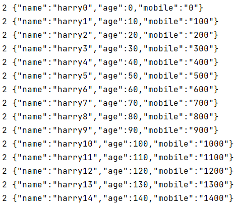
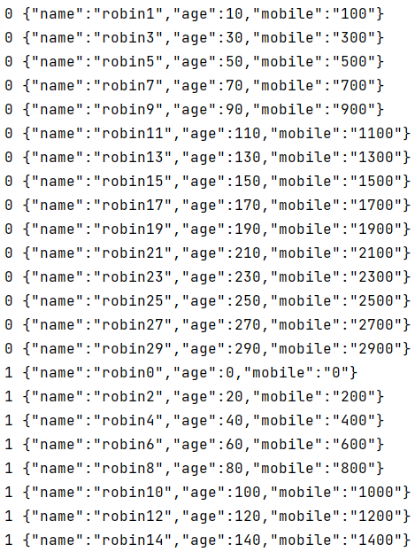

# 09-生产者分区策略

## 一、提出问题

创建topic的时候，可以指定多个partition

那么在生产者端发送消息时，能不能把消息发送到某一个<span style="color:blue;font-weight:bolder;">指定</span>的partition中？

问：什么样的场景会需要确保消息发送到指定的Partition？

答：生产者和消费者交互过程中，因为业务功能的需要，消息发送和接收的顺序需要严格保证。此时就必须把消息发送到一个指定的Partition，只有在Partition内部Kafka才保证消息的顺序，多个Partition之间的消息是没有顺序上的保证的

另一种情况是：我们希望消息数据在各个Partition之间均匀分布，避免有的broker上数据太多、有的太少——数据倾斜


## 二、默认分区策略

### 1、指定分区

在代码中明确指定某个分区的下标值，从而让消息进入指定分区

```java
@Test
public void testSendMessageToPartition() {
    String topicName = "topic-spring-boot230628";
    UserDTO userDTO = new UserDTO("tom0001", 10, "1111111111");

    // 精确指定某一个分区的下标
    Integer partition = 0;

    // 此时不需要提供 key 值
    Object key = null;

    // 虽然没有提供 key 值，但是必须传入 key 参数
    kafkaTemplate.send(topicName, partition, key, userDTO);
}
```


> 如果Partition指定了不存在的值就会抛出异常：
>
> Caused by: org.apache.kafka.common.errors.TimeoutException: Topic topic-test-enter-partition not present in metadata after 60000 ms.


### 2、不指定分区，指定key

#### ①策略

指定key值是在未指定分区时才会生效

key值会首先基于murmur2hash算法，得到HASH值，然后HASH值对分区数量取模

最终基于取模的结果决定进入哪个分区


#### ②举例

Key的类型是Object，任何类型都可以执行HASH运算

任何数据类型执行HASH运算都可以得到一个整数值

这个整数值对分区数量做取模运算，得到结果正好就是分区的下标值

接下来就基于分区下标值存入分区即可

```java
@Test
public void testHashCode() {
    System.out.println("f".hashCode() % 3); // 0
    System.out.println("a".hashCode() % 3); // 1
    System.out.println("b".hashCode() % 3); // 2
}
```


#### ③发送消息的测试代码

```java
@Test
public void testSendMessageByKey() {
    String topicName = "topic-spring-boot230628";
    UserDTO userDTO = new UserDTO("jerry0002", 20, "2222222222222");

    // 不指定分区，key 才能生效
    Integer partition = null;

    // 指定 key
    // String key = "f"; // 0
    // String key = "a"; // 1
    String key = "b"; // 2

    // 发送消息
    kafkaTemplate.send(topicName, partition, key, userDTO);
}
```


### 3、分区和key都不指定

#### ①策略描述

Kafka采用Sticky Partition（黏性分区器），会随机选择一个分区，并尽可能一直使用该分区，待该分区的batch（默认16k）已满或者已完成，Kafka再随机选择另一个分区进行使用。


#### ②调整消费端代码

```java
@KafkaListener(topics = {"topic-spring-boot230628"})
public void receiveMessage(ConsumerRecord<String, String> record) {

    log.info(record.partition() + " " + record.value());
}
```


#### ③发送消息代码

```java
@Test
public void testSendEntitySticky () {
    String topicName = "topic-spring-boot230628";

    for (int i = 0; i < 15; i++) {
        UserDTO userDTO = new UserDTO("harry"+i, i*10, i*100 +"");

        kafkaTemplate.send(topicName, userDTO);
    }
}
```


#### ④测试效果




## 三、轮询分区器

### 1、行为描述

轮询分区器全类名是：org.apache.kafka.clients.producer.<span style="color:blue;font-weight:bolder;">RoundRobinPartitioner</span>

消息轮流存入各个Partition


### 2、生产者YAML配置

```yaml
spring:
  kafka:
    bootstrap-servers: 192.168.200.100:7000,192.168.200.100:8000,192.168.200.100:9000
    producer:
      key-serializer: org.apache.kafka.common.serialization.StringSerializer
      value-serializer: org.springframework.kafka.support.serializer.JsonSerializer
      properties:
        partitioner.class: org.apache.kafka.clients.producer.RoundRobinPartitioner
```


### 3、测试程序

```java
@Test
public void testSendMessageRoundRobin() {
    String topicName = "topic-spring-boot230628";
    for (int i = 0; i < 50; i++) {
        kafkaTemplate.send(topicName, null, null, new UserDTO("robin" + i, i*10, i*100+""));
    }
}
```


### 4、测试效果




## 四、自定义分区器

在自定义分区器中，我们可以设定自己的逻辑，什么样的数据进入某一个特定的分区

比如我们根据业务需求设定key的规则：

- order.xxx：进入分区0
- cart.xxx：进入分区1
- user.xxx：进入分区2


### 1、类型要求

和内置分区器一样，自定义分区器也需要实现org.apache.kafka.clients.producer.Partitioner接口


### 2、需求设定

基于不同消息数据，把消息发送到不同分区：

- 包含atguigu，发送到：0
- 包含sgg，发送到：1
- 其它，发送到：2


### 3、代码实现

```java
import org.apache.kafka.clients.producer.Partitioner;
import org.apache.kafka.common.Cluster;
import org.springframework.stereotype.Component;

import java.util.Map;

@Component
public class AtguiguPartitioner implements Partitioner {
    @Override
    public int partition(String topic, Object key, byte[] keyBytes, Object value, byte[] valueBytes, Cluster cluster) {

        // 排除消息值为空的情况
        if (value == null) {
            throw new RuntimeException("消息值不能为空！");
        }

        // 排除消息不是字符串类型的情况
        if (!(value instanceof String)) {
            return 2;
        }

        // 需求：消息数据特征决定它进入哪个分区
        // 包含atguigu，发送到：0
        // 包含sgg，发送到：1
        // 其它，发送到：2
        String message = (String) value;

        if (message.contains("atguigu"))
            return 0;

        if (message.contains("sgg"))
            return 1;

        return 2;
    }

    @Override
    public void close() {

    }

    @Override
    public void configure(Map<String, ?> configs) {

    }
}
```


### 4、YAML配置

```yaml
spring:
  kafka:
    bootstrap-servers: 192.168.200.100:7000,192.168.200.100:8000,192.168.200.100:9000
    producer:
      key-serializer: org.apache.kafka.common.serialization.StringSerializer
      value-serializer: org.springframework.kafka.support.serializer.JsonSerializer
      properties:
        partitioner.class: com.atguigu.kafka.partitioner.AtguiguPartitioner
```


### 5、测试代码

```java
@Test
public void testMyPartitioner() {
    String topicName = "topic-spring-boot230628";
    kafkaTemplate.send(topicName, "zhu zhu atguigu zhu");
    kafkaTemplate.send(topicName, "zhu zhu sgg zhu");
    kafkaTemplate.send(topicName, "zhu zhu happy zhu");
}
```

