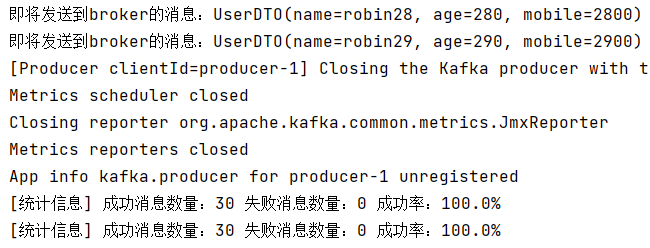

# 10-生产者拦截器

## 一、简介

消息在通过send()方法发往 broker 的过程中，有可能依次经过拦截、序列化器和分区器的一系列作用之后才被真正地发往 broker。

生产者拦截器既可以用来在消息发送前做一些准备工作，比如检查、修改消息内容，也可以用来在发送回调逻辑前做一些定制化的需求，比如统计工作。


创建生产者拦截器需要实现接口：ProducerInterceptor

| 方法                | 执行时机                                                     |
| ------------------- | ------------------------------------------------------------ |
| onSend()            | 消息发送前执行（已经调用了 KafkaTemplate 对象的 send() 方法，但是消息还没有发送到 broker） |
| onAcknowledgement() | Kafka服务端应答后，应答到达生产者确认回调前执行              |
| close()             | 拦截器对象销毁之前执行                                       |


泛型说明：

- K：发送消息时指定的key
- V：发送消息时消息数据本身


## 二、应用举例

需求：统计消息发送的成功率


### 1、创建生产者拦截器

```java
import lombok.extern.slf4j.Slf4j;
import org.apache.kafka.clients.producer.ProducerInterceptor;
import org.apache.kafka.clients.producer.ProducerRecord;
import org.apache.kafka.clients.producer.RecordMetadata;
import org.springframework.stereotype.Component;

import java.util.Map;

@Component
@Slf4j
public class KafkaProducerInterceptor implements ProducerInterceptor<String,Object> {
    
    private volatile long success = 0;
    private volatile long failure = 0;
    
    // 消息发送前执行：可以对消息内容进行处理
    @Override
    public ProducerRecord<String, Object> onSend(ProducerRecord<String, Object> producerRecord) {
        log.info("即将发送的消息内容:{}",producerRecord.value());
        
        // 此处可以修改 producerRecord 的属性值然后 return
        return producerRecord;
    }
    
    // Kafka服务端应答后，应答到达生产者确认回调前执行
    @Override
    public void onAcknowledgement(RecordMetadata recordMetadata, Exception e) {
        if(null==e){ // 成功
            success++;
        }else{ // 失败
            failure++;
        }
    }
    
    // 拦截器销毁前执行
    @Override
    public void close() {
        log.info("消息发送统计,成功数量：{}，失败数量：{}，成功比例：{}",
                success,failure,(success*1.0/(success+failure))*100+"%");
    }

    @Override
    public void configure(Map<String, ?> map) {

    }
}
```


### 2、配置生产者拦截器

目标：把拦截器对象装配到KafkaTemplate对象中

```java
import com.atguigu.kafka.interceptors.KafkaProducerInterceptor;
import jakarta.annotation.PostConstruct;
import jakarta.annotation.Resource;
import org.apache.kafka.clients.admin.NewTopic;
import org.springframework.context.annotation.Bean;
import org.springframework.context.annotation.Configuration;
import org.springframework.kafka.config.TopicBuilder;
import org.springframework.kafka.core.KafkaTemplate;

@Configuration
public class KafkaConfig {
    @Bean
    public NewTopic springTestTopic() {
        return TopicBuilder.name("topic-spring-boot") // 主题名称
                .partitions(3) // 分区数量
                .replicas(3) // 副本数量
                .build();
    }

    @Resource
    private KafkaTemplate<String,String> kafkaTemplate;

    @Resource
    private KafkaProducerInterceptor kafkaProducerInterceptor;

    @PostConstruct
    public void init() {
        kafkaTemplate.setProducerInterceptor(kafkaProducerInterceptor);
        System.out.println("----init success over,KafkaTemplate配置生产者拦截器kafkaProducerInterceptor");
    }
}
```


关于@PostConstruct注解，我们做以下几点说明：

- 被修饰的方法执行时机：Web环境下Servlet对象创建完成，初始化操作之前
- 对被修饰方法的要求
  - 不能有参数
  - 不能有返回值
  - 必须是public权限修饰符


### 3、发送消息测试

不需要专门声明测试方法，使用以前我们写过的方法即可

测试效果局部截图如下：


