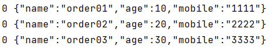
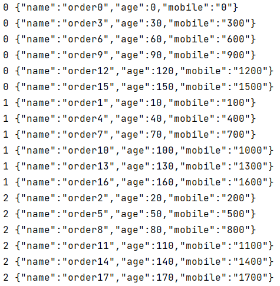

# 11-生产者数据有序

## 一、提出问题

Kafka 最多只保证<span style="color:blue;font-weight:bolder;">单分区内的消息是有序的</span>，所以如果要保证业务全局严格有序，就要设置 Topic 为单分区。但是，某批次的数据发送失败后，进行了重试，也可能出现后边的批次先于其它消息到达的情况。

如何保证单分区内数据有序or怎么解决乱序？


## 二、解决方案

总体来看，实现数据有序需要做到以下几点：

- 需要有序的消息发送到同一个分区
  - 实现方式一：直接指定相同的partition值
  - 实现方式二：不指定partition，而是指定相同的key
- 设置retries值为0


> retries值设置为零，表示消息发送失败的话，不进行重试
>
> 那么发送失败的消息就无法进入broker，也就是说存在消息丢失的可能


## 三、示例代码

### 1、YAML配置

其实没有什么需要特殊设置，retries本身默认值就是0

```yaml
spring:
  kafka:
    bootstrap-servers: 192.168.200.100:7000,192.168.200.100:8000,192.168.200.100:9000
    producer:
      key-serializer: org.apache.kafka.common.serialization.StringSerializer
      value-serializer: org.springframework.kafka.support.serializer.JsonSerializer
      retries: 0
```


### 2、发送消息代码

```java
@Test
public void testSendMessageOrder() throws ExecutionException, InterruptedException {
    String topicName = "topic-spring-boot230628";

    // 通过 partition 限定消息发送到同一个分区
    Integer partition = 0;
    String key = null;

    // 为什么要调用 get() 方法？
    // 并不是为了获取任务执行的结果
    // 而是确保第一个任务执行完成之后，再执行第二个任务
    // 如果不这样做，各个子线程负责发送消息没办法保证发送消息的顺序
    kafkaTemplate.send(topicName, partition, key, new UserDTO("order01", 10, "1111")).get();
    kafkaTemplate.send(topicName, partition, key, new UserDTO("order02", 20, "2222")).get();
    kafkaTemplate.send(topicName, partition, key, new UserDTO("order03", 30, "3333")).get();
}
```


### 3、测试效果




## 四、测试不同分区不保证顺序

### 1、测试代码

```java
@Test
public void testSendMessageNoOrder() throws ExecutionException, InterruptedException {
    String topicName = "topic-spring-boot230628";

    for (int i = 0; i < 18; i++) {
        // 每条消息发送到不同分区，看看消费端接收消息的顺序
        kafkaTemplate.send(topicName, i % 3, null, new UserDTO("order" + i, i * 10, i * 100 + "")).get();
    }
}
```


- 在生产者端发送消息之前，把消费端程序停止
- 把消息全部发送到broker之后，再启动消费端程序接收消息


### 2、测试效果



