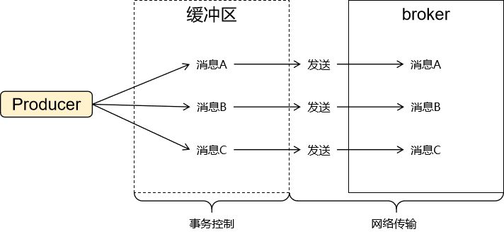

# 13-生产者事务

## 一、提出问题

生产者端发送多条消息，这些消息逻辑上是一个整体，我们希望这些消息：

- 要么都发送到消息队列
- 要么都不发送


> 下单成功后，把以下消息存入消息队列：
>
> - 通知支付模块设定支付截止时间
> - 通知购物车模块把已经下单的购物项删除
> - 通知库存子系统执行预出库
> - 通知积分子系统更新用户积分


在生产者事务执行过程，表面上发送一条消息调用了send()方法，但是实际上消息并没有往broker发送，而仅仅是存入本地日志文件，相当于加入了<span style="color:blue;font-weight:bolder;">缓存</span>。

一个事务中所有send()方法都执行成功，所有要发送的消息都存入缓存了，再一起往broker发送。


生产者端事务仅仅对消息是否全部进入缓冲区进行管理，至于消息在网络上传输过程中是否会丢失就需要借助ack和retries机制了。


## 二、Kafka事务

### 1、先决条件

- acks必须设置为-1（或all）
- retries必须大于0


### 2、事务配置

```yaml
spring:
  kafka:
    bootstrap-servers: 192.168.200.100:7000,192.168.200.100:8000,192.168.200.100:9000
    producer:
      key-serializer: org.apache.kafka.common.serialization.StringSerializer
      value-serializer: org.springframework.kafka.support.serializer.JsonSerializer
      acks: -1
      retries: 1
      transaction-id-prefix: tx_
```


- 我们在开发中，编写代码时用不上transaction-id-prefix
- transaction-id-prefix是给框架底层使用的


在Kafka中，`transaction.id.prefix`是一个配置项，用于设置事务ID的前缀。事务ID是用于跟踪Kafka事务性生产者发送的消息的唯一标识符。

通过设置`transaction.id.prefix`，可以为每个事务性生产者生成唯一的事务ID。这对于多个应用程序使用相同的Kafka集群进行消息发布非常有用，以避免事务ID冲突。

当设置了`transaction.id.prefix`后，实际的事务ID会由该前缀和一个唯一的序列号组成。序列号会自动增加，以确保每个事务都具有唯一的ID。

举个例子，如果将`transaction.id.prefix`设置为"my-app"，那么事务ID可能会像"my-app-1"、"my-app-2"等一样递增。

需要注意的是，`transaction.id.prefix`的长度不能超过80个字符，并且只能包含ASCII字母，数字和连字符（-）。

通过设置不同的`transaction.id.prefix`，你可以为每个事务性生产者创建独立的命名空间，以确保事务ID的唯一性。这对于跟踪和管理事务非常有帮助。


### 3、测试

```java
@Test
public void testTx() {
    kafkaTemplate.executeInTransaction(new KafkaOperations.OperationsCallback() {
        @Override
        public Object doInOperations(KafkaOperations operations) {

            String topicName = "topic-spring-boot230628";

            operations.send(topicName, "transaction message 01~~~@@@");
            operations.send(topicName, "transaction message 02~~~@@@");
            operations.send(topicName, "transaction message 03~~~@@@");

            System.out.println(10 / 0);

            return null;
        }
    });
}
```


控制台日志：

> 2025-04-22T13:27:58.269+08:00 ERROR 3592 --- [| producer-tx_0] o.s.k.support.LoggingProducerListener    : Exception thrown when sending a message with key='null' and payload='transaction message 02~~~@@@' to topic topic-spring-boot230628:
>
> org.apache.kafka.common.errors.<span style="color:blue;font-weight:bolder;">TransactionAbortedException</span>: <span style="color:blue;font-weight:bolder;">Failing batch since transaction was aborted</span>
>
> 2025-04-22T13:27:58.276+08:00 ERROR 3592 --- [| producer-tx_0] o.s.k.support.LoggingProducerListener    : Exception thrown when sending a message with key='null' and payload='transaction message 01~~~@@@' to topic topic-spring-boot230628:
>
> org.apache.kafka.common.errors.<span style="color:blue;font-weight:bolder;">TransactionAbortedException</span>: <span style="color:blue;font-weight:bolder;">Failing batch since transaction was aborted</span>
>
> 2025-04-22T13:27:58.277+08:00 ERROR 3592 --- [| producer-tx_0] o.s.k.support.LoggingProducerListener    : Exception thrown when sending a message with key='null' and payload='transaction message 03~~~@@@' to topic topic-spring-boot230628:
>
> org.apache.kafka.common.errors.<span style="color:blue;font-weight:bolder;">TransactionAbortedException</span>: <span style="color:blue;font-weight:bolder;">Failing batch since transaction was aborted</span>


## 三、消息重试机制

### 1、背景

事务只负责保证消息存入缓冲区，已经存入缓冲区的消息都是确定要发送到broker的

但是从生产者到broker需要经过网络，broker也有宕机的风险

所以事务提交并不能保证消息一定能写入broker

对此我们参照下面三个标准来衡量消息发送操作的可靠性





### 2、数据发送可靠性水平

#### ①At Most Once（至多一次）

- 在"At Most Once"语义下，消息发送者最多会尝试发送一次消息。
- 这意味着，如果在消息发送过程中发生错误或失败，消息可能会丢失，并且无法被接收方接收到。
- 这种语义通常用于那些对数据的可靠性要求不高，可以容忍少量数据丢失的场景。

  

#### ②At Least Once（至少一次）

- 在"At Least Once"语义下，消息发送者会确保消息至少被成功发送一次，但可能会导致重复的消息传递。
- 发送者会尝试重试发送消息，直到收到确认为止，以确保消息被接收方接收到。
- 这种语义可以保证消息不会丢失，但可能会导致消息的重复处理。因此，在接收方需要具备去重机制来处理重复消息。

  

#### ③Exactly Once（精准一次）

- "Exactly Once"语义是指消息发送者能够确保每条消息只被成功发送一次，且不会出现重复发送。
- 这意味着，在任何情况下，每条消息都能够被准确地传递给接收方，而不会发生丢失或重复处理。
- 实现"Exactly Once"语义是相对复杂的，通常需要使用事务和去重等机制来保证数据的一致性和可靠性。


需要注意的是，虽然"Exactly Once"是最理想的语义，但在实践中往往会涉及到系统复杂性、网络故障等因素，使得实现真正的"Exactly Once"变得困难。一般情况下，在Kafka中可以通过<span style="color:blue;font-weight:bolder;">事务</span>、<span style="color:blue;font-weight:bolder;">重试机制</span>和<span style="color:blue;font-weight:bolder;">幂等性</span>等特性来实现类似于"Exactly Once"的效果。


> 幂等性：操作不管是做1次还是10次，对系统的影响都是一样的。
>
> 读操作（GET）：不管执行多少次，都不会导致数据的改变，所以所有读操作都满足幂等性
>
> 写操作（POST）：通常来说对应保存操作，此时执行保存操做的实体类对象没有Id值（null）
>
> ---->User(null, "tom2024", 25, "Java")
>
> ---->insert into t_user(user_name, user_age, user_subject) values(....)
>
> ---->执行一次保存一条记录；执行多次保存多条记录
>
> ---->所以不满足幂等性
>
> 写操作（DELETE）：通常来说对应删除操作，而且通常基于Id（主键值）执行删除
>
> ---->delete from t_user where id=5;
>
> ---->执行一次是删除Id为5的记录；执行多次仍然是删除Id为5的记录
>
> ---->所以满足幂等性
>
> 写操作（PUT）：准确的来说，对应保存和更新两种操作，特点是锁定Id执行
>
> ---->Id值对应的记录存在，执行更新
>
> ---->update t_user set user_name="tom2025" where id=8;
>
> ---->Id值对应的记录不存在，执行保存
>
> ---->insert into t_user(user_name) values("tom2025");
>
> ---->User(8, "tom2025")
>
> ---->所以满足幂等性


根据业务需求和数据的重要性，您可以选择适合的数据发送语义。


风险和应对方式总结：

| 风险                                                         | 应对方式   | 效果                                                         |
| ------------------------------------------------------------ | ---------- | ------------------------------------------------------------ |
| 业务代码出错，导致在一个逻辑整体中的消息部分发送、部分没有发送 | 事务       | 消息要么都发送<br />要么都不发送                             |
| 网络传输过程中消息丢失                                       | 重试       | 多次重试保证消息发送成功                                     |
| 重复消息导致数据计算错误                                     | 幂等性     | 每次操作都针对一个具体的id执行<br />对其它数据没有影响       |
| broker实例宕机导致无法接收消息                               | 集群       | 集群中包含多个broker实例，避免单点故障<br />数据分区<br />给数据分区配备复制分片 |
| 火山爆发、地震、海啸、火灾、雷击……                           | 跨区域容灾 | 比如：东京地震了，但是我们在北京有跨区域容灾机制             |


### 3、幂等性

- 广义理解：一个操作执行一次和执行多次对系统的影响是一样的，执行多次不会破坏数据完整性
- 狭义理解：不论Producer向Broker发送多少次重复数据，Broker端都只会持久化一条，保证了不重复