# 14-消费端提交

## 一、Kafka的Offset管理机制

### 1、Kafka如何保存一条消息

broker接收到消息之后，分头做下面两件事：

- 给生产者返回ACK确认信息
- 消息持久化保存到硬盘上的日志文件中

> <span style="color:red;font-weight:bolder;">扩展阅读</span>：Kafka默认情况下对所有消息进行持久化保存这意味着一旦消息被写入到Kafka的分区中，它将会被持久化地存储在磁盘上，即使消费者已经消费了该消息
>
> Kafka通过将消息追加到日志文件中来实现持久化存储一旦消息被成功写入日志文件并复制到足够数量的副本（取决于副本因子配置），就可以保证消息的可靠性和持久性
>
> 持久化存储是Kafka的核心特性之一，它能够确保消息在发生故障或重启后仍然可用，并且支持高吞吐量和低延迟的读写操作这种设计使得Kafka成为一种可靠的消息传递系统，适用于许多不同的应用场景，如日志收集、实时数据流处理等
>
> Kafka用来保存消息的日志文件是分布式的，并且每个主题（Topic）的每个分区（Partition）都有对应的多个日志文件
>
> Kafka使用了一种称为"分段日志"（Segmented Log）的存储结构每个分区的日志被划分为多个固定大小的日志段（Log Segment），通常以时间或大小为依据进行切分每个日志段都是一个独立的物理文件，包含按顺序追加的一系列消息记录
>
> 当一个日志段达到预设的大小限制时，Kafka会关闭该日志段，并创建一个新的日志段用于继续写入消息这样的设计使得Kafka能够高效地追加写入消息，并支持高吞吐量和快速的读取操作
>
> 总体而言，Kafka的日志文件数量取决于主题的分区数、日志段的大小设置以及消息的产生速率通过将消息分配到不同的分区和日志段中，Kafka能够实现横向扩展和高并发处理能力


日志文件中，一条消息包含下面6个字段的信息：

1. <span style="color:blue;font-weight:bolder;">主题</span>（<span style="color:blue;font-weight:bolder;">Topic</span>）：表示消息所属的主题
2. <span style="color:blue;font-weight:bolder;">分区号</span>（<span style="color:blue;font-weight:bolder;">Partition</span>）：表示消息所属的分区
3. <span style="color:red;font-weight:bolder;">消息的偏移量</span>（<span style="color:red;font-weight:bolder;">Offset</span>）：表示消息在分区中的唯一位置
4. <span style="color:blue;font-weight:bolder;">消息的时间戳</span>（<span style="color:blue;font-weight:bolder;">Timestamp</span>）：表示消息的发送时间或其他自定义时间戳属性
5. <span style="color:blue;font-weight:bolder;">消息的键</span>（<span style="color:blue;font-weight:bolder;">Key</span>）：可选项，某些情况下用于消息路由和分发
6. <span style="color:blue;font-weight:bolder;">消息的值</span>（<span style="color:blue;font-weight:bolder;">Value</span>）：消息的实际内容


### 2、事实与推论

事实：

- 发送到某个Topic的消息，经过分区策略的计算只能确定性的进入某一个分区，而不会在多个分区中保存多份
- 各分区之间保存的数据是不同的
- 在一个分区内部，使用偏移量（Offset）来记录消息存放的位置
- 偏移量是一个从0开始，依次递增的整数值


推论：在整个Kafka集群范围内，<span style="color:blue;font-weight:bolder;">Topic+Partition+Offset组合</span>在一起可以<span style="color:blue;font-weight:bolder;">唯一定位</span>到一条具体的消息


### 3、消息记录格式举例

| Partition | Topic            | Offset | Key  | Value               | Timestamp     |
| --------- | ---------------- | ------ | ---- | ------------------- | ------------- |
| 0         | topic_mall_order | 0      | null | order_submit_987654 | 1623123456789 |
| 0         | topic_mall_order | 1      | null | order_submit_456789 | 1623012345678 |
| 0         | topic_mall_order | 2      | null | order_submit_654321 | 1623098765432 |
| 0         | topic_mall_order | 3      | null | order_submit_234567 | 1623154321098 |
| 0         | topic_mall_order | 4      | null | order_submit_876543 | 1623087654321 |
| 0         | topic_mall_order | 5      | null | order_submit_345678 | 1623143210987 |
| 0         | topic_mall_order | 6      | null | order_submit_765432 | 1623076543210 |
| 0         | topic_mall_order | 7      | null | order_submit_432434 | 1623132109876 |


### 4、提出问题

- 问：Kafka如何管理各个Partition中的消息对消费者来说消费到了哪一条？
- 答：在<span style="color:blue;font-weight:bolder;">__consumer_offsets主题</span>中记录


## 二、__consumer_offsets主题

### 1、数据结构

__consumer_offsets主题中包含如下字段：

- Topic：表示消费者组订阅的主题
- Partition：表示消费者组订阅的分区
- <span style="color:blue;font-weight:bolder;">Consumer group</span>：消费者组的标识
- <span style="color:blue;font-weight:bolder;">Offset</span>：消费者组在该分区中的当前消费<span style="color:blue;font-weight:bolder;">进度</span>，指示已经消费的偏移量
- Metadata：其他与偏移量相关的元数据信息
- HW（High Watermark）：每个分区的高水位线，表示已经被确认的最大偏移量
- LEO（Log End Offset）：每个分区的日志结束偏移量，即下一条即将被写入的消息的位置


### 2、字段说明：Topic和Partition

通过Topic和Partition的组合，定位到一个具体的分区


### 3、字段说明：Consumer group

首先，关于消费者组我们回顾以下两点：

- <span style="color:blue;font-weight:bolder;">组内竞争</span>：属于同一组的多个消费者之间，只有一个能获取到消息，所以消费者组内相当于是一种集群式的冗余机制
- <span style="color:blue;font-weight:bolder;">组间共享</span>：监听同一主题的多个消费者组，都会接收到消息，消息对它们来说是广播的

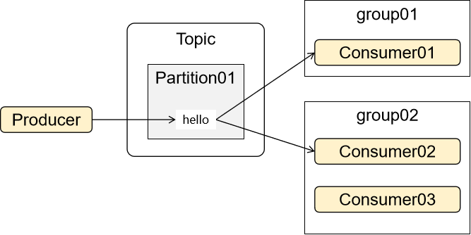


所以不同组内的消费者对于同一条消息，可能A组的消费者已经消费了，B组的还没有，那么就必须<span style="color:blue;font-weight:bolder;">分别记录</span>保存


### 4、字段说明：Offset

这是一个整数值，作用是一个指针，指向当前Partition内，当前消费者组已经消费到哪一条消息了

初始值-1，表示任何消息都没有被消费

注意：消费者接收到消息之后，必须执行提交操作，__consumer_offsets中的Offset指针才会向前移动


## 三、消费者端的提交机制

消费端做了提交的操作，broker才能知道某个消费者（组）把某条消息消费完了


### 1、__consumer_offsets中Offset指针移动过程

#### [1]情景设定

假设现在Partition中有5条消息，两个消费者分属两个不同的消费者组，准备接收消息：


__consumer_offsets中部分数据情况：

| Partition | Consumer Group | Offset |
| --------- | -------------- | ------ |
| 0         | 1              | -1     |
| 0         | 2              | -1     |


#### [2]消息0发送给Consumer01

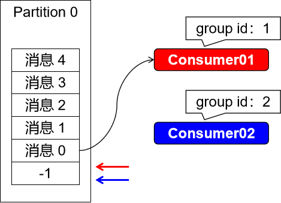


#### [3]Consumer01基于消息0处理相关业务

业务代码执行不管成功还是失败，总会结束，结束之后执行下一步

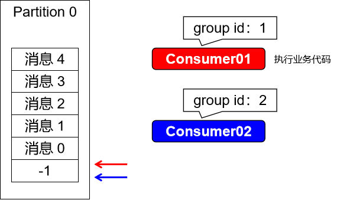


#### [4]Consumer01提交消息0

消费者端一旦执行提交操作，就表示消息处理完成；

broker接收到提交信息，就会修改__consumer_offsets中对应的数据，移动Offset指针

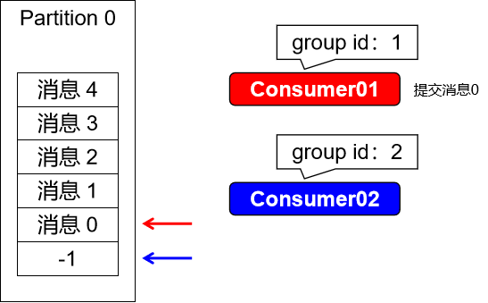


| Partition | Consumer Group | Offset |
| --------- | -------------- | ------ |
| 0         | 1              | 0      |
| 0         | 2              | -1     |


#### [5]消息1发送给Consumer01

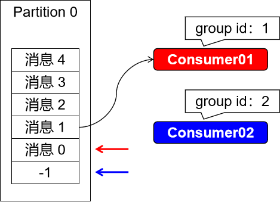


#### [6]Consumer01基于消息1处理相关业务

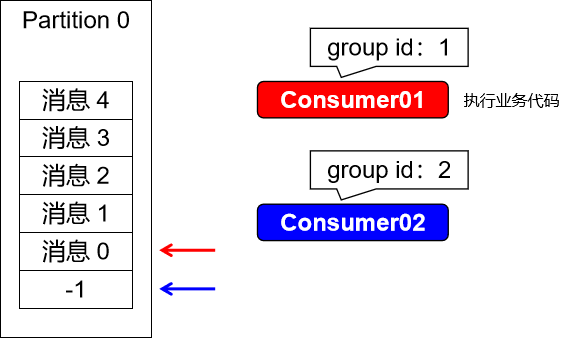


#### [7]Consumer01提交消息1

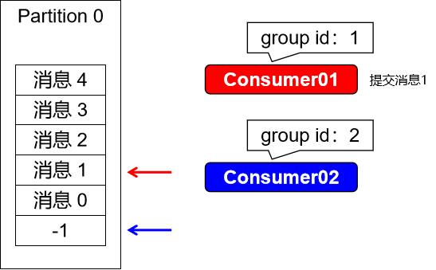


| Partition | Consumer Group | Offset |
| --------- | -------------- | ------ |
| 0         | 1              | 1      |
| 0         | 2              | -1     |


#### [8]消息0发送给Consumer02

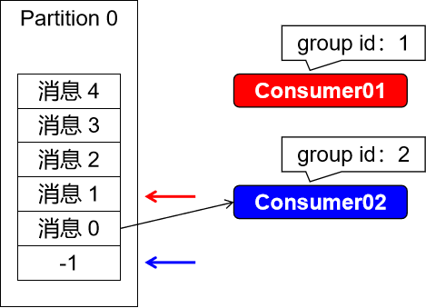


#### [9]Consumer02基于消息0处理相关业务

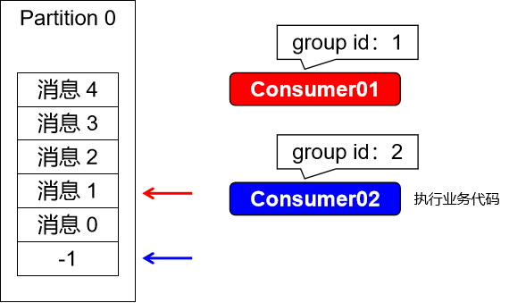


#### [10]Consumer02提交消息0

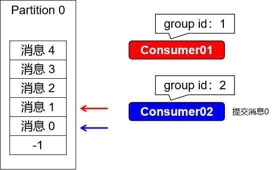


| Partition | Consumer Group | Offset |
| --------- | -------------- | ------ |
| 0         | 1              | 1      |
| 0         | 2              | 0      |


### 2、消费端提交的效果

- 消息已提交：知道这条消息消费端已经消费完了，下次消费端重启，继续发送下一条消息给它
- 消息未提交：
  - 未超过保留时间（retention time）：下次消费端重启时再次发送这条未提交的消息给消费者
  - 已超过保留时间（retention time）：消息本身仍然存在于broker上，但无法直接获取。只有在消费者请求拉取消息时，它们才能访问到这些超过保留时间的消息。


### 3、消费端消息提交方式

#### ①自动提交

- 参数enable_auto_commit：是否启用自动提交机制，默认是开启的
- 参数auto_commit_interval：执行自动提交的时间间隔，默认5秒


##### [1]测试启用自动提交

关注点：消费端程序重启后，之前已经消费过的消息是否会再次收到

测试方式：因为消费端本身就是默认开启自动提交的，我们重启消费端SpringBoot微服务，不会收到此前曾经处理过的消息


##### [2]测试不提交

这里我们要测试的，是关闭自动提交，也不做手动提交

```yaml
spring:
  Kafka:
    bootstrap-servers: 192.168.200.100:7000,192.168.200.100:8000,192.168.200.100:9000
    consumer:
      key-deserializer: org.apache.kafka.common.serialization.StringDeserializer
      value-deserializer: org.apache.kafka.common.serialization.StringDeserializer
      group-id: consumer-group
      enable-auto-commit: false
    listener:
      ack-mode: manual
```

> <span style="color:red;font-weight:bolder;">扩展阅读</span>：`spring.kafka.listener.ack-mode`配置项用于配置Spring Kafka消费者监听器的ACK模式。它定义了在成功处理消息后，消费者将如何提交偏移量。
>
> 以下是涉及的几种ACK模式：
>
> 1. `record`模式：在每条消息成功处理后自动提交偏移量。这意味着每处理一条消息就立即提交偏移量。请注意，这种模式可能会导致更频繁的偏移量提交，可能稍微影响性能。
>
> 2. `batch`模式：在一批消息全部成功处理后自动提交偏移量。这意味着在处理一批消息后才进行偏移量提交，可以减少提交操作的频率，提高性能。
>
> 3. `time`模式：定期自动提交偏移量。可以通过`spring.kafka.consumer.properties`中的`ConsumerConfig.AUTO_COMMIT_INTERVAL_MS_CONFIG`属性来配置提交的时间间隔。这种模式适用于需要在一段时间内批量提交偏移量的场景。
>
> 4. `count`模式：在达到指定的记录数后自动提交偏移量。可以通过`spring.kafka.consumer.properties`中的`ConsumerConfig.AUTO_COMMIT_INTERVAL_MS_CONFIG`属性配置提交的最大记录数。例如，设置为1000表示在处理1000条消息后自动提交偏移量。
>
> 5. `manual`模式：手动提交偏移量。在消息成功处理后，不会自动提交偏移量。您需要显式调用`Acknowledgment`对象的`acknowledge()`方法来提交偏移量。这样可以实现更精细的控制，并确保在适当的时候进行偏移量的提交。
>
> 6. `manual_immediate`模式：手动提交偏移量，并立即提交。与`manual`模式类似，您也需要显式调用`Acknowledgment`对象的`acknowledge()`方法来提交偏移量，但在处理消息后立即提交偏移量。
>
> 总体而言，`spring.kafka.listener.ack-mode`配置项中涉及的ACK模式控制了消费者何时和如何提交偏移量。与我们之前讨论的消费端提交相比，这些ACK模式提供了更多的灵活性和可定制性，以满足不同场景下对偏移量提交的需求。

- 重启微服务使新的配置生效
- 生产者端发送新的消息
- 消费者端接收到了新的消息
- 再次重启消费端，会看到消息被再次投递


#### ②手动提交

YAML保持上面已设置的不变，修改监听器方法：

```java
@KafkaListener(topics = {"topic-spring-boot230628"})
public void simpleConsumerPartition(ConsumerRecord<String, String> record, Acknowledgment acknowledgment) {
    System.out.println(record.partition() + " " + record.value());

    // 消息处理完成后，手动提交
    acknowledgment.acknowledge();
}
```


#### ③评价

- 手动提交：一个消息执行一次提交，更准确
- 自动提交：在一定的时间间隔之后，执行提交，存在一定的风险；例如：在时间间隔内，消费者宕机、网络不稳定等原因导致某些消息没有提交，进而导致消息重复投递


### 4、抛出异常

当消费端在接收消息的过程中抛出异常而没有手动提交偏移量时，Kafka会将该消息视为未被成功处理，并尝试重新投递给消费者。

在默认情况下，Kafka会根据一定的重试策略来决定重新投递消息的次数。具体的重试策略由`max.poll.retries`和`retry.backoff.ms`等配置参数控制。

- `max.poll.retries`指定了在发生可恢复异常时，Kafka将尝试重新投递消息的最大次数，默认为10次。
- `retry.backoff.ms`指定了两次重试之间的时间间隔，即每次重试失败后等待的时间，默认为100毫秒。

因此，如果在消费者处理消息时抛出异常，并且没有手动提交偏移量，Kafka会根据重试策略对该消息进行多次重试投递，直到达到`max.poll.retries`次或者消费者成功处理消息并手动提交偏移量为止。

需要注意的是，如果在所有的重试尝试都失败后，消息仍然未被成功处理，那么这条消息将被视为无法恢复的错误消息，并且可能进入到死信队列等特殊处理机制中，具体取决于您的应用程序的配置。

请确保在消费者代码中正确处理异常，并根据实际需求选择适当的重试策略和异常处理逻辑，以确保消息被成功处理并做出相应的提交。

```java
@KafkaListener(topics = {"topic-spring-boot230628"})
public void simpleConsumerPartition(ConsumerRecord<String, String> record, Acknowledgment acknowledgment) {
    System.out.println(record.partition() + " " + record.offset() + " " + record.value());

    System.out.println(10 / 0);

    // 消息处理完成后，手动提交
    acknowledgment.acknowledge();
}
```


### 5、死信主题

上面的测试我们看到，多次重试仍然失败的消息，Kafka就不再重复投递了

在Kafka中，这样的消息就被设定为了“死信”

为了让消费失败的消息不会被丢弃，我们可以借助死信主题机制来接收那些处理失败的消息，做一些后续的善后处理


比如：生产者发送了一个消息，代表用户下单成功

消费端需要在接收到消息后执行给用户增加积分的操作

可是实际执行时，因为反复抛出异常，消息处理失败且超过重试次数

那我们从业务的角度不能不给用户加积分，所以可以通过监听死信主题

把这个失败操作记录到日志或待办事项或触发警报，然后人工介入处理


#### ①@RetryableTopic注解

```java
// 部分属性
String attempts() default "3";
Backoff backoff() default @Backoff;
String autoCreateTopics() default "true";
```

| 属性名           | 作用                                                         | 默认值   |
| ---------------- | ------------------------------------------------------------ | -------- |
| attempts         | 失败后重试次数                                               | 3        |
| backoff          | 详情在@Backoff注解设置                                       | @Backoff |
| autoCreateTopics | 设置是否自动创建死信主题<br />死信主题会自动在原主题名称后附加“-dlt” | true     |


#### ②@Backoff注解

```java
// 设置失败后重试操作的间隔时间，value属性是delay属性的别名，默认值1000毫秒
@AliasFor("delay")
long value() default 1000L;

// 设置失败后重试操作的间隔时间，delay属性是value属性的别名，默认值1000毫秒
@AliasFor("value")
long delay() default 1000L;
```


#### ③测试代码

```java
// 全部都使用默认值测试
@RetryableTopic
@KafkaListener(topics = {"topic-spring-boot230628"})
public void simpleConsumerPartition(ConsumerRecord<String, String> record, Acknowledgment acknowledgment) {
    System.out.println(record.partition() + " " + record.offset() + " " + record.value());

    System.out.println(10 / 0);

    // 消息处理完成后，手动提交
    acknowledgment.acknowledge();
}

// 死信主题会自动在原主题名称后附加“-dlt”
@KafkaListener(topics = {"topic-spring-boot230628-dlt"})
public void deadLetterProcess(ConsumerRecord<String, String> record, Acknowledgment acknowledgment) {

    System.out.println("死信主题：" + record.partition() + " " + record.offset() + " " + record.value());

    // 消息处理完成后，手动提交
    acknowledgment.acknowledge();
}
```


使用命令行监听死信主题：

```shell
kafka-console-consumer.sh \
--bootstrap-server 192.168.200.100:7000,192.168.200.100:8000,192.168.200.100:9000 \
--topic topic-spring-boot-dlt \
--consumer-property group.id=group01
```

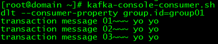


#### ④查看死信主题

```shell
kafka-topics.sh --bootstrap-server 192.168.200.100:7000,192.168.200.100:8000,192.168.200.100:9000 --list
```

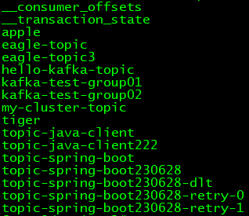
