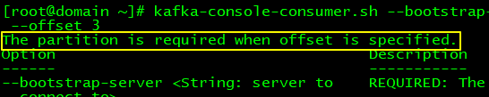
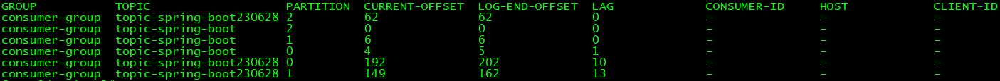

# 15-消费端指定偏移量

## 一、说明

消费端接收消息时，默认情况是按照分区中的Offset顺序接收，但也可以由我们指定Offset。


## 二、命令参数

### 1、当前版本

命令还是kafka-console-consumer.sh，参数说明如下：

| 参数               | 说明                                                         |
| ------------------ | ------------------------------------------------------------ |
| --offset earliest  | 本次从Offset最小值开始消费，有可能导致消息重复投递           |
| --offset latest    | 本次从最新的消息开始消费，而不会考虑之前已经消费的消息，可能会导致消费者跳过一些历史消息<br />基于实际测试结果看到：latest指的是没有消息过的消息中最新的消息 |
| --offset  非负整数 | 本次从非负整数指定的位置开始消费                             |

<span style="color:blue;font-weight:bolder;">注意</span>：当offset被指定时，必须指定Partition




### 2、旧版本

以Kafka 3.5.1版本为例：

| 参数                   | 说明                                                         |
| ---------------------- | ------------------------------------------------------------ |
| --to-earliest          | 本次从Offset最小值开始消费，有可能导致消息重复投递           |
| --to-latest            | 本次从最新的消息开始消费，而不会考虑之前已经消费的消息，可能会导致消费者跳过一些历史消息 |
| --to-current           | current意思是当前，这里指当前已经提交的最新Offset            |
| --to-offset 非负整数值 | 本次从非负整数指定的位置开始消费                             |
| --execute              | 上面的参数只是设定方案，必须再带上--execute才表示执行方案    |


## 三、命令行测试

### 1、测试--offset earliest

```shell
kafka-console-consumer.sh \
--bootstrap-server 192.168.200.100:7000,192.168.200.100:8000,192.168.200.100:9000 \
--topic topic-spring-boot \
--offset earliest \
--partition 0
```


### 2、测试--offset latest

```shell
kafka-console-consumer.sh \
--bootstrap-server 192.168.200.100:7000,192.168.200.100:8000,192.168.200.100:9000 \
--topic topic-spring-boot \
--offset latest \
--partition 0
```


### 3、测试--offset  非负整数

```
kafka-console-consumer.sh \
--bootstrap-server 192.168.200.100:7000,192.168.200.100:8000,192.168.200.100:9000 \
--topic topic-spring-boot \
--offset 0 \
--partition 0
```


### 4、消费者组查看偏移量

```shell
kafka-consumer-groups.sh \
--bootstrap-server 192.168.200.100:7000,192.168.200.100:8000,192.168.200.100:9000 \
--describe \
--group consumer-group
```



- CURRENT-OFFSET：已提交消息的Offset
- LOG-END-OFFSET：生产者发送的最新消息的Offset
- LAG：上述两项之间的差距


## 四、SpringBoot整合环境

### 1、示例代码

```java
@KafkaListener(topicPartitions = {
    @TopicPartition(
        topic = "topic-spring-boot230628",
        partitionOffsets = {
            @PartitionOffset(partition = "0", initialOffset = "0"),
            @PartitionOffset(partition = "1", initialOffset = "50"),
            @PartitionOffset(partition = "2", initialOffset = "0", relativeToCurrent = "true")
        }
    )
})
public void simpleConsumerPartition(ConsumerRecord<String, String> record, Acknowledgment acknowledgment) {
    System.out.println(record.partition() + " " + record.offset() + " " + record.value());

    // 消息处理完成后，手动提交
    acknowledgment.acknowledge();
}
```


### 2、注解属性说明

- relativeToCurrent
  - true：以当前已提交Offset为基准
  - false：默认值，以0为基准
- initialOffset：在relativeToCurrent指定基准的基础上，指定一个偏移量