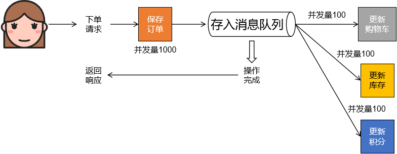

# 16-消费端限流

## 一、消息队列削峰限流



削峰填谷：


## 二、实现方式

设置@KafkaListener注解的concurrency属性：

```java
	/**
	 * Override the container factory's {@code concurrency} setting for this listener. May
	 * be a property placeholder or SpEL expression that evaluates to a {@link Number}, in
	 * which case {@link Number#intValue()} is used to obtain the value.
	 * <p>SpEL {@code #{...}} and property place holders {@code ${...}} are supported.
	 * @return the concurrency.
	 * @since 2.2
	 */
	String concurrency() default "";
```


concurrency属性设置的是消费端从消息队列取回消息时，并发的线程数量：

```java
@KafkaListener(topics = {"topic-spring-boot230628"}, concurrency = "3")
```

