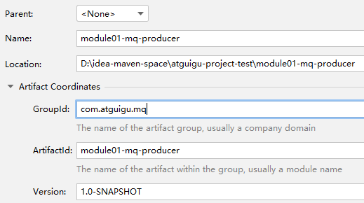
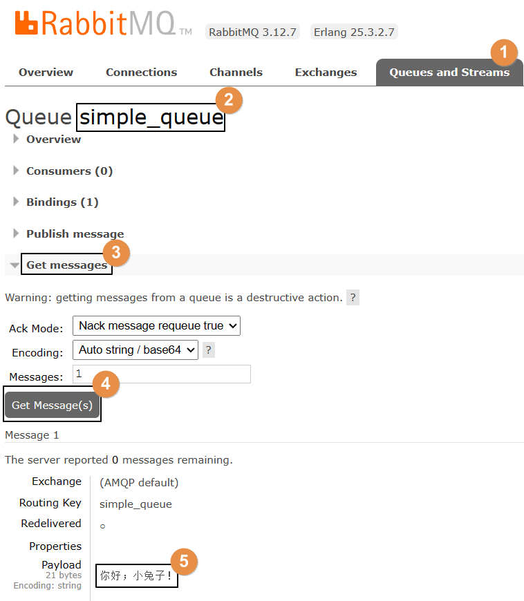
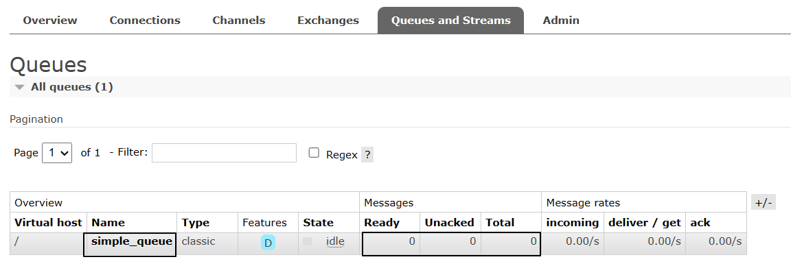

# 02-Hello RabbitMQ

## 一、目标

生产者发送消息，消费者接收消息，用最简单的方式实现<br/>

官网说明参见下面超链接：<br/>

[RabbitMQ tutorial - "Hello World!" — RabbitMQ](https://www.rabbitmq.com/tutorials/tutorial-one-java.html)


![(P) -> [|||] -> (C)](assets/02/python-one.png)


## 二、具体操作

### 1、创建Java工程

#### ①消息发送端（生产者）




<br/>


#### ②消息接收端


<br/>


#### ③添加依赖

```xml
<dependencies>
    <dependency>
        <groupId>com.rabbitmq</groupId>
        <artifactId>amqp-client</artifactId>
        <version>5.20.0</version>
    </dependency>
</dependencies>
```


<br/>


### 2、发送消息

#### ①Java代码

不用客气，整个代码全部复制——当然，连接信息改成你自己的：

```java
import com.rabbitmq.client.Channel;  
import com.rabbitmq.client.Connection;  
import com.rabbitmq.client.ConnectionFactory;  
  
public class Producer {  
  
    public static void main(String[] args) throws Exception {  
  
        // 创建连接工厂  
        ConnectionFactory connectionFactory = new ConnectionFactory();  
  
        // 设置主机地址  
        connectionFactory.setHost("192.168.200.100");  
  
        // 设置连接端口号：默认为 5672
        connectionFactory.setPort(5672);
  
        // 虚拟主机名称：默认为 /
        connectionFactory.setVirtualHost("/");
  
        // 设置连接用户名；默认为guest  
        connectionFactory.setUsername("guest");
  
        // 设置连接密码；默认为guest  
        connectionFactory.setPassword("123456");
  
        // 创建连接  
        Connection connection = connectionFactory.newConnection();  
  
        // 创建频道  
        Channel channel = connection.createChannel();  
  
        // 声明（创建）队列  
        // queue      参数1：队列名称  
        // durable    参数2：是否定义持久化队列，当 MQ 重启之后还在  
        // exclusive  参数3：是否独占本次连接。若独占，只能有一个消费者监听这个队列且 Connection 关闭时删除这个队列  
        // autoDelete 参数4：是否在不使用的时候自动删除队列，也就是在没有Consumer时自动删除  
        // arguments  参数5：队列其它参数  
        channel.queueDeclare("simple_queue", true, false, false, null);  
  
        // 要发送的信息  
        String message = "你好；小兔子！";  
  
        // 参数1：交换机名称,如果没有指定则使用默认Default Exchange  
        // 参数2：路由key,简单模式可以传递队列名称  
        // 参数3：配置信息  
        // 参数4：消息内容  
        channel.basicPublish("", "simple_queue", null, message.getBytes());  
  
        System.out.println("已发送消息：" + message);  
  
        // 关闭资源  
        channel.close();  
        connection.close();  
    }  
}
```


#### ②查看效果





### 3、接收消息

#### ①Java代码

不用客气，整个代码全部复制——当然，连接信息改成你自己的：

```java
import com.rabbitmq.client.*;  
  
import java.io.IOException;  
  
public class Consumer {  
  
    public static void main(String[] args) throws Exception {  
  
        // 1.创建连接工厂  
        ConnectionFactory factory = new ConnectionFactory();  
  
        // 2. 设置参数  
        factory.setHost("192.168.200.100");  
        factory.setPort(5672);  
        factory.setVirtualHost("/");  
        factory.setUsername("guest");
        factory.setPassword("123456");  
  
        // 3. 创建连接 Connection        
        Connection connection = factory.newConnection();  
  
        // 4. 创建Channel  
        Channel channel = connection.createChannel();  
  
        // 5. 创建队列  
        // 如果没有一个名字叫simple_queue的队列，则会创建该队列，如果有则不会创建  
        // 参数1. queue：队列名称  
        // 参数2. durable：是否持久化。如果持久化，则当MQ重启之后还在  
        // 参数3. exclusive：是否独占。  
        // 参数4. autoDelete：是否自动删除。当没有Consumer时，自动删除掉  
        // 参数5. arguments：其它参数。  
        channel.queueDeclare("simple_queue",true,false,false,null);  
  
        // 接收消息  
        DefaultConsumer consumer = new DefaultConsumer(channel){  
  
            // 回调方法,当收到消息后，会自动执行该方法  
            // 参数1. consumerTag：标识  
            // 参数2. envelope：获取一些信息，交换机，路由key...  
            // 参数3. properties：配置信息  
            // 参数4. body：数据  
            @Override  
            public void handleDelivery(String consumerTag, Envelope envelope, AMQP.BasicProperties properties, byte[] body) throws IOException {  
  
                System.out.println("consumerTag："+consumerTag);  
                System.out.println("Exchange："+envelope.getExchange());  
                System.out.println("RoutingKey："+envelope.getRoutingKey());  
                System.out.println("properties："+properties);  
                System.out.println("body："+new String(body));  
            }  
        };  
  
        // 参数1. queue：队列名称  
        // 参数2. autoAck：是否自动确认，类似咱们发短信，发送成功会收到一个确认消息  
        // 参数3. callback：回调对象  
        // 消费者类似一个监听程序，主要是用来监听消息  
        channel.basicConsume("simple_queue",true,consumer);  
    }  
}
```


#### ②控制台打印

> consumerTag：amq.ctag-8EB87GaZFP52LKSMcj98UA
> Exchange：
> RoutingKey：simple_queue
> properties：#contentHeader<basic>(content-type=null, content-encoding=null, headers=null, delivery-mode=null, priority=null, correlation-id=null, reply-to=null, expiration=null, message-id=null, timestamp=null, type=null, user-id=null, app-id=null, cluster-id=null)
> body：<span style="color:blue;font-weight:bolder;">你好；小兔子！</span>


#### ③查看后台管理界面

因为消息被消费掉了，所以RabbitMQ服务器上没有了：

