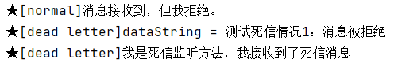
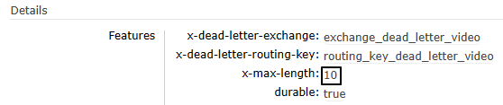
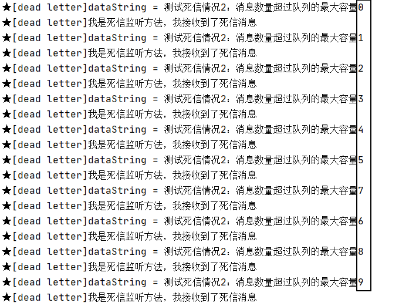
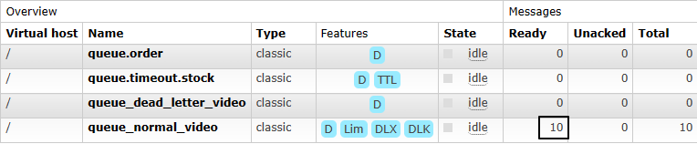
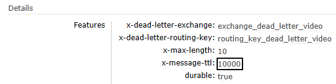
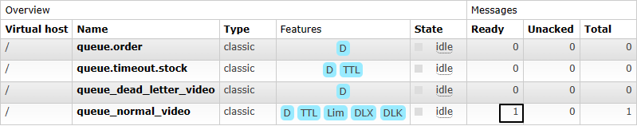
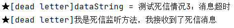

# 11-死信

## 一、测试相关准备

- 正常交换机：exchange_normal_video
- 正常队列：queue_normal_video
- 正常路由键：routing_key_normal_video


- 死信交换机：exchange_dead_letter_video
- 死信队列：queue_dead_letter_video
- 死信路由键：routing_key_dead_letter_video

```java
public static final String EXCHANGE_NORMAL = "exchange_normal_video";  
public static final String EXCHANGE_DEAD_LETTER = "exchange_dead_letter_video";  
  
public static final String ROUTING_KEY_NORMAL = "routing_key_normal_video";  
public static final String ROUTING_KEY_DEAD_LETTER = "routing_key_dead_letter_video";  
  
public static final String QUEUE_NORMAL = "queue_normal_video";  
public static final String QUEUE_DEAD_LETTER = "queue_dead_letter_video";
```


## 二、消费端拒收消息

### 1、发送消息的代码

```java
@Test  
public void testSendMessageButReject() {  
    rabbitTemplate  
            .convertAndSend(  
                    EXCHANGE_NORMAL,  
                    ROUTING_KEY_NORMAL,  
                    "测试死信情况1：消息被拒绝");  
}
```


### 2、接收消息的代码

```java
@RabbitListener(bindings = @QueueBinding(  
    value = @Queue(  
            value = QUEUE_NORMAL,  
            durable = "true",  
            autoDelete = "false",  
  
            // 在参数中进行设定：把死信转入死信队列
            arguments = {  
                @Argument(name = "x-dead-letter-exchange", value = EXCHANGE_DEAD_LETTER),  
                @Argument(name = "x-dead-letter-routing-key", value = ROUTING_KEY_DEAD_LETTER)}),  
    exchange = @Exchange(value = EXCHANGE_NORMAL, durable = "true", autoDelete = "false"),  
    key = {ROUTING_KEY_NORMAL}
))
public void processMessageNormal(Message message, Channel channel) throws IOException {
    // 监听正常队列，但是拒绝消息
    log.info("★[normal]消息接收到，但我拒绝。");
    channel.basicReject(message.getMessageProperties().getDeliveryTag(), false);
}
```

```java
@RabbitListener(bindings = @QueueBinding(  
        value = @Queue(value = QUEUE_DEAD_LETTER, durable = "true", autoDelete = "false"),  
        exchange = @Exchange(value = EXCHANGE_DEAD_LETTER, durable = "true", autoDelete = "false"),  
        key = {ROUTING_KEY_DEAD_LETTER}  
))  
public void processMessageDead(String dataString, Message message, Channel channel) throws IOException {  
    // 监听死信队列  
    log.info("★[dead letter]dataString = " + dataString);
    log.info("★[dead letter]我是死信监听方法，我接收到了死信消息");
    channel.basicAck(message.getMessageProperties().getDeliveryTag(), false);
}
```


### 3、执行结果




## 三、消息数量超过队列容纳极限

### 1、发送消息的代码

```java
@Test  
public void testSendMultiMessage() {  
    for (int i = 0; i < 20; i++) {  
        rabbitTemplate.convertAndSend(  
                EXCHANGE_NORMAL,  
                ROUTING_KEY_NORMAL,  
                "测试死信情况2：消息数量超过队列的最大容量" + i);  
    }  
}
```


### 2、接收消息的代码

在上一个例子的基础上，正常队列监听方法做两点修改：

- 增加一个参数设定队列容量

```java
@RabbitListener(bindings = @QueueBinding(  
    value = @Queue(  
            value = QUEUE_NORMAL,  
            durable = "true",  
            autoDelete = "false",  
  
            // 在参数中进行设定：把死信转入死信队列  
            // 设定当前队列的最大消息容量：10  
            arguments = {  
                @Argument(name = "x-dead-letter-exchange", value = EXCHANGE_DEAD_LETTER),  
                @Argument(name = "x-dead-letter-routing-key", value = ROUTING_KEY_DEAD_LETTER),  
                @Argument(name = "x-max-length", value = "10", type = "java.lang.Integer")  
            }),  
    exchange = @Exchange(value = EXCHANGE_NORMAL, durable = "true", autoDelete = "false"),  
    key = {ROUTING_KEY_NORMAL}  
))  
public void processMessageNormal(Message message, Channel channel) throws IOException {  
    // 监听正常队列
    System.out.println("★[normal]消息接收到。");  
    channel.basicAck(message.getMessageProperties().getDeliveryTag(), false);  
}
```


### 3、测试方式

- 在RabbitMQ管理界面上删除我们要修改参数的队列
- 重启消费端程序，确认RabbitMQ服务器上的队列已经设定了新的参数
- 在消费端程序代码中注释掉监听方法，再次重启消费端程序——也就是说此时没有监听程序了
- 让生产者发送消息


### 4、执行效果

<p>正常队列的参数如下图所示：</p>




<p>生产者发送20条消息之后，消费端死信队列接收到前10条消息：</p>




剩下10条消息留在队列中，等待被取走：




## 四、消息超时未消费

### 1、发送消息的代码

正常发送一条消息即可，所以使用第一个例子的代码。

```java
@Test  
public void testSendMessageButReject() {  
    rabbitTemplate  
            .convertAndSend(  
                    EXCHANGE_NORMAL,  
                    ROUTING_KEY_NORMAL,  
                    "测试死信情况3：消息超时");  
}
```


### 2、接收消息的代码

<p>把上一个例子的监听方法注释打开，给队列添加一个参数：设置队列中消息的超时时间。</p>

```java
@Argument(name = "x-message-ttl", value = "10000", type = "java.lang.Integer")
```


### 3、测试方式

- 在RabbitMQ管理界面上删除我们要修改参数的队列
- 重启消费端程序，确认RabbitMQ服务器上的队列已经设定了新的参数
- 在消费端程序代码中注释掉监听方法，再次重启消费端程序——也就是说此时没有监听程序了
- 让生产者发送消息


### 4、执行效果

队列参数生效：




<p>因为没有消费端监听程序，所以消息未超时前滞留在队列中：</p>




消息超时后，进入死信队列：



