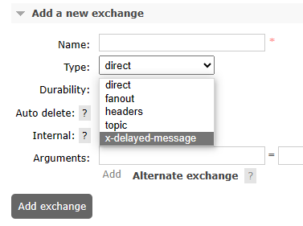
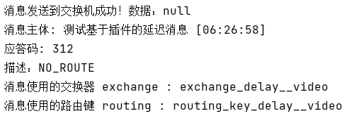
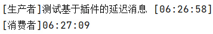

# 12-延迟插件

## 一、插件安装

### 1、确定卷映射目录

```shell
docker inspect rabbitmq
```


运行结果：

```json
        "Mounts": [
            {
                "Type": "volume",
                "Name": "rabbitmq-plugin",
                "Source": "/var/lib/docker/volumes/rabbitmq-plugin/_data",
                "Destination": "/plugins",
                "Driver": "local",
                "Mode": "z",
                "RW": true,
                "Propagation": ""
            },
            {
                "Type": "volume",
                "Name": "cca7bc3012f5b76bd6c47a49ca6911184f9076f5f6263b41f4b9434a7f269b11",
                "Source": "/var/lib/docker/volumes/cca7bc3012f5b76bd6c47a49ca6911184f9076f5f6263b41f4b9434a7f269b11/_data",
                "Destination": "/var/lib/rabbitmq",
                "Driver": "local",
                "Mode": "",
                "RW": true,
                "Propagation": ""
            }
        ]
```


和容器内/plugins目录对应的宿主机目录是：/var/lib/docker/volumes/rabbitmq-plugin/_data


### 2、下载延迟插件

官方文档说明页地址：https://www.rabbitmq.com/community-plugins.html


下载插件安装文件：

```shell
cd /opt
wget https://github.com/rabbitmq/rabbitmq-delayed-message-exchange/releases/download/v3.12.0/rabbitmq_delayed_message_exchange-3.12.0.ez
mv rabbitmq_delayed_message_exchange-3.12.0.ez /var/lib/docker/volumes/rabbitmq-plugin/_data
```


### 3、启用插件

```shell
# 登录进入容器内部
docker exec -it rabbitmq /bin/bash

# rabbitmq-plugins命令所在目录已经配置到$PATH环境变量中了，可以直接调用
rabbitmq-plugins enable rabbitmq_delayed_message_exchange

# 退出Docker容器
exit

# 重启Docker容器
docker restart rabbitmq
```


### 4、确认

如果创建新交换机时可以在type中看到x-delayed-message选项，那就说明插件安装好了




## 二、代码测试

### 1、生产者端代码

```java
@Test  
public void testSendDelayMessage() {  
    rabbitTemplate.convertAndSend(  
            EXCHANGE_DELAY,   
            ROUTING_KEY_DELAY,   
            "测试基于插件的延迟消息 [" + new SimpleDateFormat("hh:mm:ss").format(new Date()) + "]",   
            messageProcessor -> {  
  
        // 设置延迟时间  
        messageProcessor.getMessageProperties().setDelay(10 * 1000);  
          
        return messageProcessor;  
    });  
}
```


### 2、消费者端代码

```java  
import com.rabbitmq.client.Channel;
import lombok.extern.slf4j.Slf4j;
import org.springframework.amqp.core.Message;  
import org.springframework.amqp.rabbit.annotation.*;  
import org.springframework.stereotype.Component;  
  
import java.io.IOException;  
import java.text.SimpleDateFormat;  
import java.util.Date;  
  
@Component  
@Slf4j
public class MyDelayMessageListener {  
  
    public static final String EXCHANGE_DELAY = "exchange_delay__video";  
    public static final String ROUTING_KEY_DELAY = "routing_key_delay__video";  
    public static final String QUEUE_DELAY = "queue_delay__video";  
  
    @RabbitListener(bindings = @QueueBinding(  
        value = @Queue(value = QUEUE_DELAY, durable = "true", autoDelete = "false"),  
        exchange = @Exchange(  
                value = EXCHANGE_DELAY,   
                durable = "true",   
                autoDelete = "false",   
                type = "x-delayed-message",   
                arguments = @Argument(name = "x-delayed-type", value = "direct")),  
        key = {ROUTING_KEY_DELAY}  
    ))  
    public void process(String dataString, Message message, Channel channel) throws IOException {  
        log.info("[生产者]" + dataString);  
        log.info("[消费者]" + new SimpleDateFormat("hh:mm:ss").format(new Date()));  
        channel.basicAck(message.getMessageProperties().getDeliveryTag(), false);  
    }  
  
}
```


### 3、执行效果

#### ①交换机类型


#### ②生产者端效果




#### ③消费者端效果


