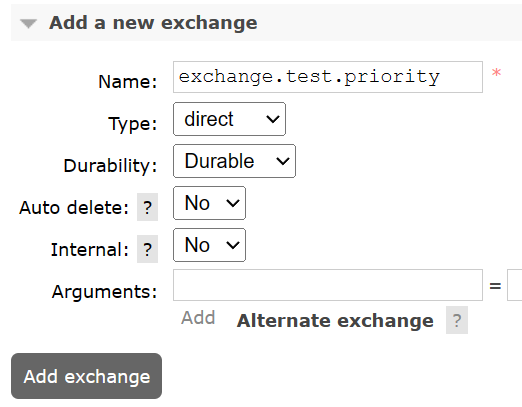
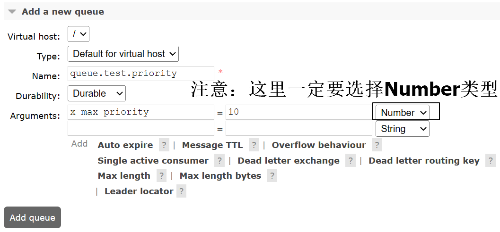
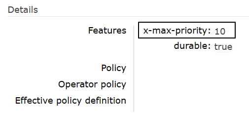
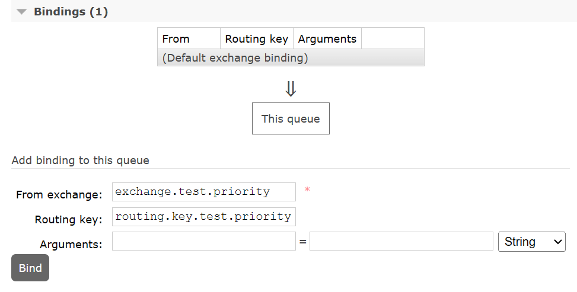
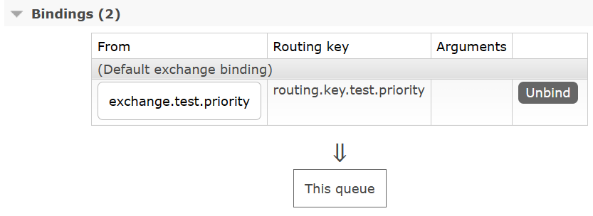

# 15-优先级队列

## 一、创建相关资源

### 1、创建交换机

exchange.test.priority




### 2、创建队列

queue.test.priority

x-max-priority







### 3、队列绑定交换机







## 二、生产者发送消息

### 1、配置POM

```xml
<parent>
    <groupId>org.springframework.boot</groupId>
    <artifactId>spring-boot-starter-parent</artifactId>
    <version>3.1.5</version>
</parent>

<dependencies>
    <dependency>
        <groupId>org.springframework.boot</groupId>
        <artifactId>spring-boot-starter-amqp</artifactId>
    </dependency>
    <dependency>
        <groupId>org.springframework.boot</groupId>
        <artifactId>spring-boot-starter-test</artifactId>
    </dependency>
    <dependency>
        <groupId>org.projectlombok</groupId>
        <artifactId>lombok</artifactId>
    </dependency>
</dependencies>
```


### 2、配置YAML

```yaml
spring:
  rabbitmq:
    host: 192.168.200.100
    port: 5672
    username: guest
    password: 123456
    virtual-host: /
```


### 3、主启动类

```java
import org.springframework.boot.SpringApplication;
import org.springframework.boot.autoconfigure.SpringBootApplication;

@SpringBootApplication
public class RabbitMQPriorityProducer {

    public static void main(String[] args) {
        SpringApplication.run(RabbitMQPriorityProducer.class, args);
    }

}
```


### 4、发送消息

- 不要启动消费者程序，让多条不同优先级的消息滞留在队列中
- 第一次发送优先级为1的消息
- 第二次发送优先级为2的消息
- 第三次发送优先级为3的消息
- 先发送的消息优先级低，后发送的消息优先级高，将来看看消费端是不是先收到优先级高的消息

#### ①第一次发送优先级为1的消息

```java
package com.atguigu.mq.test;

import jakarta.annotation.Resource;
import org.junit.jupiter.api.Test;
import org.springframework.amqp.rabbit.core.RabbitTemplate;
import org.springframework.boot.test.context.SpringBootTest;

@SpringBootTest
public class RabbitMQTest {

    public static final String EXCHANGE_PRIORITY = "exchange.test.priority";
    public static final String ROUTING_KEY_PRIORITY = "routing.key.test.priority";

    @Resource
    private RabbitTemplate rabbitTemplate;

    @Test
    public void testSendMessage() {
        rabbitTemplate.convertAndSend(EXCHANGE_PRIORITY, ROUTING_KEY_PRIORITY, "I am a message with priority 1.", message->{
            message.getMessageProperties().setPriority(1);
            return message;
        });
    }

}
```


#### ②第二次发送优先级为2的消息

```java
@Test
public void testSendMessage() {
    rabbitTemplate.convertAndSend(EXCHANGE_PRIORITY, ROUTING_KEY_PRIORITY, "I am a message with priority 2.", message->{
        message.getMessageProperties().setPriority(2);
        return message;
    });
}
```


#### ③第三次发送优先级为3的消息

```java
@Test
public void testSendMessage() {
    rabbitTemplate.convertAndSend(EXCHANGE_PRIORITY, ROUTING_KEY_PRIORITY, "I am a message with priority 3.", message->{
        message.getMessageProperties().setPriority(3);
        return message;
    });
}
```


## 三、消费端接收消息

### 1、配置POM

```xml
<parent>
    <groupId>org.springframework.boot</groupId>
    <artifactId>spring-boot-starter-parent</artifactId>
    <version>3.1.5</version>
</parent>

<dependencies>
    <dependency>
        <groupId>org.springframework.boot</groupId>
        <artifactId>spring-boot-starter-amqp</artifactId>
    </dependency>
    <dependency>
        <groupId>org.springframework.boot</groupId>
        <artifactId>spring-boot-starter-web</artifactId>
    </dependency>
    <dependency>
        <groupId>org.projectlombok</groupId>
        <artifactId>lombok</artifactId>
    </dependency>
</dependencies>
```


### 2、配置YAML

```yaml
spring:
  rabbitmq:
    host: 192.168.200.100
    port: 5672
    username: guest
    password: 123456
    virtual-host: /
```


### 3、主启动类

```java
package com.atguigu.mq;

import org.springframework.boot.SpringApplication;
import org.springframework.boot.autoconfigure.SpringBootApplication;

@SpringBootApplication
public class RabbitMQPriorityConsumer {

    public static void main(String[] args) {
        SpringApplication.run(RabbitMQPriorityConsumer.class, args);
    }

}
```


### 4、监听器

```java
import com.rabbitmq.client.Channel;
import lombok.extern.slf4j.Slf4j;
import org.springframework.amqp.core.Message;
import org.springframework.amqp.rabbit.annotation.*;
import org.springframework.stereotype.Component;

@Slf4j
@Component
public class MyMessageProcessor {

    public static final String EXCHANGE_PRIORITY = "exchange.test.priority";
    public static final String ROUTING_KEY_PRIORITY = "routing.key.test.priority";
    public static final String QUEUE_PRIORITY = "queue.test.priority";

    @RabbitListener(bindings = @QueueBinding(
            value = @Queue(value = QUEUE_PRIORITY, durable = "true", autoDelete = "false"),
            exchange = @Exchange(value = EXCHANGE_PRIORITY, durable = "true", autoDelete = "false"),
            key = {ROUTING_KEY_PRIORITY}
    ))
    public void processMessage(String data, Message message, Channel channel) {
        log.info(data);
    }

}
```


### 5、测试效果

对于已经滞留服务器的消息，只要消费端一启动，就能够收到消息队列的投递，打印效果如下：

