# 16-RabbitMQ集群

## 一、集群搭建

### 1、Docker版本确认

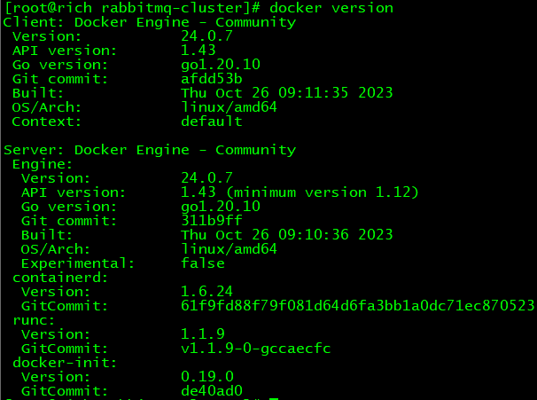


### 2、创建运行集群实例的Docker容器

```shell
docker run -d \
--name rmq-clu-01 \
--hostname node01 \
-p 1000:5672 \
-p 1100:15672 \
-v rmq-clu-01-plugin:/plugins \
-v rmq-clu-01-config:/etc \
-v rmq-clu-cookie:/var/lib/rabbitmq \
-e RABBITMQ_DEFAULT_USER=guest \
-e RABBITMQ_DEFAULT_PASS=123456 \
rabbitmq:3.12-management

docker run -d \
--name rmq-clu-02 \
--hostname node02 \
-p 2000:5672 \
-p 2100:15672 \
-v rmq-clu-02-plugin:/plugins \
-v rmq-clu-02-config:/etc \
-v rmq-clu-cookie:/var/lib/rabbitmq \
-e RABBITMQ_DEFAULT_USER=guest \
-e RABBITMQ_DEFAULT_PASS=123456 \
--link rmq-clu-01:node01 \
rabbitmq:3.12-management

docker run -d \
--name rmq-clu-03 \
--hostname node03 \
-p 3000:5672 \
-p 3100:15672 \
-v rmq-clu-03-plugin:/plugins \
-v rmq-clu-03-config:/etc \
-v rmq-clu-cookie:/var/lib/rabbitmq \
-e RABBITMQ_DEFAULT_USER=guest \
-e RABBITMQ_DEFAULT_PASS=123456 \
--link rmq-clu-01:node01 \
--link rmq-clu-02:node02 \
rabbitmq:3.12-management
```


参数说明：

| 参数名称                            | 参数说明                                         |
| ----------------------------------- | ------------------------------------------------ |
| -v rmq-clu-cookie:/var/lib/rabbitmq | RabbitMQ要求集群中各实例使用一个相同的Cookie值   |
| --link                              | Docker容器之间建立连接，使其彼此之间可以互相通信 |


### 3、各实例加入集群

#### ①节点01中操作

```shell
# 登录到Docker容器内部
docker exec -it rmq-clu-01 /bin/bash

# 停止当前实例中的RabbitMQ服务（该服务在RabbitMQ内部被称为rabbit应用）
rabbitmqctl stop_app

# 重置rabbit应用
rabbitmqctl reset

# 启动rabbit应用
rabbitmqctl start_app

# 退出Docker容器
exit
```


#### ②节点02中操作

```shell
# 登录到Docker容器内部
docker exec -it rmq-clu-02 /bin/bash

# 停止当前实例中的RabbitMQ服务（该服务在RabbitMQ内部被称为rabbit应用）
rabbitmqctl stop_app

# 重置rabbit应用
rabbitmqctl reset

# 加入集群
# rabbit是应用名
# node01是集群实例中的某个节点名
rabbitmqctl join_cluster rabbit@node01

# 启动rabbit应用
rabbitmqctl start_app

# 退出Docker容器
exit
```


#### ③节点03中操作

```shell
# 登录到Docker容器内部
docker exec -it rmq-clu-03 /bin/bash

# 停止当前实例中的RabbitMQ服务（该服务在RabbitMQ内部被称为rabbit应用）
rabbitmqctl stop_app

# 重置rabbit应用
rabbitmqctl reset

# 加入集群
# rabbit是应用名
# node01是集群实例中的某个节点名
rabbitmqctl join_cluster rabbit@node01

# 启动rabbit应用
rabbitmqctl start_app

# 查看集群状态
rabbitmqctl cluster_status

# 退出Docker容器
exit
```


如果一切顺利，那么会看到集群状态如下：

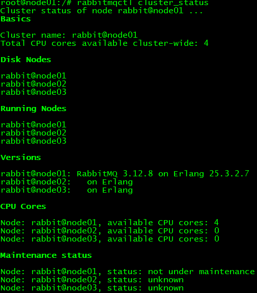


### 4、登录Management UI

使用创建容器时指定的账号、密码：

- 账号：guest
- 密码：123456


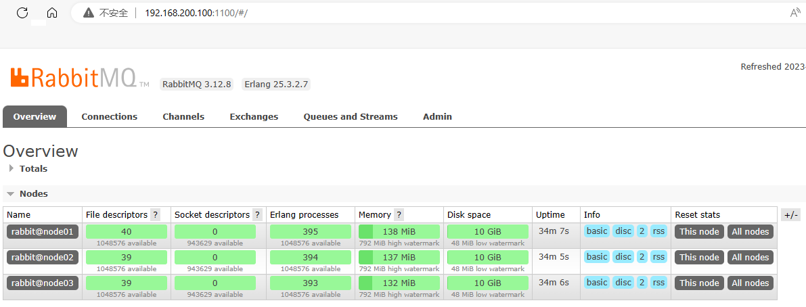


### 5、把节点从集群中踢出

<span style="color:blue;font-weight:bolder;">注意</span>：有需要的时候再操作

以节点2为例：

```shell
# 登录节点2所在Docker容器
docker exec -it rmq-clu-02 /bin/bash
rabbitmqctl stop_app
rabbitmqctl reset
rabbitmqctl start_app
exit

# 登录节点1所在Docker容器
docker exec -it rmq-clu-01 /bin/bash
rabbitmqctl forget_cluster_node rabbit@node02
```


## 二、负载均衡：Management UI

### 1、说明

- 其实访问任何一个RabbitMQ实例的管理界面都是对集群操作，所以配置负载均衡通过统一入口访问在我们学习期间就是锦上添花
- 先给管理界面做负载均衡，然后方便我们在管理界面上创建交换机、队列等操作


### 2、安装HAProxy

```shell
yum install -y haproxy
haproxy -v
systemctl start haproxy
systemctl enable haproxy
```

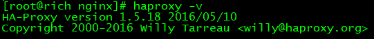


### 3、修改配置文件

配置文件位置：

> /etc/haproxy/haproxy.cfg


在配置文件末尾增加如下内容：

> frontend rabbitmq_ui_frontend
>   bind 192.168.200.100:22222
>   mode http
>   default_backend rabbitmq_ui_backend
>
> backend rabbitmq_ui_backend
>   mode http
>   balance roundrobin
>   option httpchk GET /
>   server rabbitmq_ui1 192.168.200.100:1100 check
>   server rabbitmq_ui2 192.168.200.100:2100 check
>   server rabbitmq_ui3 192.168.200.100:3100 check


设置SELinux策略，允许HAProxy拥有权限连接任意端口：

```shell
setsebool -P haproxy_connect_any=1
```

> SELinux是Linux系统中的安全模块，它可以限制进程的权限以提高系统的安全性。在某些情况下，SELinux可能会阻止HAProxy绑定指定的端口，这就需要通过设置域（domain）的安全策略来解决此问题。
>
> 通过执行`setsebool -P haproxy_connect_any=1`命令，您已经为HAProxy设置了一个布尔值，允许HAProxy连接到任意端口。这样，HAProxy就可以成功绑定指定的socket，并正常工作。
>


重启HAProxy：

```shell
systemctl restart haproxy
```


### 4、测试效果

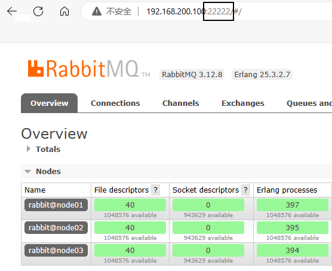


## 三、负载均衡：核心功能

### 1、增加配置

> frontend rabbitmq_frontend
>   bind 192.168.200.100:11111
>   mode tcp
>   default_backend rabbitmq_backend
>
> backend rabbitmq_backend
>   mode tcp
>   balance roundrobin
>   server rabbitmq1 192.168.200.100:1000 check
>   server rabbitmq2 192.168.200.100:2000 check
>   server rabbitmq3 192.168.200.100:3000 check


重启HAProxy服务：

```shell
systemctl restart haproxy
```


### 3、测试

#### ①创建组件

- 交换机：exchange.cluster.test
- 队列：queue.cluster.test
- 路由键：routing.key.cluster.test


#### ②创建生产者端程序

##### [1]配置POM

```xml
<parent>
    <groupId>org.springframework.boot</groupId>
    <artifactId>spring-boot-starter-parent</artifactId>
    <version>3.1.5</version>
</parent>

<dependencies>
    <dependency>
        <groupId>org.springframework.boot</groupId>
        <artifactId>spring-boot-starter-amqp</artifactId>
    </dependency>
    <dependency>
        <groupId>org.springframework.boot</groupId>
        <artifactId>spring-boot-starter-test</artifactId>
    </dependency>
    <dependency>
        <groupId>org.projectlombok</groupId>
        <artifactId>lombok</artifactId>
    </dependency>
</dependencies>
```


##### [2]主启动类

```java
import org.springframework.boot.SpringApplication;  
import org.springframework.boot.autoconfigure.SpringBootApplication;  
  
@SpringBootApplication
public class RabbitMQProducerMainType {

    public static void main(String[] args) {
        SpringApplication.run(RabbitMQProducerMainType.class, args);
    }

}
```


##### [3]配置YAML

```yaml
spring:
  rabbitmq:
    host: 192.168.200.100
    port: 11111
    username: guest
    password: 123456
    virtual-host: /
    publisher-confirm-type: CORRELATED # 交换机的确认
    publisher-returns: true # 队列的确认
logging:
  level:
    com.atguigu.mq.config.MQProducerAckConfig: info
```


##### [4]配置类

```java
import jakarta.annotation.PostConstruct;
import lombok.extern.slf4j.Slf4j;
import org.springframework.amqp.core.ReturnedMessage;
import org.springframework.amqp.rabbit.connection.CorrelationData;
import org.springframework.amqp.rabbit.core.RabbitTemplate;
import org.springframework.beans.factory.annotation.Autowired;
import org.springframework.context.annotation.Configuration;

@Configuration
@Slf4j
public class MQProducerAckConfig implements RabbitTemplate.ConfirmCallback, RabbitTemplate.ReturnsCallback{

    @Autowired
    private RabbitTemplate rabbitTemplate;

    @PostConstruct
    public void init() {
        rabbitTemplate.setConfirmCallback(this);
        rabbitTemplate.setReturnsCallback(this);
    }

    @Override
    public void confirm(CorrelationData correlationData, boolean ack, String cause) {
        if (ack) {
            log.info("消息发送到交换机成功！数据：" + correlationData);
        } else {
            log.info("消息发送到交换机失败！数据：" + correlationData + " 原因：" + cause);
        }
    }

    @Override
    public void returnedMessage(ReturnedMessage returned) {
        log.info("消息主体: " + new String(returned.getMessage().getBody()));
        log.info("应答码: " + returned.getReplyCode());
        log.info("描述：" + returned.getReplyText());
        log.info("消息使用的交换器 exchange : " + returned.getExchange());
        log.info("消息使用的路由键 routing : " + returned.getRoutingKey());
    }
}
```


##### [5] Junit测试类

```java
import jakarta.annotation.Resource;
import org.junit.jupiter.api.Test;
import org.springframework.amqp.rabbit.core.RabbitTemplate;
import org.springframework.boot.test.context.SpringBootTest;

@SpringBootTest
public class RabbitMQTest {

    @Resource
    private RabbitTemplate rabbitTemplate;

    public static final String EXCHANGE_CLUSTER_TEST = "exchange.cluster.test";
    public static final String ROUTING_KEY_CLUSTER_TEST = "routing.key.cluster.test";

    @Test
    public void testSendMessage() {
        rabbitTemplate.convertAndSend(EXCHANGE_CLUSTER_TEST, ROUTING_KEY_CLUSTER_TEST, "message test cluster~~~");
    }

}
```


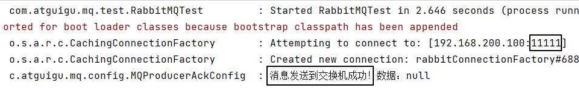


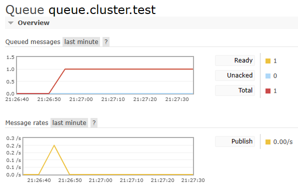


#### ③创建消费端程序

##### [1]配置POM

```xml
<parent>
    <groupId>org.springframework.boot</groupId>
    <artifactId>spring-boot-starter-parent</artifactId>
    <version>3.1.5</version>
</parent>

<dependencies>
    <dependency>
        <groupId>org.springframework.boot</groupId>
        <artifactId>spring-boot-starter-amqp</artifactId>
    </dependency>
    <dependency>
        <groupId>org.springframework.boot</groupId>
        <artifactId>spring-boot-starter-test</artifactId>
    </dependency>
    <dependency>
        <groupId>org.projectlombok</groupId>
        <artifactId>lombok</artifactId>
    </dependency>
</dependencies>
```


##### [2]主启动类

```java  
import org.springframework.boot.SpringApplication;  
import org.springframework.boot.autoconfigure.SpringBootApplication;  
  
@SpringBootApplication
public class RabbitMQProducerMainType {

    public static void main(String[] args) {
        SpringApplication.run(RabbitMQProducerMainType.class, args);
    }

}
```


##### [3]配置YAML

```yaml
spring:
  rabbitmq:
    host: 192.168.200.100
    port: 11111
    username: guest
    password: 123456
    virtual-host: /
logging:
  level:
    com.atguigu.mq.listener.MyProcessor: info
```


##### [4]监听器

```java
import com.rabbitmq.client.Channel;
import lombok.extern.slf4j.Slf4j;
import org.springframework.amqp.core.Message;
import org.springframework.amqp.rabbit.annotation.Exchange;
import org.springframework.amqp.rabbit.annotation.Queue;
import org.springframework.amqp.rabbit.annotation.QueueBinding;
import org.springframework.amqp.rabbit.annotation.RabbitListener;
import org.springframework.stereotype.Component;

@Component
@Slf4j
public class MyProcessor {

    @RabbitListener(bindings = @QueueBinding(
        value = @Queue(value = "queue.cluster.test"),
        exchange = @Exchange(value = "queue.cluster.test"),
        key = {"routing.key.cluster.test"}
    ))
    public void messageProcess(String data, Message message, Channel channel) {
        log.info("消费端：" + data);
    }

}
```


##### [5]运行效果

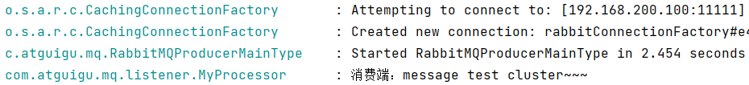


## 四、镜像队列

### 1、提出问题

现在我们创建过的队列，它是属于节点1的：

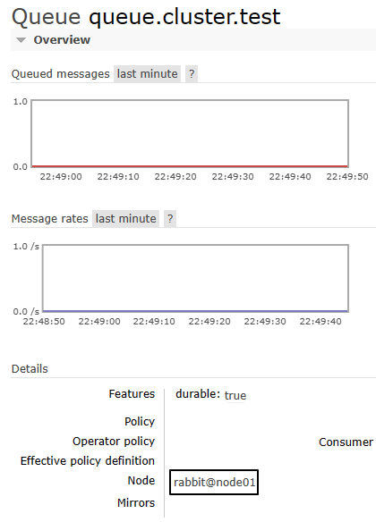


现在我们停掉节点1的rabbit应用：

```shell
# 登录Docker容器
docker exec -it rmq-clu-01 /bin/bash

# 停止rabbit应用
rabbitmqctl stop_app
```

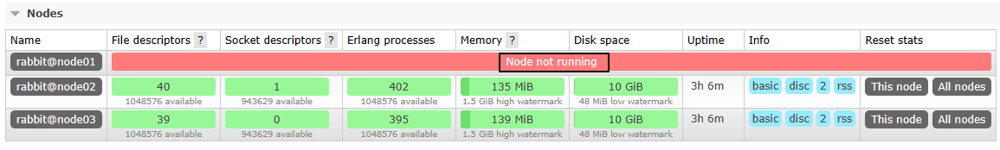


再次发送消息：

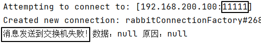


为了后续操作，再重新启动rabbit应用

```shell
rabbitmqctl start_app
```


### 2、创建策略使队列镜像化


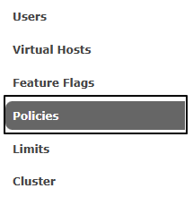


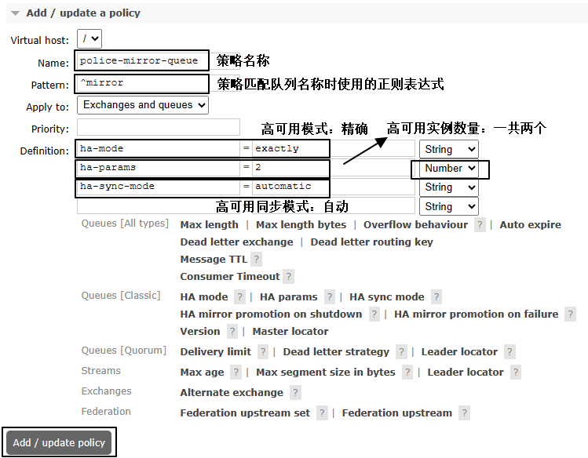


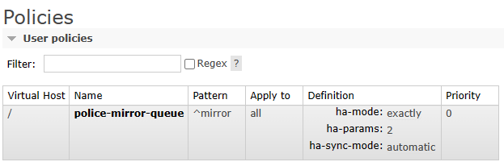


### 3、创建新的队列

<span style="color:blue;font-weight:bolder;">要求</span>：队列名称必须符合策略中指定的正则表达式

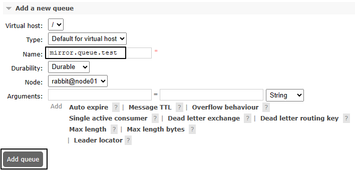


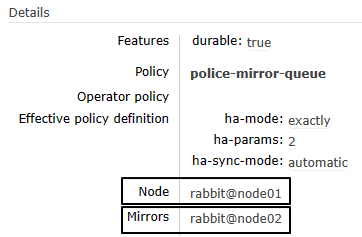


绑定交换机：

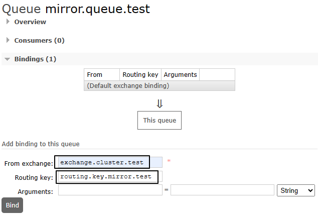


### 4、测试

节点1关闭rabbit应用

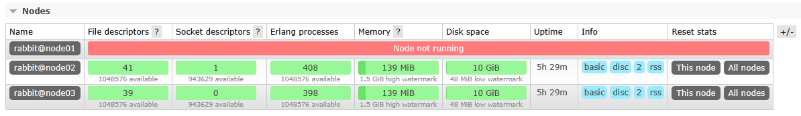


然后就发现两个镜像队列自动分布到了节点2和节点3上：

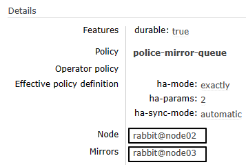


调整Java代码中的组件名称：

```java
public static final String EXCHANGE_CLUSTER_TEST = "exchange.cluster.test";
public static final String ROUTING_KEY_MIRROR_TEST = "routing.key.mirror.test";
public static final String QUEUE_MIRROR_TEST = "mirror.queue.test";
```


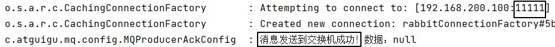


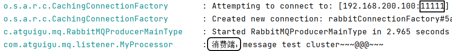

