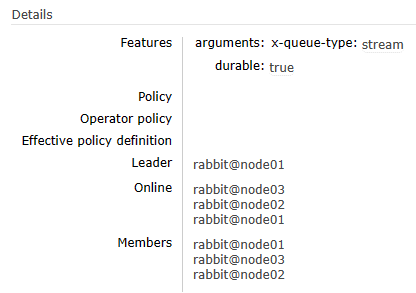
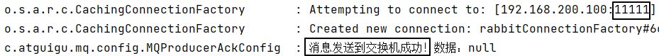
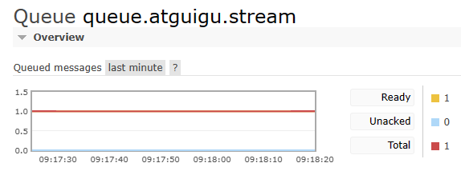
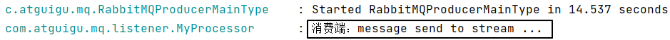
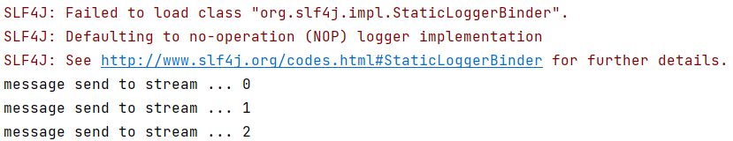
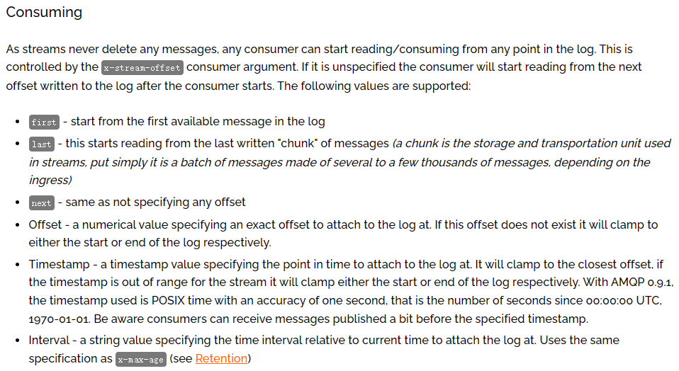
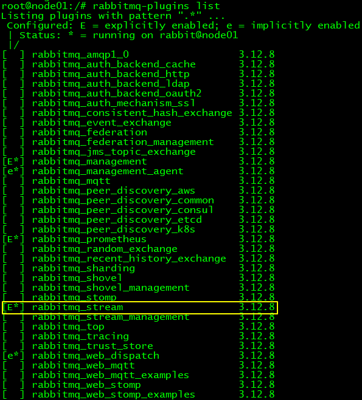

# 18-Stream Queue

## 一、按Classic Queue方式使用Stream Queue

### 1、创建交换机

- 交换机名称：exchange.atguigu.normal
- 交换机类型：direct


### 2、创建队列

- 队列名称：queue.atguigu.stream
- 队列类型：<span style="color:blue;font-weight:bolder;">Stream</span>





### 3、绑定交换机和队列

- 路由键：routing.key.atguigu.stream


### 4、生产者端发送消息

```java
public static final String EXCHANGE_ATGUIGU_NORMAL = "exchange.atguigu.normal";
public static final String ROUTING_KEY_ATGUIGU_STREAM = "routing.key.atguigu.stream";

@Test
public void testSendMessageToStream() {
    rabbitTemplate.convertAndSend(EXCHANGE_ATGUIGU_NORMAL, ROUTING_KEY_ATGUIGU_STREAM, "message send to stream ...");
}
```







### 5、消费端接收消息

```java
public static final String EXCHANGE_ATGUIGU_NORMAL = "exchange.atguigu.normal";
public static final String ROUTING_KEY_ATGUIGU_STREAM = "routing.key.atguigu.stream";
public static final String QUEUE_ATGUIGU_STREAM = "queue.atguigu.stream";

@RabbitListener(bindings = @QueueBinding(
    value = @Queue(value = QUEUE_ATGUIGU_STREAM),
    exchange = @Exchange(value = EXCHANGE_ATGUIGU_NORMAL),
    key = {ROUTING_KEY_ATGUIGU_STREAM}
))
public void messageFromStream(String data, Message message, Channel channel) {
    log.info("消费端：" + data);
}
```




## 二、指定Offset消费消息

> <span style="color:blue;font-weight:bolder;">说明</span>：此功能在SpringBoot整合环境下并不支持！需要在<span style="color:blue;font-weight:bolder;">原生API</span>环境下操作！


### 1、引入依赖

创建新的module，然后引入依赖：

```xml
<dependencies>
    <dependency>
        <groupId>com.rabbitmq</groupId>
        <artifactId>amqp-client</artifactId>
        <version>5.20.0</version>
    </dependency>
</dependencies>
```


### 2、创建消费端程序

```java
import com.rabbitmq.client.Channel;
import com.rabbitmq.client.Connection;
import com.rabbitmq.client.ConnectionFactory;

import java.util.Collections;

public class Consumer {

    public static void main(String[] args) throws Exception {

        // 1.创建连接工厂  
        ConnectionFactory factory = new ConnectionFactory();

        // 2. 设置参数  
        factory.setHost("192.168.200.100");
        factory.setPort(11111);
        factory.setVirtualHost("/");
        factory.setUsername("guest");
        factory.setPassword("123456");

        // 3. 创建连接 Connection        
        Connection connection = factory.newConnection();

        // 4. 创建Channel  
        Channel channel = connection.createChannel();

        // 5、设置 Qos 值，官方文档专门指出：必须设置
        channel.basicQos(100);

        // 6、设定消息监听
        channel.basicConsume(
                "queue.atguigu.stream", // 队列名称
                false,
                Collections.singletonMap("x-stream-offset", "first"), // 指定消费消息的起始位置
                (consumerTag, message) -> {
                    
                    // 获取当前消息的实际偏移量
                    Object offsetValue = message.getProperties().getHeaders().get("x-stream-offset");
                    
                    // 消息本身
                    String data = new String(message.getBody());

                    System.out.println(data + " " + offsetValue);
                    channel.basicAck(message.getEnvelope().getDeliveryTag(), false); // ack is required
                },
                consumerTag -> {});
    }
}
```


### 3、运行效果

每次重启消费端程序都会重新从第一条消息开始消费：




### 4、first之外的其它取值




## 三、按Stream自身方式使用Stream

### 1、启用Stream插件

> <span style="color:blue;font-weight:bolder;">说明</span>：只有启用了Stream插件，才能使用流式队列的完整功能

在集群每个节点中依次执行如下操作：

```shell
# 登录Docker容器
docker exec -it rmq-clu-01 /bin/bash

# 启用Stream插件
rabbitmq-plugins enable rabbitmq_stream

# 重启rabbit应用
rabbitmqctl stop_app
rabbitmqctl start_app

# 查看插件状态
rabbitmq-plugins list

# 退出Docker容器
exit
```




### 2、使用专门客户端

```xml
<dependencies>
    <dependency>
        <groupId>com.rabbitmq</groupId>
        <artifactId>stream-client</artifactId>
        <version>0.14.0</version>
    </dependency>
</dependencies>
```

Stream 专属 Java 客户端官方网址：https://github.com/rabbitmq/rabbitmq-stream-java-client