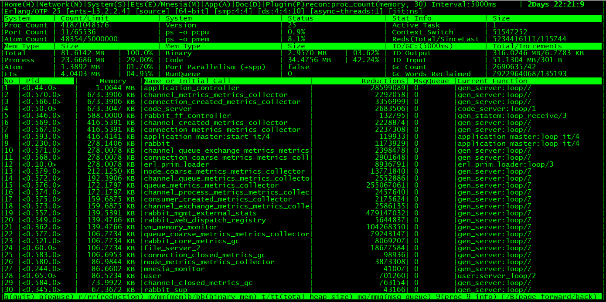
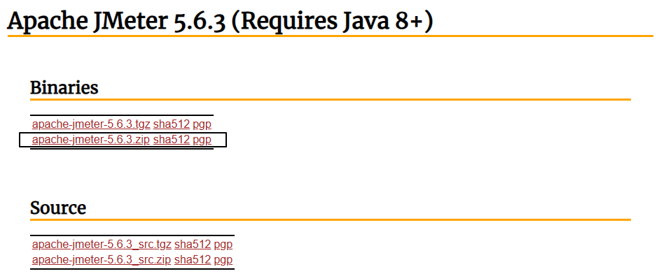
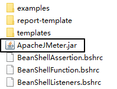
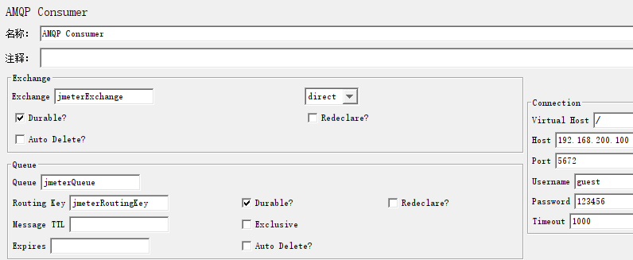

# 19-命令行查看RabbitMQ运行时状态

## 一、使用rabbitmqctl命令

### 1、概述

rabbitmqctl是一个功能非常强大的命令，几乎包含了RabbitMQ操作控制的方方面面，官方文档中它的使用方式如下：

```shell
rabbitmqctl [--node <node>] [--timeout <timeout>] [--longnames] [--quiet] <command> [<command options>]
```


它的帮助文档摘录如下：

> <span style="color:blue;font-weight:bolder;">Nodes</span>:
>
>    await_startup	Waits for the RabbitMQ application to start on the target node
>    <span style="color:blue;">reset</span>			Instructs a RabbitMQ node to leave the cluster and return to its virgin state
>    rotate_logs 	    Does nothing [deprecated]
>    shutdown  Stops RabbitMQ and its runtime (Erlang VM). Monitors progress for local nodes. Does not require a PID file path.
>    <span style="color:blue;">start_app</span>		Starts the RabbitMQ application but leaves the runtime (Erlang VM) running
>    stop 			Stops RabbitMQ and its runtime (Erlang VM). Requires a local node pid file path to monitor progress.
>    <span style="color:blue;">stop_app</span>		Stops the RabbitMQ application, leaving the runtime (Erlang VM) running
>    wait 		 Waits for RabbitMQ node startup by monitoring a local PID file. See also 'rabbitmqctl await_online_nodes'
>
> <span style="color:blue;font-weight:bolder;">Cluster</span>:
>
>    await_online_nodes                     Waits for <count> nodes to join the cluster
>    change_cluster_node_type               Changes the type of the cluster node
>    <span style="color:blue;">cluster_status</span>     Displays all the nodes in the cluster grouped by node type, together with the currently running nodes
>    force_boot                             Forces node to start even if it cannot contact or rejoin any of its previously known peers
>    force_reset                            Forcefully returns a RabbitMQ node to its virgin state
>    forget_cluster_node                    Removes a node from the cluster
>    <span style="color:blue;">join_cluster</span>                           Instructs the node to become a member of the cluster that the specified node is in
>    rename_cluster_node                    Renames cluster nodes in the local database
>    update_cluster_nodes     Instructs a cluster member node to sync the list of known cluster members from <seed_node>
>
> <span style="color:blue;font-weight:bolder;">Replication</span>:
>
>    cancel_sync_queue       Instructs a synchronising mirrored queue to stop synchronising itself
>    sync_queue         Instructs a mirrored queue with unsynchronised mirrors (follower replicas) to synchronise them
>
> <span style="color:blue;font-weight:bolder;">Users</span>:
>
>    add_user     Creates a new user in the internal database. This user will have no permissions for any virtual hosts by default.
>    authenticate_user                      Attempts to authenticate a user. Exits with a non-zero code if authentication fails.
>    change_password                        Changes the user password
>    clear_password                         Clears (resets) password and disables password login for a user
>    clear_user_limits                      Clears user connection/channel limits
>    delete_user        Removes a user from the internal database. Has no effect on users provided by external backends such as LDAP
>    list_user_limits                       Displays configured user limits
>    list_users                             List user names and tags
>    set_user_limits                        Sets user limits
>    set_user_tags                          Sets user tags
>
> <span style="color:blue;font-weight:bolder;">Access Control</span>:
>
>    clear_permissions                      Revokes user permissions for a vhost
>    clear_topic_permissions                Clears user topic permissions for a vhost or exchange
>    list_permissions                       Lists user permissions in a virtual host
>    list_topic_permissions                 Lists topic permissions in a virtual host
>    list_user_permissions                  Lists permissions of a user across all virtual hosts
>    list_user_topic_permissions            Lists user topic permissions
>    list_vhosts                            Lists virtual hosts
>    set_permissions                        Sets user permissions for a vhost
>    set_permissions_globally               Sets user permissions for all virtual hosts.
>    set_topic_permissions                  Sets user topic permissions for an exchange
>
> <span style="color:blue;font-weight:bolder;">Monitoring, observability and health checks</span>:
>
>    activate_free_disk_space_monitoring    [Re-]activates free disk space monitoring on a node
>    deactivate_free_disk_space_monitoring  Deactivates free disk space monitoring on a node
>    list_bindings                          Lists all bindings on a vhost
>    list_channels                          Lists all channels in the node
>    list_ciphers                           Lists cipher suites supported by encoding commands
>    list_connections                       Lists AMQP 0.9.1 connections for the node
>    list_consumers                         Lists all consumers for a vhost
>    list_exchanges                         Lists exchanges
>    list_hashes                            Lists hash functions supported by encoding commands
>    list_node_auth_attempt_stats           Lists authentication attempts on the target node
>    list_queues                            Lists queues and their properties
>    list_unresponsive_queues               Tests queues to respond within timeout. Lists those which did not respond
>    ping                                   Checks that the node OS process is up, registered with EPMD and CLI tools can authenticate with it
>    report       Generate a server status report containing a concatenation of all server status information for support purposes
>    schema_info                            Lists schema database tables and their properties
>    <span style="color:blue;">status</span>                                 Displays status of a node
>
> <span style="color:blue;font-weight:bolder;">Parameters</span>:
>
>    clear_global_parameter                 Clears a global runtime parameter
>    clear_parameter                        Clears a runtime parameter.
>    list_global_parameters                 Lists global runtime parameters
>    list_parameters                        Lists runtime parameters for a virtual host
>    set_global_parameter                   Sets a runtime parameter.
>    set_parameter                          Sets a runtime parameter.
>
> <span style="color:blue;font-weight:bolder;">Policies</span>:
>
>    clear_operator_policy                  Clears an operator policy
>    clear_policy                           Clears (removes) a policy
>    list_operator_policies                 Lists operator policy overrides for a virtual host
>    list_policies                          Lists all policies in a virtual host
>    set_operator_policy                    Sets an operator policy that overrides a subset of arguments in user policies
>    set_policy                             Sets or updates a policy
>
> <span style="color:blue;font-weight:bolder;">Virtual hosts</span>:
>
>    add_vhost                              Creates a virtual host
>    clear_vhost_limits                     Clears virtual host limits
>    delete_vhost                           Deletes a virtual host
>    list_vhost_limits                      Displays configured virtual host limits
>    restart_vhost                          Restarts a failed vhost data stores and queues
>    set_vhost_limits                       Sets virtual host limits
>    set_vhost_tags                         Sets virtual host tags
>    trace_off 
>    trace_on
>    update_vhost_metadata                  Updates metadata (tags, description, default queue type) a virtual host
>
> <span style="color:blue;font-weight:bolder;">Configuration and Environment</span>:
>
>    decode                                 Decrypts an encrypted configuration value
>    encode                                 Encrypts a sensitive configuration value
>    environment      Displays the name and value of each variable in the application environment for each running application
>    set_cluster_name                       Sets the cluster name
>    set_disk_free_limit                    Sets the disk_free_limit setting
>    set_log_level                          Sets log level in the running node
>    set_vm_memory_high_watermark           Sets the vm_memory_high_watermark setting
>
> <span style="color:blue;font-weight:bolder;">Definitions</span>:
>
>    export_definitions                     Exports definitions in JSON or compressed Erlang Term Format.
>    import_definitions                     Imports definitions in JSON or compressed Erlang Term Format.
>
> <span style="color:blue;font-weight:bolder;">Feature flags</span>:
>
>    enable_feature_flag                    Enables a feature flag or all supported feature flags on the target node
>    list_feature_flags                     Lists feature flags
>
> <span style="color:blue;font-weight:bolder;">Operations</span>:
>
>    close_all_connections       Instructs the broker to close all connections for the specified vhost or entire RabbitMQ node
>    close_all_user_connections             Instructs the broker to close all connections of the specified user
>    close_connection                       Instructs the broker to close the connection associated with the Erlang process id
>    eval                                   Evaluates a snippet of Erlang code on the target node
>    eval_file                              Evaluates a file that contains a snippet of Erlang code on the target node
>    exec                                   Evaluates a snippet of Elixir code on the CLI node
>    force_gc                               Makes all Erlang processes on the target node perform/schedule a full sweep garbage collection
>    resume_listeners                       Resumes client connection listeners making them accept client connections again
>    suspend_listeners                      Suspends client connection listeners so that no new client connections are accepted
>
> <span style="color:blue;font-weight:bolder;">Queues</span>:
>
>    delete_queue                           Deletes a queue
>    purge_queue                            Purges a queue (removes all messages in it)
>
> <span style="color:blue;font-weight:bolder;">Management plugin</span>:
>
>    reset_stats_db                         Resets statistics database. This will remove all metrics data!
>
> <span style="color:blue;font-weight:bolder;">Other</span>:
>
>    hash_password                          Hashes a plaintext password
>
> <span style="color:blue;font-weight:bolder;">Deprecated</span>:
>
>    hipe_compile       DEPRECATED. This command is a no-op. HiPE is no longer supported by modern Erlang versions
>    node_health_check                      DEPRECATED. Performs intrusive, opinionated health checks on a fully booted node. See https://www.rabbitmq.com/monitoring.html#health-checks instead
>
> Use 'rabbitmqctl help <command>' to learn more about a specific command


### 2、查看节点整体状态

命令如下：

```shell
rabbitmqctl status
```


运行结果如下：

> Status of node rabbit@node01 ...
> <span style="color:blue;font-weight:bolder;">Runtime</span>
>
> OS PID: 20
> OS: Linux
> Uptime (seconds): 5891
> Is under maintenance?: false
> RabbitMQ version: 3.12.8
> RabbitMQ release series support status: supported
> Node name: rabbit@node01
> Erlang configuration: Erlang/OTP 25 [erts-13.2.2.4] [source] [64-bit] [smp:4:4] [ds:4:4:10] [async-threads:1] [jit:ns]
> Crypto library: OpenSSL 3.1.4 24 Oct 2023
> Erlang processes: 399 used, 1048576 limit
> Scheduler run queue: 1
> Cluster heartbeat timeout (net_ticktime): 60
>
> <span style="color:blue;font-weight:bolder;">Plugins</span>
>
> Enabled plugin file: /etc/rabbitmq/enabled_plugins
> Enabled plugins:
>
>  * rabbitmq_prometheus
>  * accept
>  * prometheus
>  * rabbitmq_management
>  * rabbitmq_management_agent
>  * rabbitmq_web_dispatch
>  * amqp_client
>  * cowboy
>  * cowlib
>
> <span style="color:blue;font-weight:bolder;">Data directory</span>
>
> Node data directory: /var/lib/rabbitmq/mnesia/rabbit@node01
> Raft data directory: /var/lib/rabbitmq/mnesia/rabbit@node01/quorum/rabbit@node01
>
> <span style="color:blue;font-weight:bolder;">Config files</span>
>
>  * /etc/rabbitmq/conf.d/10-defaults.conf
>
> <span style="color:blue;font-weight:bolder;">Log file(s)</span>
>
>  * <stdout>
>
> <span style="color:blue;font-weight:bolder;">Alarms</span>
>
> (none)
>
> <span style="color:blue;font-weight:bolder;">Memory</span>
>
> Total memory used: 0.1418 gb
> Calculation strategy: rss
> Memory high watermark setting: 0.4 of available memory, computed to: 0.8305 gb
>
> reserved_unallocated: 0.0885 gb (62.4 %)
> code: 0.0361 gb (25.47 %)
> other_proc: 0.0193 gb (13.64 %)
> other_system: 0.0158 gb (11.18 %)
> other_ets: 0.0028 gb (1.98 %)
> atom: 0.0015 gb (1.04 %)
> plugins: 0.0014 gb (0.97 %)
> metrics: 0.0007 gb (0.52 %)
> mgmt_db: 0.0002 gb (0.15 %)
> msg_index: 0.0002 gb (0.11 %)
> mnesia: 0.0001 gb (0.06 %)
> binary: 0.0001 gb (0.04 %)
> quorum_ets: 0.0 gb (0.02 %)
> queue_procs: 0.0 gb (0.01 %)
> connection_other: 0.0 gb (0.0 %)
> quorum_queue_dlx_procs: 0.0 gb (0.0 %)
> quorum_queue_procs: 0.0 gb (0.0 %)
> stream_queue_procs: 0.0 gb (0.0 %)
> stream_queue_replica_reader_procs: 0.0 gb (0.0 %)
> allocated_unused: 0.0 gb (0.0 %)
> connection_channels: 0.0 gb (0.0 %)
> connection_readers: 0.0 gb (0.0 %)
> connection_writers: 0.0 gb (0.0 %)
> queue_slave_procs: 0.0 gb (0.0 %)
> stream_queue_coordinator_procs: 0.0 gb (0.0 %)
>
> <span style="color:blue;font-weight:bolder;">File Descriptors</span>
>
> Total: 2, limit: 1048479
> Sockets: 0, limit: 943629
>
> <span style="color:blue;font-weight:bolder;">Free Disk Space</span>
>
> Low free disk space watermark: 0.05 gb
> Free disk space: 10.6157 gb
>
> <span style="color:blue;font-weight:bolder;">Totals</span>
>
> Connection count: 0
> Queue count: 1
> Virtual host count: 1
>
> <span style="color:blue;font-weight:bolder;">Listeners</span>
>
> Interface: [::], port: 15672, protocol: http, purpose: HTTP API
> Interface: [::], port: 15692, protocol: http/prometheus, purpose: Prometheus exporter API over HTTP
> Interface: [::], port: 25672, protocol: clustering, purpose: inter-node and CLI tool communication
> Interface: [::], port: 5672, protocol: amqp, purpose: AMQP 0-9-1 and AMQP 1.0


## 二、使用rabbitmq-diagnostics命令

### 1、概述

单词diagnostics的意思是诊断，所以rabbitmq-diagnostics命令可以认为是一个RabbitMQ诊断工具

```shell
rabbitmq-diagnostics [--node <node>] [--timeout <timeout>] [--longnames] [--quiet] <command> [<command options>]
```


### 2、rabbitmq-diagnostics命令监控相关

rabbitmq-diagnostics命令在监控方面的支持比rabbitmqctl命令更丰富：

> Monitoring, observability and health checks:
>
>    activate_free_disk_space_monitoring    [Re-]activates free disk space monitoring on a node
>    alarms                                 Lists resource alarms (local or cluster-wide) in effect on the target node
>    check_alarms                           Health check that exits with a non-zero code if the target node reports any alarms, local or cluster-wide.
>    check_certificate_expiration           Checks the expiration date on the certificates for every listener configured to use TLS
>    check_if_node_is_mirror_sync_critical  Health check that exits with a non-zero code if there are classic mirrored queues without online synchronised mirrors (queues that would potentially lose data if the target node is shut down)
>    check_if_node_is_quorum_critical       Health check that exits with a non-zero code if there are queues/streams with minimum online quorum (queues/streams that will lose their quorum if the target node shuts down)
>    check_local_alarms                     Health check that exits with a non-zero code if the target node reports any local alarms
>    check_port_connectivity                Basic TCP connectivity health check for each listener's port on the target node
>    check_port_listener                    Health check that exits with a non-zero code if target node does not have an active listener for given port
>    check_protocol_listener                Health check that exits with a non-zero code if target node does not have an active listener for given protocol
>    check_running                          Health check that exits with a non-zero code if the RabbitMQ app on the target node is not running
>    check_virtual_hosts                    Health check that checks if all vhosts are running in the target node
>    cipher_suites                          Lists cipher suites enabled by default. To list all available cipher suites, add the --all argument.
>    consume_event_stream                   Streams internal events from a running node. Output is jq-compatible.
>    deactivate_free_disk_space_monitoring  Deactivates free disk space monitoring on a node
>    discover_peers                         Performs peer discovery and lists discovered nodes, if any
>    erlang_version                         Displays Erlang/OTP version on the target node
>    is_booting                             Checks if RabbitMQ is still booting on the target node
>    is_running                             Checks if RabbitMQ is fully booted and running on the target node
>    list_bindings                          Lists all bindings on a vhost
>    list_channels                          Lists all channels in the node
>    list_ciphers                           Lists cipher suites supported by encoding commands
>    list_connections                       Lists AMQP 0.9.1 connections for the node
>    list_consumers                         Lists all consumers for a vhost
>    list_exchanges                         Lists exchanges
>    list_hashes                            Lists hash functions supported by encoding commands
>    list_network_interfaces                Lists network interfaces (NICs) on the target node
>    list_node_auth_attempt_stats           Lists authentication attempts on the target node
>    list_queues                            Lists queues and their properties
>    list_unresponsive_queues               Tests queues to respond within timeout. Lists those which did not respond
>    listeners                              Lists active connection listeners (bound interface, port, protocol) on the target node
>    log_tail                               Prints the last N lines of the log on the node
>    log_tail_stream                        Streams logs from a running node for a period of time
>    maybe_stuck                            Detects Erlang processes ("lightweight threads") potentially not making progress on the target node
>    <span style="color:blue;font-weight:bolder;">memory_breakdown</span>                       Provides a memory usage breakdown on the target node.
>    <span style="color:blue;font-weight:bolder;">observer</span>                               Starts a CLI observer interface on the target node
>    ping                                   Checks that the node OS process is up, registered with EPMD and CLI tools can authenticate with it
>    quorum_status                          Displays quorum status of a quorum queue
>    remote_shell                           Starts an interactive Erlang shell on the target node
>    report                                 Generate a server status report containing a concatenation of all server status information for support purposes
>    runtime_thread_stats                   Provides a breakdown of runtime thread activity stats on the target node
>    schema_info                            Lists schema database tables and their properties
>    server_version                         Displays server version on the target node
>    status                                 Displays status of a node
>    stream_status                          Displays the status of a stream
>    tls_versions                           Lists TLS versions supported (but not necessarily allowed) on the target node


### 3、查看内存状态

命令：

```shell
rabbitmq-diagnostics memory_breakdown
```


效果：

> Reporting memory breakdown on node rabbit@node01...
> reserved_unallocated: 0.0898 gb (62.94%)
> code: 0.0361 gb (25.32%)
> other_proc: 0.0195 gb (13.64%)
> other_system: 0.0158 gb (11.11%)
> other_ets: 0.0028 gb (1.97%)
> atom: 0.0015 gb (1.03%)
> plugins: 0.0012 gb (0.88%)
> metrics: 0.0007 gb (0.51%)
> mgmt_db: 0.0002 gb (0.16%)
> msg_index: 0.0002 gb (0.11%)
> mnesia: 0.0001 gb (0.05%)
> binary: 0.0001 gb (0.04%)
> quorum_ets: 0.0 gb (0.02%)
> queue_procs: 0.0 gb (0.01%)
> connection_other: 0.0 gb (0.0%)
> quorum_queue_procs: 0.0 gb (0.0%)
> quorum_queue_dlx_procs: 0.0 gb (0.0%)
> stream_queue_procs: 0.0 gb (0.0%)
> stream_queue_replica_reader_procs: 0.0 gb (0.0%)
> connection_readers: 0.0 gb (0.0%)
> connection_writers: 0.0 gb (0.0%)
> connection_channels: 0.0 gb (0.0%)
> queue_slave_procs: 0.0 gb (0.0%)
> stream_queue_coordinator_procs: 0.0 gb (0.0%)
> allocated_unused: 0.0 gb (0.0%)


解析：

| 字段                              | 说明                                                         |
| --------------------------------- | ------------------------------------------------------------ |
| reserved_unallocated              | RabbitMQ节点为消息缓冲区保留的，但尚未分配给任何具体组件（如队列或交换器）的内存空间。这部分内存通常用于处理传入的消息，但由于尚未分配给特定组件，因此在统计时被归类为保留但未分配的内存。 |
| code                              | RabbitMQ节点中用于执行代码的内存。这包括了可执行代码和运行时需要的数据结构所占用的内存空间。在RabbitMQ中，这些代码通常是用于处理消息的业务逻辑、路由规则和其他自定义逻辑的程序代码。 |
| other_proc                        | RabbitMQ节点中由其他进程使用的内存。除了RabbitMQ自身的进程之外，可能还有其他相关的进程在节点上运行，并使用一部分内存。这些进程可能是与RabbitMQ交互的插件、监控工具或其他系统组件。因此，"other_proc"所指的是所有非RabbitMQ本身进程使用的内存。 |
| other_system                      | RabbitMQ节点中由操作系统和其他系统级组件使用的内存。这部分内存是由操作系统管理和分配给各个进程，包括RabbitMQ进程在内。除了RabbitMQ进程自身所需的内存之外，操作系统还会为其他系统级任务、服务和进程保留一部分内存。因此，"other_system"所指的是操作系统和其他系统级组件占用的内存空间。 |
| other_ets                         | RabbitMQ节点中由其他ETS（Erlang Term Storage）表使用的内存。ETS是Erlang语言提供的一种用于存储和管理大量数据的机制。在RabbitMQ中，除了队列、交换器等消息组件外，还可能存在其他使用ETS表来存储临时或缓存数据的组件或插件。这些组件使用的内存被归类为"other_ets"，表示它们占用的ETS表所使用的内存空间。 |
| atom                              | RabbitMQ节点中由原子（atom）数据类型占用的内存。在Erlang语言中，原子是一种特殊的数据类型，它是不可变且具有唯一性的常量。原子常常用于表示命名、标识符和其他静态数据，例如队列名称、交换器类型等。RabbitMQ节点使用一定量的内存来存储这些原子常量，而"atom"表示了这部分内存的占用情况。原子常量的内存占用通常比较小，但随着原子数量的增加，其内存占用也会相应增加。 |
| plugins                           | RabbitMQ节点中加载的插件所占用的内存。RabbitMQ提供了一种机制，允许用户通过插件扩展其功能和特性。这些插件可以添加新的协议支持、队列类型、交换器类型、认证机制等等。当你在RabbitMQ节点上加载并启用插件时，它们会占用一定的内存空间来存储插件代码和相关数据结构。因此，"plugins"表示了这些插件所使用的内存量。请注意，不同的插件可能会占用不同数量的内存，具体取决于插件的实现和功能。 |
| metrics                           | RabbitMQ节点中用于存储度量指标数据的内存。度量指标是对RabbitMQ系统和组件性能的衡量标准，例如消息处理速率、队列长度、连接数等。这些度量指标通常以时间序列的形式记录，并在需要时进行监控和分析。为了支持度量指标的收集和存储，RabbitMQ会分配一定的内存空间来存储这些数据。因此，"metrics"表示了用于存储度量指标数据的内存使用量。这些指标可以帮助你监视和优化RabbitMQ系统的性能。 |
| mgmt_db                           | RabbitMQ节点中用于存储管理数据库（Management Database）的内存。管理数据库是RabbitMQ的一个组件，用于存储和管理与RabbitMQ相关的元数据信息，如节点配置、队列状态、交换器绑定等。这些元数据信息对于监控、管理和调试RabbitMQ系统非常重要。为了支持管理数据库的操作和查询，RabbitMQ会分配一部分内存来存储这些数据。因此，"mgmt_db"表示了用于管理数据库的内存使用量。 |
| msg_index                         | RabbitMQ节点中用于消息索引的内存。消息索引是一种机制，用于快速检索和定位存储在队列中的消息。它可以根据特定的条件（如消息ID、优先级等）进行高效的搜索和访问。为了支持消息索引的功能，RabbitMQ会分配一部分内存来存储这些索引数据。因此，"msg_index"表示了用于消息索引的内存使用量。通过有效管理和优化消息索引，可以提高消息处理和查询性能。 |
| mnesia                            | RabbitMQ节点中用于存储和管理持久化数据的内存数据库。它是基于Erlang语言的Mnesia数据库引擎构建的，提供了可靠的、分布式的事务处理和数据持久化能力。在RabbitMQ中，mnesia被用于存储一些关键的元数据信息，如队列、交换器、绑定规则等。这些数据在节点重启后仍然保留，确保消息的持久性和系统的可靠性。因此，"mnesia"表示了用于存储和管理这些持久化数据的内存使用量。通过优化mnesia的配置和性能，可以提升RabbitMQ的稳定性和吞吐量。 |
| binary                            | RabbitMQ节点中用于存储二进制数据的内存。二进制数据是指以原始字节序列形式存储的数据，例如消息内容、消息属性或其他任何以二进制形式表示的数据。在RabbitMQ中，这些二进制数据被存储在内存中，以便在消息传递和处理过程中进行快速访问和操作。因此，"binary"表示了用于存储二进制数据的内存使用量。随着消息数量和大小的增加，二进制数据所占用的内存也会相应增加。优化二进制数据的存储和管理可以提高消息处理的效率和性能。 |
| quorum_ets                        | RabbitMQ节点中用于存储Quorum队列的ETS表所占用的内存。Quorum队列是一种高可靠性的队列类型，在RabbitMQ 3.8版本引入。它通过使用多个节点上的复制副本来提供数据冗余和容错能力。为了支持Quorum队列的功能，RabbitMQ使用ETS表来存储相关的元数据和状态信息。因此，"quorum_ets"表示了用于存储Quorum队列的ETS表所使用的内存量。随着Quorum队列数量和大小的增加，quorum_ets所占用的内存也会相应增加。优化quorum_ets的使用可以提高Quorum队列的性能和可靠性。 |
| queue_procs                       | RabbitMQ节点中用于处理队列消息的进程所占用的内存。在RabbitMQ中，每个队列都有一组专门的进程负责处理其中的消息。这些进程负责从队列中获取消息、执行相应的逻辑，并将消息传递给消费者或其他组件。这些队列处理进程会使用一定的内存来存储与消息处理相关的数据结构和状态信息。因此，"queue_procs"表示了这些队列处理进程所使用的内存量。随着队列数量和消息处理的压力增加，queue_procs所占用的内存也会相应增加。对于高并发场景，优化queue_procs的内存使用是提高消息处理性能的关键之一。 |
| connection_other                  | RabbitMQ节点中与连接相关的其他内存使用情况。这部分内存是由与连接操作和管理相关的组件或功能所占用的。连接是指客户端与RabbitMQ节点之间建立的网络连接，用于发送和接收消息、执行管理操作等。除了一般连接所需的内存之外，还可能有一些特定功能或插件需要额外的内存来支持连接的某些特性。因此，"connection_other"表示了这些与连接相关的其他内存使用量。具体使用情况会根据不同的配置、插件和功能而有所变化。 |
| quorum_queue_procs                | RabbitMQ节点中用于处理Quorum队列消息的进程所占用的内存。Quorum队列是一种高可靠性的队列类型，在RabbitMQ 3.8版本中引入。与传统的队列类型相比，Quorum队列使用了不同的消息复制机制和处理方式。为了支持Quorum队列的功能，RabbitMQ会分配一组专门的进程来处理这些队列中的消息。这些进程负责执行Quorum队列的复制、确认和持久化等操作，并确保数据的一致性和可靠性。因此，"quorum_queue_procs"表示了这些Quorum队列处理进程所使用的内存量。随着Quorum队列数量和消息处理压力的增加，quorum_queue_procs所占用的内存也会相应增加。优化这些进程的内存使用可以提高Quorum队列的性能和可靠性。 |
| quorum_queue_dlx_procs            | RabbitMQ节点中用于处理Quorum队列死信（Dead-Letter Exchange）消息的进程所占用的内存。死信队列是一种特殊的队列，用于接收无法被消费者处理的消息。当消息在Quorum队列中达到一定条件时，例如超过最大重试次数或消息过期，将被发送到死信队列进行进一步处理。为了支持Quorum队列死信功能，RabbitMQ会分配一组专门的进程来处理这些死信消息，并根据配置的死信交换器进行路由和处理。因此，"quorum_queue_dlx_procs"表示了这些Quorum队列死信处理进程所使用的内存量。随着死信消息数量的增加，quorum_queue_dlx_procs所占用的内存也会相应增加。优化这些进程的内存使用可以提高Quorum队列死信功能的性能和可靠性。 |
| stream_queue_procs                | RabbitMQ节点中用于处理流式队列（Stream Queue）消息的进程所占用的内存。流式队列是一种新型的队列类型，在RabbitMQ 3.9版本中引入。它提供了持久性、有序性和高吞吐量的特性，适用于处理实时数据流或事件流。为了支持流式队列的功能，RabbitMQ会分配一组专门的进程来处理这些队列中的消息。这些进程负责从流式队列中获取消息、维护消息顺序和执行相关的逻辑。因此，"stream_queue_procs"表示了这些流式队列处理进程所使用的内存量。随着流式队列数量和消息处理压力的增加，stream_queue_procs所占用的内存也会相应增加。优化这些进程的内存使用可以提高流式队列的性能和可靠性。 |
| stream_queue_replica_reader_procs | RabbitMQ节点中用于处理流式队列副本读取器（Replica Reader）消息的进程所占用的内存。在流式队列中，副本读取器是一组专门的进程，负责从主要副本中读取消息，并与其他副本同步数据以维护副本之间的一致性。这些副本读取器进程通过协调和执行复制协议来确保消息的可靠性和一致性。因此，"stream_queue_replica_reader_procs"表示了这些副本读取器进程所使用的内存量。随着流式队列的副本数量和消息处理压力增加，stream_queue_replica_reader_procs所占用的内存也会相应增加。优化这些进程的内存使用可以提高流式队列的复制性能和可靠性。 |
| connection_readers                | RabbitMQ节点中用于处理连接读取（Connection Reader）的进程所占用的内存。连接读取器是一组专门的进程，负责从客户端连接接收消息并将其传递给RabbitMQ节点进行处理。这些进程负责解析和处理传入的消息，并将其路由到相应的队列或交换器。因为连接读取是一个关键的组件，它需要一定的内存来存储相关的数据结构和状态信息。因此，"connection_readers"表示了这些连接读取器进程所使用的内存量。随着连接数量和消息处理压力的增加，connection_readers所占用的内存也会相应增加。优化这些进程的内存使用可以提高连接的处理性能和吞吐量。 |
| connection_writers                | RabbitMQ节点中用于处理连接写入（Connection Writer）的进程所占用的内存。连接写入器负责将消息从RabbitMQ节点发送回客户端连接，并确保可靠的消息传递和流控制。这些进程负责将消息序列化并通过网络发送给客户端，同时监控和管理传输过程中的吞吐量和资源利用率。因为连接写入是一个关键的组件，它需要一定的内存来存储相关的数据结构和状态信息。因此，“connection_writers”表示了这些连接写入器进程所使用的内存量。随着连接数量和消息处理压力的增加，connection_writers所占用的内存也会相应增加。优化这些进程的内存使用可以提高连接的处理性能和吞吐量。 |
| connection_channels               | RabbitMQ节点中用于处理连接通道（Connection Channels）的内存。连接通道是在客户端与RabbitMQ节点之间建立的连接上创建的逻辑通道，用于进行消息传递和操作。每个连接可以拥有多个通道，每个通道可以独立地执行命令、声明队列、发送和接收消息等操作。连接通道使得客户端可以同时进行并发处理，并且能够更好地控制和管理消息流量和资源利用。因此，"connection_channels"表示了用于存储连接通道相关数据结构和状态信息的内存使用量。随着连接通道数量的增加，connection_channels所占用的内存也会相应增加。优化连接通道的内存使用可以提高系统的并发性能和可扩展性。 |
| queue_slave_procs                 | RabbitMQ节点中用于处理队列从属进程（Queue Slave Process）的内存。在RabbitMQ集群中，队列可以具有主副本模式，其中一个节点拥有主副本队列，其他节点作为从属节点拥有队列的副本。队列从属进程负责维护从属队列的一致性和数据复制，并与主副本节点进行通信以保持数据同步。这些从属进程分布在不同的节点上，协同工作以提供高可用性和数据冗余。因此，"queue_slave_procs"表示了这些队列从属进程所使用的内存量。随着从属队列数量的增加，queue_slave_procs所占用的内存也会相应增加。优化这些进程的内存使用可以提高队列副本的效率和可靠性。 |
| stream_queue_coordinator_procs    | RabbitMQ节点中用于处理流式队列协调器（Stream Queue Coordinator）的进程所占用的内存。在流式队列中，协调器是一组专门的进程，负责管理和协调各个分区（Partition）之间的消息分发和顺序维护。它控制消息的写入和读取，并确保消息按照正确的顺序和要求进行传递。这些协调器进程会使用一定的内存来存储与消息协调和分发相关的数据结构和状态信息。因此，"stream_queue_coordinator_procs"表示了这些流式队列协调器进程所使用的内存量。随着流式队列的分区数量和消息处理压力增加，stream_queue_coordinator_procs所占用的内存也会相应增加。优化这些进程的内存使用可以提高流式队列的性能和可靠性。 |
| allocated_unused                  | RabbitMQ 节点中已分配但未使用的内存。这部分内存是由 RabbitMQ 在启动时预先分配给不同的组件（如连接、队列、交换器等），但目前尚未被实际使用。可能的原因包括连接数较少、队列或交换器的轻负载，或者节点正处于低负载状态。尽管这部分内存已经分配，但如果没有被实际使用，它可以被其他组件或操作所利用，以提高整体的内存利用率。 |


### 4、实时查看运行状态

#### ①界面部分功能截图




#### ②界面操作方式说明

- 参照第一行显示的内容，输入各个菜单项括号中的大写字母并回车即可查看不同的监控主题
  - H：回首页
  - N：查看网络状态信息
  - S：查看系统状态信息
  - E：查看ETS（Erlang Term Storage）表信息
  - M：查看Mnesia数据库信息
  - A：查看应用程序信息
  - D：查看操作文档
  - P：查看插件信息
  - CQ：查看经典队列信息
  - QQ：查看仲裁队列信息
- 参照第二行显示的内容，输入特定的字母执行对应的操作
  - q：退出
  - p：暂停
  - F：向前翻页
  - B：向后翻页


## 三、压力测试

### 1、安装Apache JMeter

#### ①首先确保当前系统环境下正确安装了JDK

> [root@rich ~]# <span style="color:blue;font-weight:bolder;">java -version</span>
> java version "1.8.0_121"
> Java(TM) SE Runtime Environment (build 1.8.0_121-b13)
> Java HotSpot(TM) 64-Bit Server VM (build 25.121-b13, mixed mode)


#### ②安装Apache JMeter

- 下载地址：https://jmeter.apache.org/download_jmeter.cgi




- 解压


- 运行：到bin目录下找到ApacheJMeter.jar双击运行




### 2、给JMeter添加jar包

#### ①需要加入的jar包

- amqp-client-3.4.4.jar（RabbitMQ客户端）
- JMeterAMQP.jar（JMeter的RabbitMQ插件）


#### ②jar包添加位置

解压目录（例如：apache-jmeter-5.6.3）下：lib\ext


### 3、创建测试计划

#### ①创建线程组


线程数和循环次数可以根据实际情况调整：


#### ②创建取样器：生产者端


#### ③创建取样器：消费者端




#### ④运行测试计划


## 四、告警

### 1、说明

RabbitMQ会在内存耗尽、磁盘空间耗尽时阻塞连接，姑且算是一种主动告警方式。程序员可以通过在客户端编写回调方法接收阻塞通知


### 2、实现方式

```java
ConnectionFactory factory = new ConnectionFactory();
Connection connection = factory.newConnection();
connection.addBlockedListener(new BlockedListener() {
    public void handleBlocked(String reason) throws IOException {
        // Connection is now blocked
    }

    public void handleUnblocked() throws IOException {
        // Connection is now unblocked
    }
});
```

