# 20-Management UI

## 1、Overview选项卡

### ①Totals

#### [1]单一实例

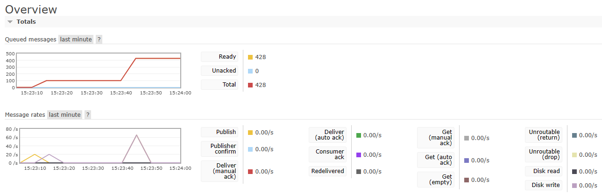

#### [2]集群

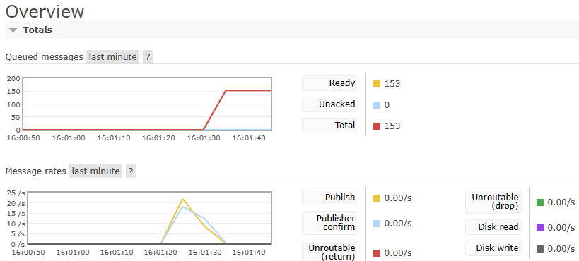

### ②Global Counts


### ③Nodes

#### [1]外部摘要信息

- 单一实例

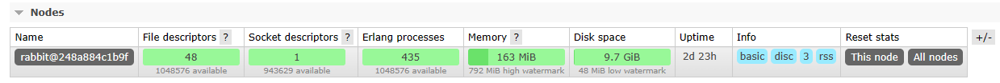

- 集群

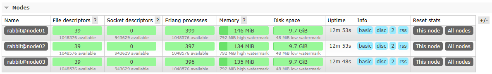

#### [2]Overview

- 单一实例

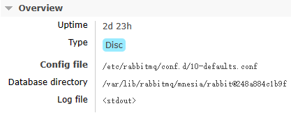

- 集群中某个实例

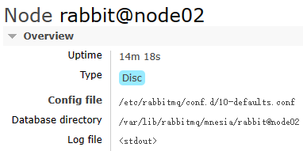

#### [3]Process statistics

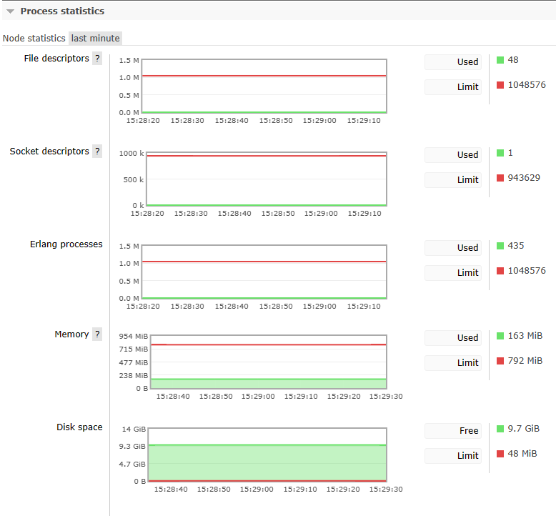

#### [4]Persistence statistics

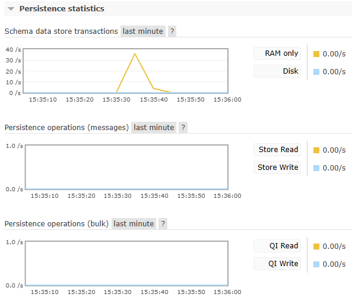


#### [5]I/O statistics

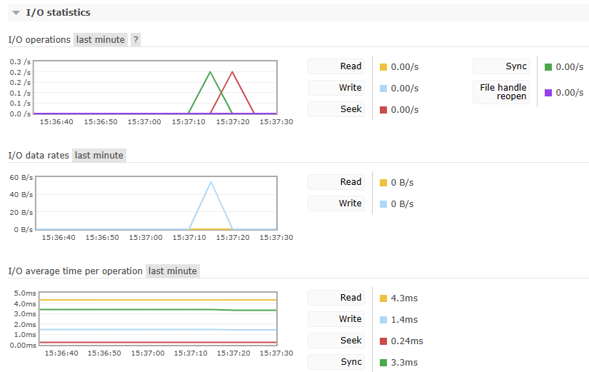


#### [6]Churn statistics

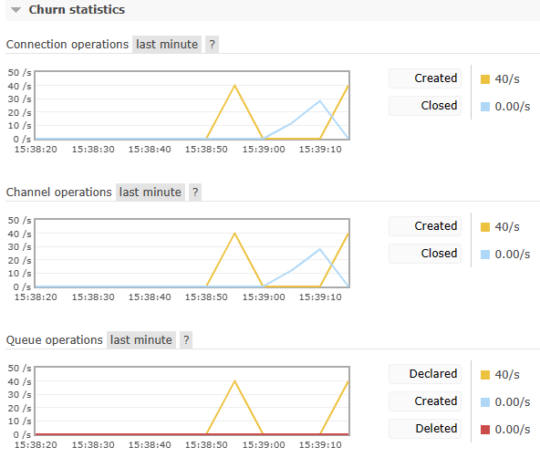

#### [7]Cluster links

- 单一实例

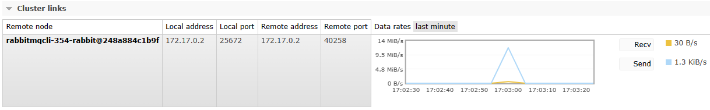


- 集群

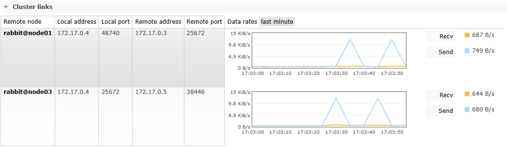

#### [8]Memory Details

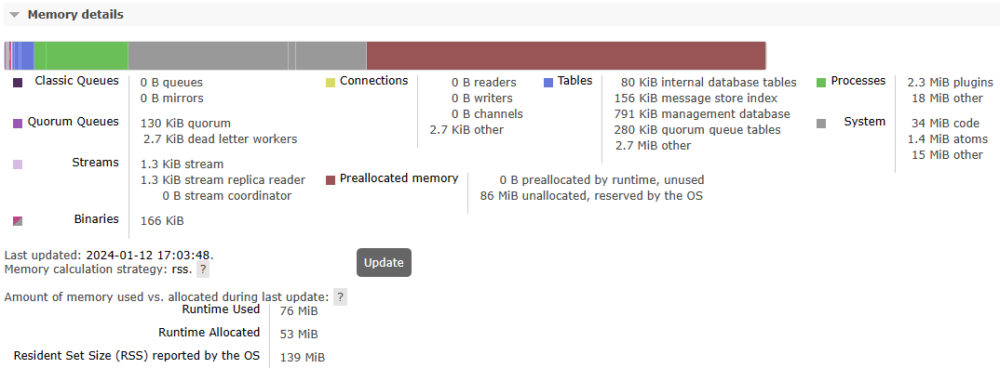

#### [9]Binary references

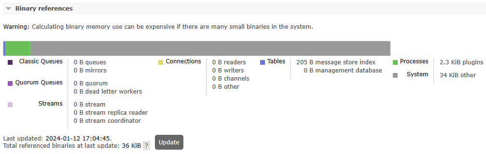

#### [10]Advanced

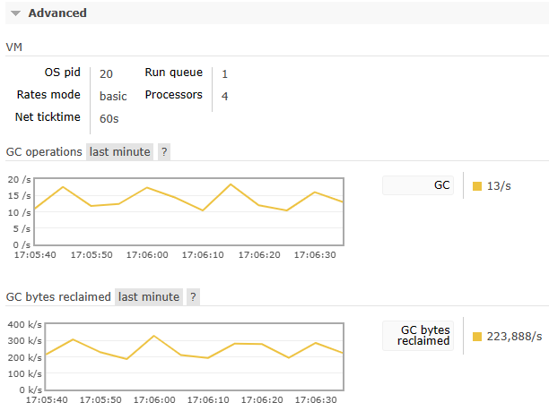

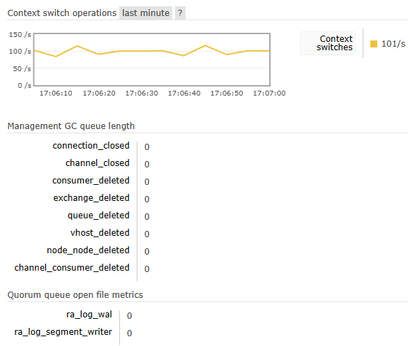

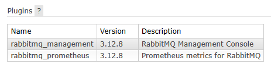

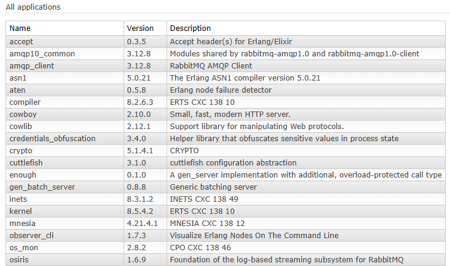

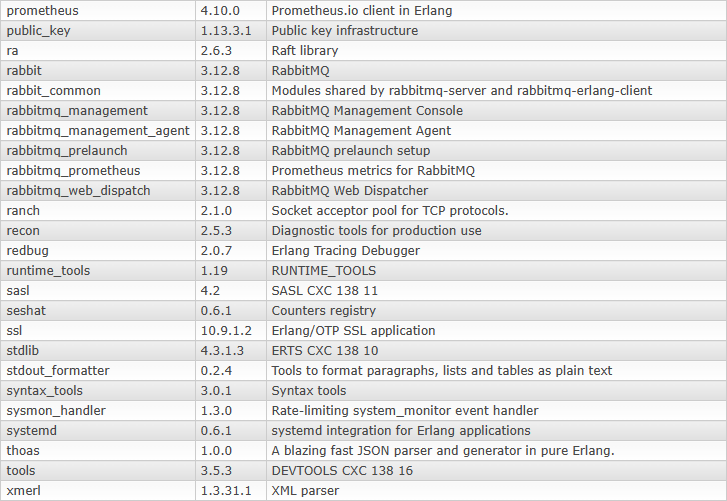

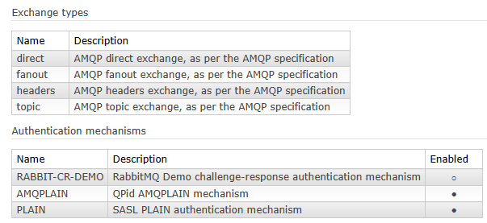

### ④Churn statistics

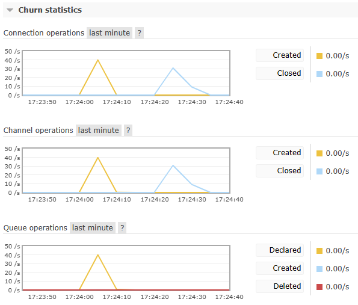

### ⑤Ports and contexts

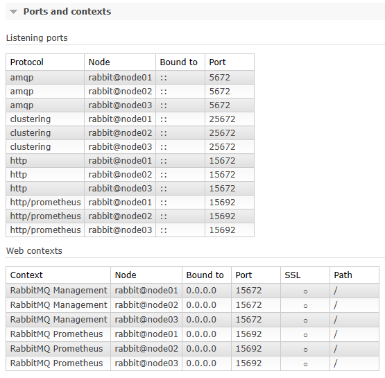

### ⑥Export definitions

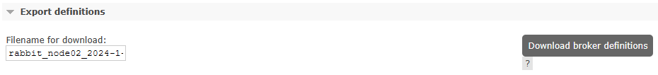

```json
{
    "rabbit_version":"3.12.8",
    "rabbitmq_version":"3.12.8",
    "product_name":"RabbitMQ",
    "product_version":"3.12.8",
    "users":[
        {
            "name":"guest",
            "password_hash":"E76Z2NmF08kv9ovR2AuNS4QRY3XDUm3W6f2Aeok9v3Qb0Vgs",
            "hashing_algorithm":"rabbit_password_hashing_sha256",
            "tags":[
                "administrator"
            ],
            "limits":{

            }
        }
    ],
    "vhosts":[
        {
            "name":"/"
        }
    ],
    "permissions":[
        {
            "user":"guest",
            "vhost":"/",
            "configure":".*",
            "write":".*",
            "read":".*"
        }
    ],
    "topic_permissions":[

    ],
    "parameters":[

    ],
    "global_parameters":[
        {
            "name":"internal_cluster_id",
            "value":"rabbitmq-cluster-id-n3E1YptmxZYUQ_03R6vruA"
        }
    ],
    "policies":[

    ],
    "queues":[
        {
            "name":"jmeterQueue",
            "vhost":"/",
            "durable":true,
            "auto_delete":false,
            "arguments":{

            }
        },
        {
            "name":"queue.quorum.test",
            "vhost":"/",
            "durable":true,
            "auto_delete":false,
            "arguments":{
                "x-queue-type":"quorum"
            }
        },
        {
            "name":"atguigu.queue.test",
            "vhost":"/",
            "durable":true,
            "auto_delete":false,
            "arguments":{

            }
        }
    ],
    "exchanges":[
        {
            "name":"exchange.quorum.test",
            "vhost":"/",
            "type":"direct",
            "durable":true,
            "auto_delete":false,
            "internal":false,
            "arguments":{

            }
        },
        {
            "name":"exchange.cluster.test",
            "vhost":"/",
            "type":"direct",
            "durable":true,
            "auto_delete":false,
            "internal":false,
            "arguments":{

            }
        },
        {
            "name":"atguigu-exchange-test",
            "vhost":"/",
            "type":"direct",
            "durable":true,
            "auto_delete":false,
            "internal":false,
            "arguments":{

            }
        },
        {
            "name":"jmeterExchange",
            "vhost":"/",
            "type":"direct",
            "durable":true,
            "auto_delete":false,
            "internal":false,
            "arguments":{

            }
        }
    ],
    "bindings":[
        {
            "source":"atguigu-exchange-test",
            "vhost":"/",
            "destination":"atguigu.queue.test",
            "destination_type":"queue",
            "routing_key":"atguigu.routing.key.test",
            "arguments":{

            }
        },
        {
            "source":"exchange.quorum.test",
            "vhost":"/",
            "destination":"queue.quorum.test",
            "destination_type":"queue",
            "routing_key":"routing.key.quorum.test",
            "arguments":{

            }
        },
        {
            "source":"jmeterExchange",
            "vhost":"/",
            "destination":"jmeterQueue",
            "destination_type":"queue",
            "routing_key":"jmeterRoutingKey",
            "arguments":{

            }
        }
    ]
}
```

### ⑦Import definitions

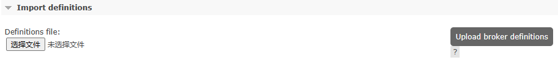

## 2、Connections选项卡

### ①All connections

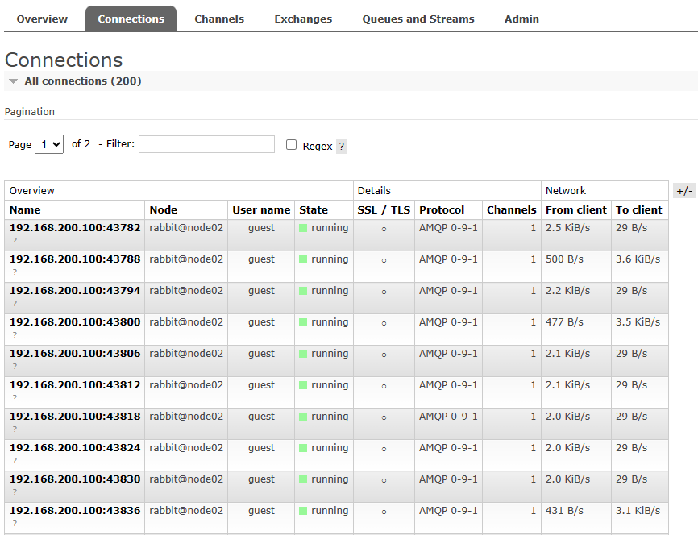

### ②Connection细节

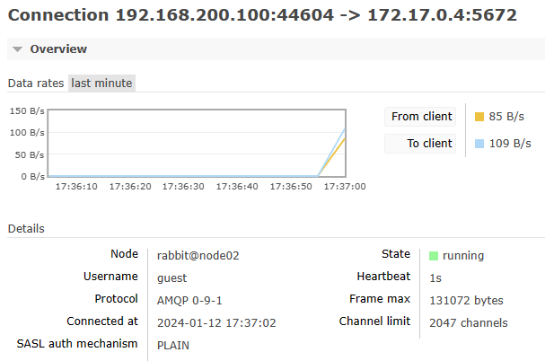

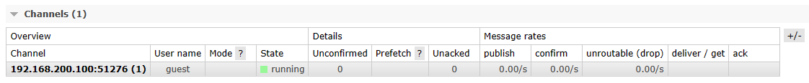

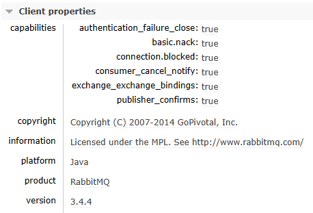

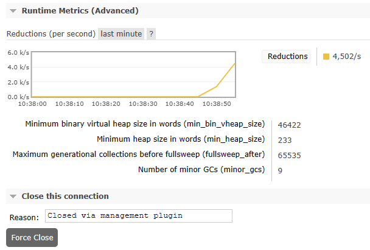

## 3、Channel选项卡

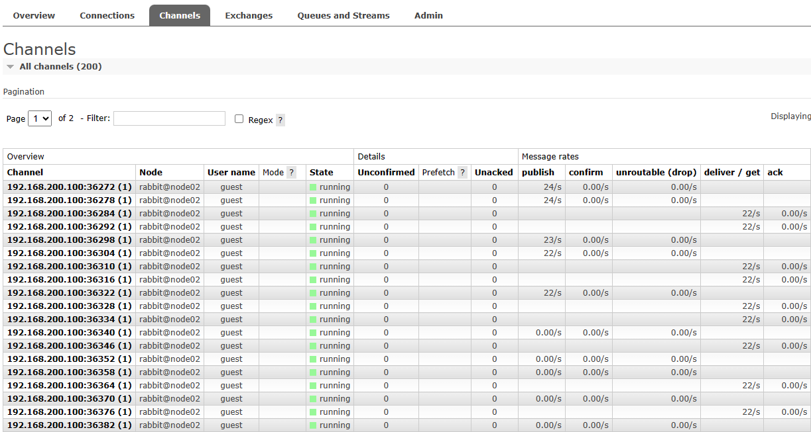

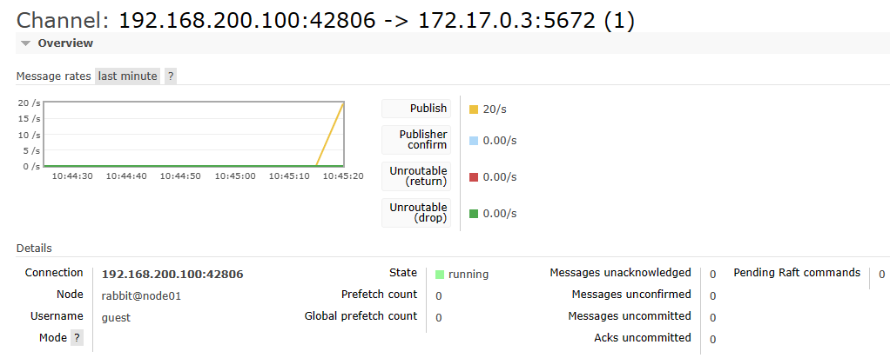

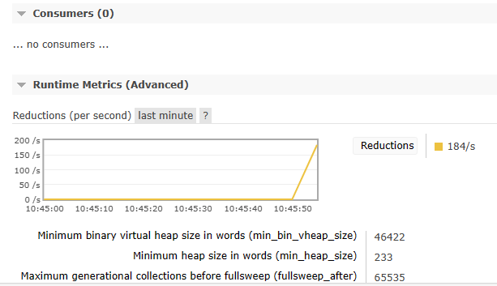

## 4、Exchanges选项卡

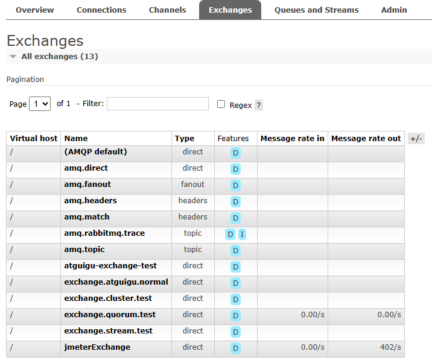

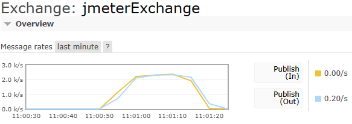

## 5、Queues And Streams选项卡

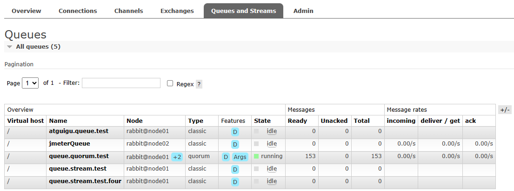

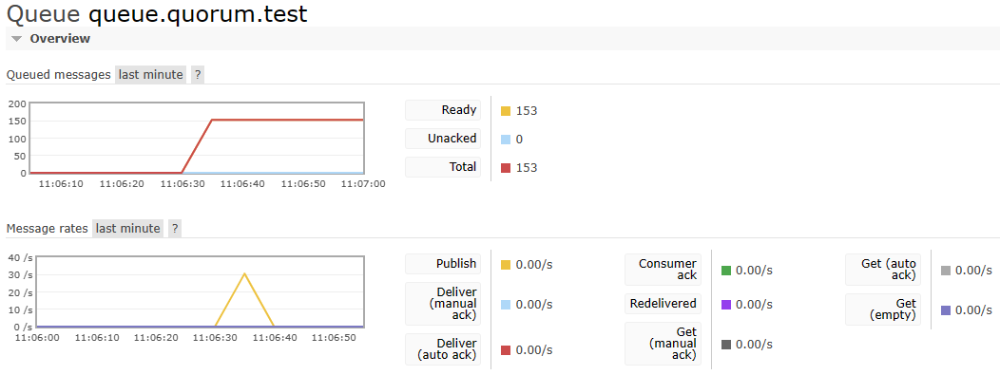