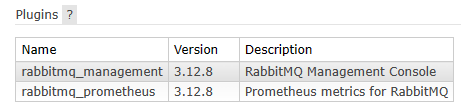
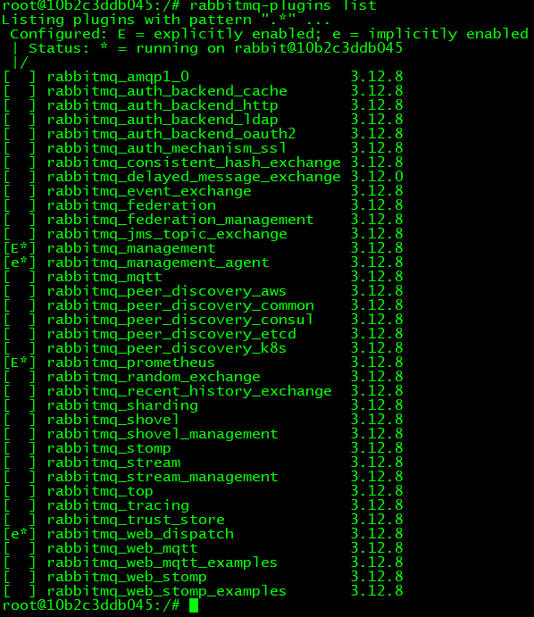
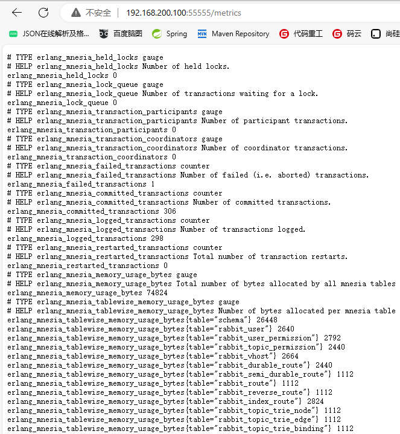
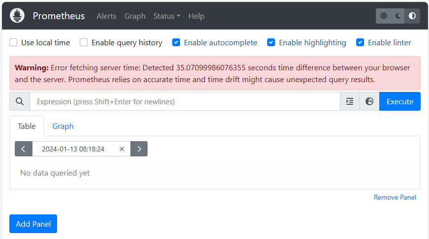

# 21、使用Prometheus监控RabbitMQ

## 一、产品简介


Prometheus 是一个开源的系统监控和警报工具，用于收集、存储和分析应用程序、服务和基础设施的指标数据。它提供了强大的时间序列数据库和灵活的查询语言，使用户能够实时监视系统的性能、资源利用率和可用性。

以下是 Prometheus 的主要特点和功能：

1. 数据采集：Prometheus 通过自身的客户端库或第三方集成，周期性地从目标应用、服务或设备中抓取指标数据。它支持多种数据传输协议，如 HTTP、Pushgateway、Node Exporter 等。

2. 指标存储：Prometheus 使用一种高效的时间序列数据库来保存抓取的指标数据。这个时序数据库可以存储数百万条时间序列，并提供快速的读写操作。

3. 查询和可视化：Prometheus 提供了强大的查询语言（PromQL），允许用户根据时间范围和标签条件对指标数据进行复杂的查询、聚合和转换。它还与 Grafana 等数据可视化工具集成，使用户能够创建仪表板和图表来直观地展示监控数据。

4. 警报和通知：Prometheus 具有内置的警报规则引擎，可以基于用户定义的条件和阈值触发告警。当指标达到或超过设定的阈值时，Prometheus 可以发送通知，如电子邮件、Slack 等。

5. 自动发现和服务发现：Prometheus 支持自动发现目标，并能够与容器、云平台、配置管理工具等集成，实现动态添加和删除目标的监控。

6. 可扩展性和高可用性：Prometheus 具有可水平扩展的架构，可以通过添加更多的实例来处理大量的指标数据。它还支持数据复制和分布式查询，以提供高可用性和灾备能力。

总的来说，Prometheus 是一个功能强大、易于部署和使用的监控解决方案，适用于各种规模的应用和基础设施环境。它的设计初衷是为了满足云原生应用和微服务架构的监控需求，同时也被广泛应用于传统的虚拟机和物理服务器环境中。


## 二、Prometheus对接

### 1、RabbitMQ的Prometheus插件

作为被监控对象，RabbitMQ必须提供数据给Prometheus才行。对此RabbitMQ提供了Prometheus插件实现。

RabbitMQ的Prometheus插件，在目前我们使用的版本中不需要安装、启用，默认就是启用的，我们可以从以下两个方面进行确认


#### ①Management UI查看插件

Overview选项卡 ---> Nodes ---> 点击某个节点 ---> Advanced ---> Plugins




#### ②命令行查看已启用插件

```shell
# 登录 docker 容器
docker exec -it 容器名称 /bin/bash

# 查看插件列表
rabbitmq-plugins list
```




### 2、暴露数据采集端口

RabbitMQ的Prometheus插件对外暴露的端口默认为15692，完整的访问地址举例如下：

> http://192.168.200.100:15692/metrics

所以需要让Docker把容器内部的15692端口映射到宿主机

可问题是已创建的Docker容器增加映射端口操作很繁琐，所以我们需要创建新的Docker容器组成RabbitMQ集群（原来的容器stop以避免端口号冲突）

```shell
docker run -d \
--name rmq-clu-04 \
--hostname node04 \
-p 1000:5672 \
-p 1100:15672 \
-p 1200:15692 \
-v rmq-clu-04-plugin:/plugins \
-v rmq-clu-04-config:/etc \
-v rmq-clu-cookie:/var/lib/rabbitmq \
-e RABBITMQ_DEFAULT_USER=guest \
-e RABBITMQ_DEFAULT_PASS=123456 \
rabbitmq:3.12-management

docker run -d \
--name rmq-clu-05 \
--hostname node05 \
-p 2000:5672 \
-p 2100:15672 \
-p 2200:15692 \
-v rmq-clu-05-plugin:/plugins \
-v rmq-clu-05-config:/etc \
-v rmq-clu-cookie:/var/lib/rabbitmq \
-e RABBITMQ_DEFAULT_USER=guest \
-e RABBITMQ_DEFAULT_PASS=123456 \
--link rmq-clu-04:node04 \
rabbitmq:3.12-management

docker run -d \
--name rmq-clu-06 \
--hostname node06 \
-p 3000:5672 \
-p 3100:15672 \
-p 3200:15692 \
-v rmq-clu-06-plugin:/plugins \
-v rmq-clu-06-config:/etc \
-v rmq-clu-cookie:/var/lib/rabbitmq \
-e RABBITMQ_DEFAULT_USER=guest \
-e RABBITMQ_DEFAULT_PASS=123456 \
--link rmq-clu-04:node04 \
--link rmq-clu-05:node05 \
rabbitmq:3.12-management
```


各节点加入集群：

- 节点04中操作

```shell
# 登录到Docker容器内部
docker exec -it rmq-clu-04 /bin/bash

# 停止当前实例中的RabbitMQ服务（该服务在RabbitMQ内部被称为rabbit应用）
rabbitmqctl stop_app

# 重置rabbit应用
rabbitmqctl reset

# 启动rabbit应用
rabbitmqctl start_app

# 退出Docker容器
exit
```


- 节点05中操作

```shell
# 登录到Docker容器内部
docker exec -it rmq-clu-05 /bin/bash

# 停止当前实例中的RabbitMQ服务（该服务在RabbitMQ内部被称为rabbit应用）
rabbitmqctl stop_app

# 重置rabbit应用
rabbitmqctl reset

# 加入集群
# rabbit是应用名
# node01是集群实例中的某个节点名
rabbitmqctl join_cluster rabbit@node04

# 启动rabbit应用
rabbitmqctl start_app

# 退出Docker容器
exit
```


- 节点06中操作

```shell
# 登录到Docker容器内部
docker exec -it rmq-clu-06 /bin/bash

# 停止当前实例中的RabbitMQ服务（该服务在RabbitMQ内部被称为rabbit应用）
rabbitmqctl stop_app

# 重置rabbit应用
rabbitmqctl reset

# 加入集群
# rabbit是应用名
# node01是集群实例中的某个节点名
rabbitmqctl join_cluster rabbit@node04

# 启动rabbit应用
rabbitmqctl start_app

# 查看集群状态
rabbitmqctl cluster_status

# 退出Docker容器
exit
```


HAProxy负载均衡配置文件位置：

> /etc/haproxy/haproxy.cfg


HAProxy负载均衡配置内容：

- Management UI统一入口：33333

- 核心功能统一入口：44444
- 数据采集统一入口：55555

```text
frontend rabbitmq_ui_frontend2
bind 192.168.200.100:33333
mode http
default_backend rabbitmq_ui_backend2

backend rabbitmq_ui_backend2
mode http
balance roundrobin
option httpchk GET /
server rabbitmq_ui1 192.168.200.100:1100 check
server rabbitmq_ui2 192.168.200.100:2100 check
server rabbitmq_ui3 192.168.200.100:3100 check

frontend rabbitmq_frontend2
bind 192.168.200.100:44444
mode tcp
default_backend rabbitmq_backend2

backend rabbitmq_backend2
mode tcp
balance roundrobin
server rabbitmq1 192.168.200.100:1000 check
server rabbitmq2 192.168.200.100:2000 check
server rabbitmq3 192.168.200.100:3000 check

frontend rabbitmq_monitor_frontend2
bind 192.168.200.100:55555
mode tcp
default_backend rabbitmq_monitor_backend2

backend rabbitmq_monitor_backend2
mode tcp
balance roundrobin
server rabbitmq1 192.168.200.100:1200 check
server rabbitmq2 192.168.200.100:2200 check
server rabbitmq3 192.168.200.100:3200 check
```


### 3、访问数据采集端口

访问地址：

> http://192.168.200.100:55555/metrics




### 4、配置Prometheus

#### ①解压

prometheus-2.48.1.linux-amd64.tar.gz


#### ②配置

配置文件位置：解压目录/prometheus.yml

```yaml
scrape_configs:
  - job_name: "rabbitmq"
    static_configs:
      - targets: ["localhost:55555"]
  - job_name: "rabbitmq_node"
    static_configs:
      - targets: ["localhost:1200"]
      - targets: ["localhost:2200"]
      - targets: ["localhost:3200"]
```


#### ③启动

```shell
./prometheus --config.file=prometheus.yml
```


#### ④访问

> http://192.168.200.100:9090




