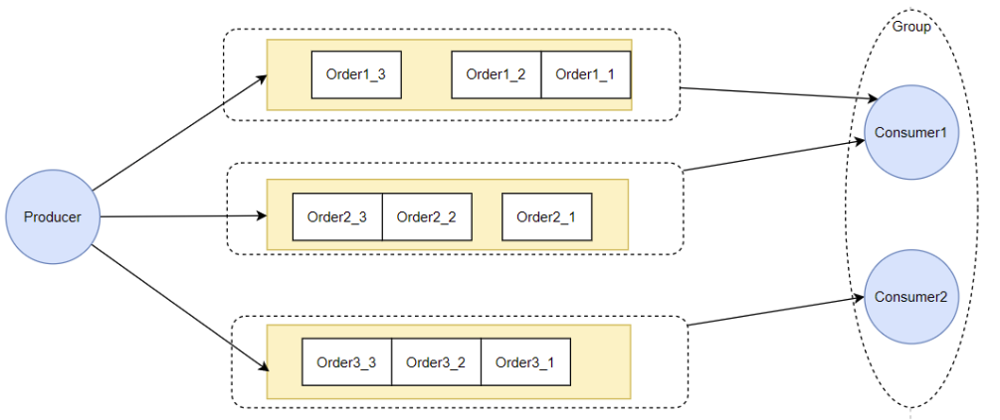
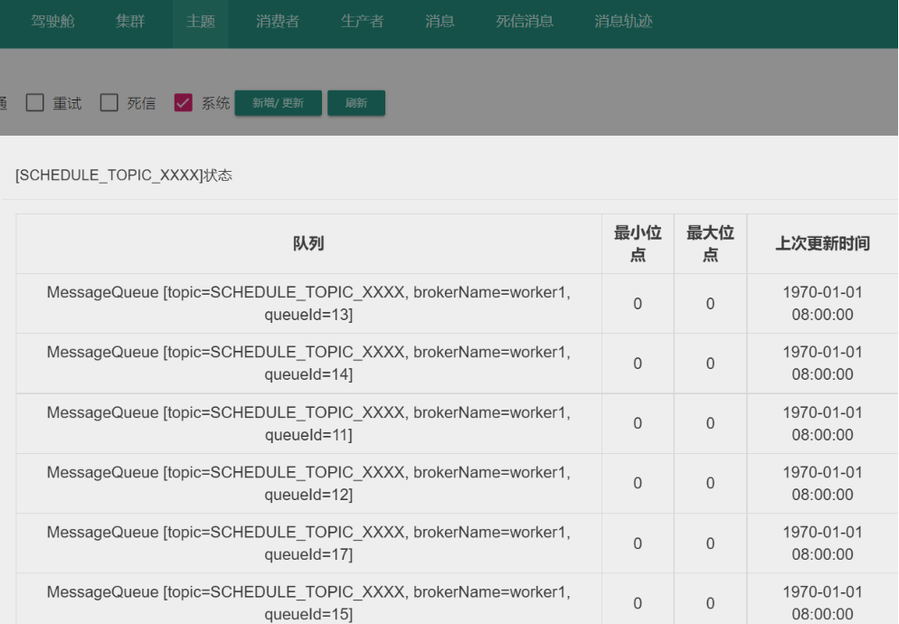
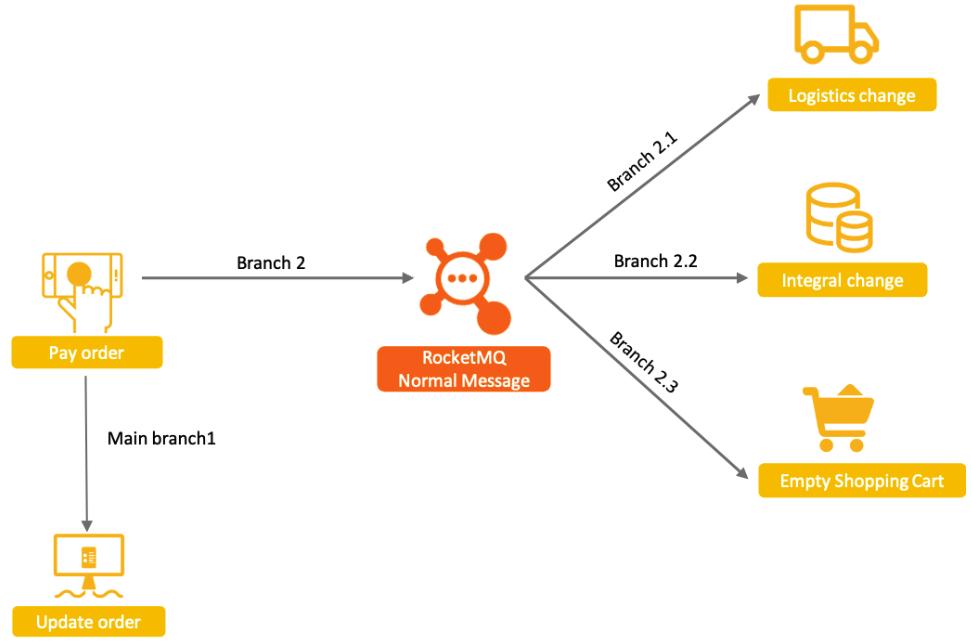
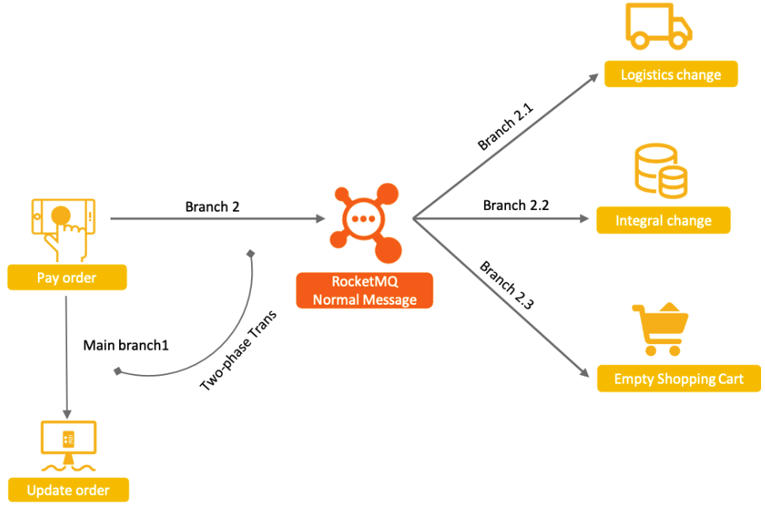
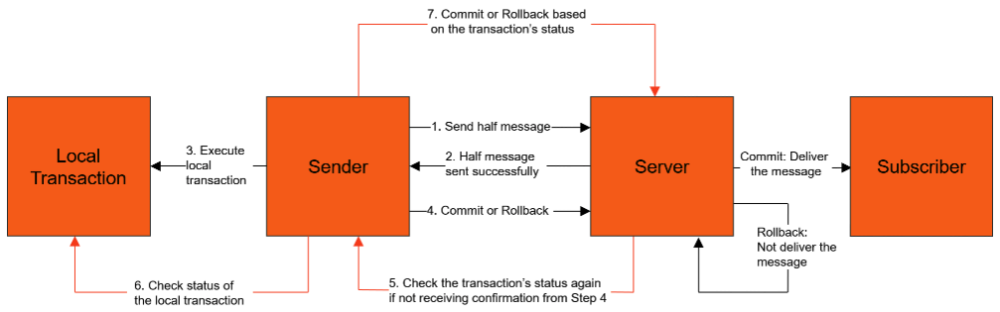
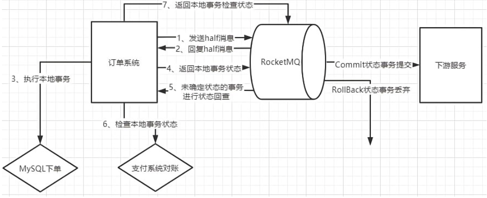
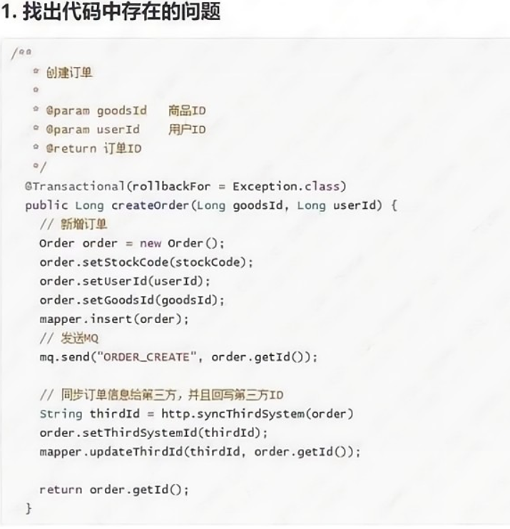
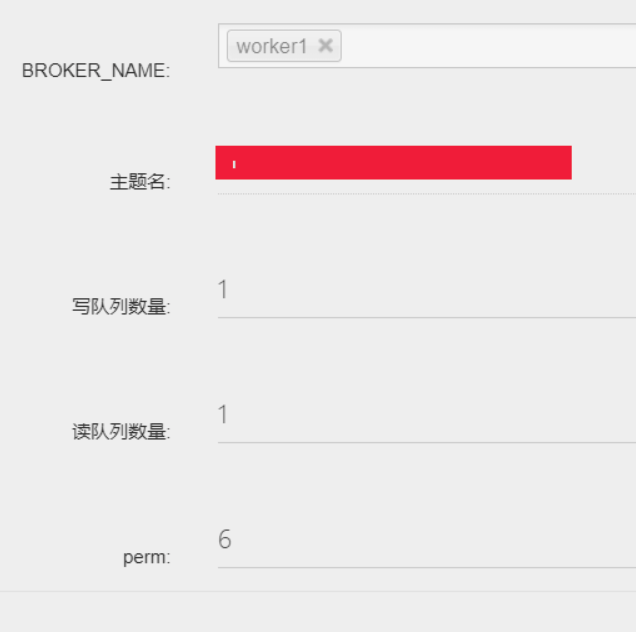
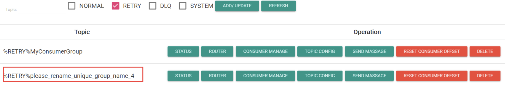
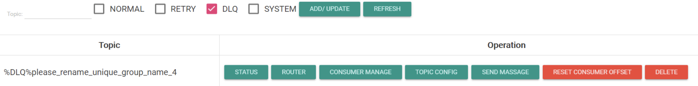

[TOC]

<center><h1>RocketMQ核心编程模型</h1></center>

# 一、深入理解RocketMQ的消息模型

## 1、RocketMQ客户端基本流程

RocketMQ基于Maven提供了客户端的核心依赖：

```xml
<dependency>
    <groupId>org.apache.rocketmq</groupId>
    <artifactId>rocketmq-client</artifactId>
    <version>5.3.0</version>
</dependency>
```

一个最为简单的消息生产者代码如下：

```java
public class Producer {
    public static void main(String[] args) throws MQClientException, InterruptedException {
        //初始化一个消息生产者
        DefaultMQProducer producer = new DefaultMQProducer("please_rename_unique_group_name");
        // 指定nameserver地址
        producer.setNamesrvAddr("192.168.65.112:9876");
        // 启动消息生产者服务
        producer.start();
        for (int i = 0; i < 2; i++) {
            try {
                // 创建消息。消息由Topic,Tag和body三个属性组成，其中Body就是消息内容
                Message msg = new Message("TopicTest","TagA",("Hello RocketMQ " +i).getBytes(RemotingHelper.DEFAULT_CHARSET));
                //发送消息，获取发送结果
                SendResult sendResult = producer.send(msg);
                System.out.printf("%s%n", sendResult);
            } catch (Exception e) {
                e.printStackTrace();
                Thread.sleep(1000);
            }
        }
        //消息发送完后，停止消息生产者服务。
        producer.shutdown();
    }
}
```

一个简单的消息消费者代码如下：

```java
public class Consumer {
    public static void main(String[] args) throws InterruptedException, MQClientException {
        //构建一个消息消费者
        DefaultMQPushConsumer consumer = new DefaultMQPushConsumer("please_rename_unique_group_name_4");
        //指定nameserver地址
       consumer.setNamesrvAddr("192.168.65.112:9876");
       consumer.setConsumeFromWhere(ConsumeFromWhere.CONSUME_FROM_LAST_OFFSET);
        // 订阅一个感兴趣的话题，这个话题需要与消息的topic一致
        consumer.subscribe("TopicTest", "*");
        // 注册一个消息回调函数，消费到消息后就会触发回调。
        consumer.registerMessageListener(new MessageListenerConcurrently() {
            @Override
            public ConsumeConcurrentlyStatus consumeMessage(List<MessageExt> msgs,ConsumeConcurrentlyContext context) {
				msgs.forEach(messageExt -> {
                    try {
                        System.out.println("收到消息:"+new String(messageExt.getBody(), RemotingHelper.DEFAULT_CHARSET));
                    } catch (UnsupportedEncodingException e) {}
                });
                return ConsumeConcurrentlyStatus.CONSUME_SUCCESS;
            }
        });
        //启动消费者服务
        consumer.start();
        System.out.print("Consumer Started");
    }
}
```

RocketMQ的客户端编程模型相对比较固定，基本都有一个固定的步骤。掌握这个固定步骤，对于学习其他复杂的消息模型也是很有帮助的。

* 消息生产者的固定步骤

1.创建消息生产者producer，并指定生产者组名
2.指定Nameserver地址
3.启动producer。 这个步骤比较容易忘记。可以认为这是消息生产者与服务端建立连接的过程。
4.创建消息对象，指定主题Topic、Tag和消息体
5.发送消息
6.关闭生产者producer，释放资源。

* 消息消费者的固定步骤

1.创建消费者Consumer，必须指定消费者组名
2.指定Nameserver地址
3.订阅主题Topic和Tag
4.设置回调函数，处理消息
5.启动消费者consumer。消费者会一直挂起，持续处理消息。

其中，最为关键的就是NameServer。从示例中可以看到，RocketMQ的客户端只需要指定NameServer地址，而不需要指定具体的Broker地址。

指定NameServer的方式有两种。可以在客户端直接指定，例如 consumer.setNameSrvAddr("127.0.0.1:9876")。然后，也可以通过读取系统环境变量NAMESRV\_ADDR指定。其中第一种方式的优先级更高。

## 2、消息确认机制

RocketMQ要支持互联网金融场景，那么消息安全是必须优先保障的。而消息安全有两方面的要求，一方面是生产者要能确保将消息发送到Broker上。另一方面是消费者要能确保从Broker上争取获取到消息。

**1、消息生产端采用消息确认加多次重试的机制保证消息正常发送到RocketMQ**

针对消息发送的不确定性，封装了三种发送消息的方式。

**第一种称为单向发送**

单向发送方式下，消息生产者只管往Broker发送消息，而全然不关心Broker端有没有成功接收到消息。这就好比生产者向Broker发一封电子邮件，Broker有没有处理电子邮件，生产者并不知道。

```java
public class OnewayProducer {
    public static void main(String[] args)throws Exception{
        DefaultMQProducer producer = new DefaultMQProducer("producerGroup");
        producer.start();
        Message message = new Message("Order","tag","order info : orderId = xxx".getBytes(StandardCharsets.UTF_8));
        producer.sendOneway(message);
        Thread.sleep(50000);
        producer.shutdown();
    }
}
```

sendOneway方法没有返回值，如果发送失败，生产者无法补救。

单向发送有一个好处，就是发送消息的效率更高。适用于一些追求消息发送效率，而允许消息丢失的业务场景。比如日志。

**第二种称为同步发送**

同步发送方式下，消息生产者在往Broker端发送消息后，会阻塞当前线程，等待Broker端的相应结果。这就好比生产者给Broker打了个电话。通话期间生产者就停下手头的事情，直到Broker明确表示消息处理成功了，生产者才继续做其他的事情。

```java
 SendResult sendResult = producer.send(msg);
```

SendResult来自于Broker的反馈。producer在send发出消息，到Broker返回SendResult的过程中，无法做其他的事情。

在SendResult中有一个SendStatus属性，这个SendStatus是一个枚举类型，其中包含了Broker端的各种情况。

```java
public enum SendStatus {
    SEND_OK,
    FLUSH_DISK_TIMEOUT,
    FLUSH_SLAVE_TIMEOUT,
    SLAVE_NOT_AVAILABLE,
}
```

在这几种枚举值中，SEND\_OK表示消息已经成功发送到Broker上。至于其他几种枚举值，都是表示消息在Broker端处理失败了。使用同步发送的机制，我们就可以在消息生产者发送完消息后，对发送失败的消息进行补救。例如重新发送。

但是此时要注意，如果Broker端返回的SendStatus不是SEND\_OK，也并不表示消息就一定不会推送给下游的消费者。仅仅只是表示Broker端并没有完全正确的处理这些消息。因此，如果要重新发送消息，最好要带上唯一的系统标识，这样在消费者端，才能自行做幂等判断。也就是用具有业务含义的OrderID这样的字段来判断消息有没有被重复处理。

这种同步发送的机制能够很大程度上保证消息发送的安全性。但是，这种同步发送机制的发送效率比较低。毕竟，send方法需要消息在生产者和Broker之间传输一个来回后才能结束。如果网速比较慢，同步发送的耗时就会很长。

**第三种称为异步发送**

异步发送机制下，生产者在向Broker发送消息时，会同时注册一个回调函数。接下来生产者并不等待Broker的响应。当Broker端有响应数据过来时，自动触发回调函数进行对应的处理。这就好比生产者向Broker发电子邮件通知时，另外找了一个代理人专门等待Broker的响应。而生产者自己则发完消息后就去做其他的事情去了。

```java
producer.send(msg, new SendCallback() {
    @Override
    public void onSuccess(SendResult sendResult) {
        countDownLatch.countDown();
        System.out.printf("%-10d OK %s %n", index,getMsgId());
    }
    @Override
    public void onException(Throwable e) {
        countDownLatch.countDown();
        System.out.printf("%-10d Exception %s %n", index, e);
        e.printStackTrace();
    }
});
```

在SendCallback接口中有两个方法，onSuccess和onException。当Broker端返回消息处理成功的响应信息SendResult时，就会调用onSuccess方法。当Broker端处理消息超时或者失败时，就会调用onExcetion方法，生产者就可以在onException方法中进行补救措施。

此时同样有几个问题需要注意。一是与同步发送机制类似，触发了SendCallback的onException方法同样并不一定就表示消息不会向消费者推送。如果Broker端返回响应信息太慢，超过了超时时间，也会触发onException方法。超时时间默认是3秒，可以通过**producer.setSendMsgTimeout**方法定制。而造成超时的原因则有很多，消息太大造成网络拥堵、网速太慢、Broker端处理太慢等都可能造成消息处理超时。

二是在SendCallback的对应方法被触发之前，生产者不能调用shutdown()方法。如果消息处理完之前，生产者线程就关闭了，生产者的SendCallback对应方法就不会触发。这是因为使用异步发送机制后，生产者虽然不用阻塞下来等待Broker端响应，但是SendCallback还是需要附属于生产者的主线程才能执行。如果Broker端还没有返回SendResult，而生产者主线程已经停止了，那么SendCallback的执行线程也就会随主线程一起停止，对应的方法自然也就无法执行了。

这种异步发送的机制能够比较好的兼容消息的安全性以及生产者的高吞吐需求，是很多MQ产品都支持的方式。RabbitMQ和Kafka都支持这种异步发送的机制。但是异步发送机制也并不是万能的，毕竟异步发送机制对消息生产者的主线业务是有侵入的。具体使用时还是需要根据业务场景考虑。

RocketMQ提供的这三种发送消息的方式，并不存在绝对的好坏之分。我们更多的是需要根据业务场景进行选择。例如在电商下单这个场景，我们就应该尽量选择同步发送或异步发送，优先保证数据安全。然后，如果下单场景的并发比较高，业务比较繁忙，就应该尽量优先选择异步发送的机制。这时，我们就应该对下单服务的业务进行优化定制，尽量适应异步发送机制的要求。这样就可以尽量保证下单服务能够比较可靠的将用户的订单消息发送到RocketMQ了。

**2、消息消费者端采用状态确认机制保证消费者一定能正常处理对应的消息**

我们之前分析生产者的可靠性问题，核心的解决思路就是通过确认Broker端的状态来保证生产者发送消息的可靠性。对于RocketMQ的消费者来说，保证消息处理可靠性的思路也是类似的。只不过这次换成了Broker等待消费者返回消息处理状态。

```java
consumer.registerMessageListener(new MessageListenerConcurrently() {
    @Override
    public ConsumeConcurrentlyStatus consumeMessage(List<MessageEx ConsumeConcurrentlyContext context) {
        System.out.printf("%s Receive New Messages: %s %n",currentThread().getName(), msgs);
        return ConsumeConcurrentlyStatus.CONSUME_SUCCESS;
    }
});
```

这个返回值是一个枚举值，有两个选项 CONSUME\_SUCCESS和RECONSUME\_LATER。如果消费者返回CONSUME\_SUCCESS，那么消息自然就处理结束了。但是如果消费者没有处理成功，返回的是RECONSUME\_LATER，Broker就会过一段时间再发起消息重试。

为了要兼容重试机制的成功率和性能，RocketMQ设计了一套非常完善的消息重试机制，从而尽可能保证消费者能够正常处理用户的订单信息。

1、Broker不可能无限制的向消费失败的消费者推送消息。如果消费者一直没有恢复，Broker显然不可能一直无限制的推送，这会浪费集群很多的性能。所以，Broker会记录每一个消息的重试次数。如果一个消息经过很多次重试后，消费者依然无法正常处理，那么Broker会将这个消息推入到消费者组对应的死信Topic中。死信Topic相当于windows当中的垃圾桶。你可以人工介入对死信Topic中的消息进行补救，也可以直接彻底删除这些消息。RocketMQ默认的最大重试次数是16次。

2、为了让这些重试的消息不会影响Topic下其他正常的消息，Broker会给每个消费者组设计对应的重试Topic。MessageQueue是一个具有严格FIFO特性的数据结构。如果需要重试的这些消息还是放在原来的MessageQueue中，就会对当前MessageQueue产生阻塞，让其他正常的消息无法处理。RocketMQ的做法是给每个消费者组自动生成一个对应的重试Topic。在消息需要重试时，会先移动到对应的重试Topic中。后续Broker只要从这些重试Topic中不断拿出消息，往消费者组重新推送即可。这样，这些重试的消息有了自己单独的队列，就不会影响到Topic下的其他消息了。

3、RocketMQ中设定的消费者组都是订阅主题和消费逻辑相同的服务备份，所以当消息重试时，Broker只要往消费者组中随意一个实例推送即可。这是消息重试机制能够正常运行的基础。但是，在客户端的具体实现时，MQDefaultMQConsumer并没有强制规定消费者组不能重复。也就是说，你完全可以实现出一些订阅主题和消费逻辑完全不同的消费者服务，共同组成一个消费组。在这种情况下，RocketMQ不会报错，但是消息的处理逻辑就无法保持一致了。这会给业务带来很大的麻烦。这是在实际应用时需要注意的地方。

4、Broker端最终只通过消费者组返回的状态来确定消息有没有处理成功。至于消费者组自己的业务执行是否正常，Broker端是没有办法知道的。因此，在实现消费者的业务逻辑时，应该要尽量使用同步实现方式，保证在自己业务处理完成之后再向Broker端返回状态。而应该尽量避免异步的方式处理业务逻辑。

**3、消费者组也可以自行指定起始消费位点**

Broker端通过Consumer返回的状态来推进所属消费者组对应的Offset。但是，这里还是会造成一种分裂，消息最终是由Consumer来处理，但是消息却是由Broker推送过来的，也就是说，Consumer无法确定自己将要处理的是哪些消息。这就好比你上班做一天事情，公司负责给你发一笔工资。如果一切正常，那么没什么问题。 但是如果出问题了呢？公司拖欠了你的工资，这时，你就还是需要能到公司查账，至少查你自己的工资记录。从上一次发工资的时候计算你该拿的钱。

使用消息对列要如何解决这样的问题呢？这时，就可以创建另外一个新的消费者组，并通过ConsumerFromWhere属性指定这个消费者组的消费起点，从而让这个新的消费者组去消费之前发送过的历史消息。而这个ConsumerFromWhere属性并不是直接指定Offset的数值，因为客户端也不知道Broker端记录的Offset数值是多少。RocketMQ就提供了一个枚举值。名字一目了然。

```java
public enum ConsumeFromWhere {
    CONSUME_FROM_LAST_OFFSET, //从对列的最后一条消息开始消费
    CONSUME_FROM_FIRST_OFFSET, //从对列的第一条消息开始消费
    CONSUME_FROM_TIMESTAMP; //从某一个时间点开始重新消费
}
```

另外，如果指定了ConsumerFromWhere.CONSUME\_FROM\_TIMESTAMP，这就表示要从一个具体的时间开始。具体时间点，需要通过Consumer的另一个属性ConsumerTimestamp。这个属性可以传入一个表示时间的字符串。

```java
consumer.setConsumerTimestamp("20131223171201");
```

到这里，我们就从客户端的角度分析清楚了要如何保证消息的安全性。但是消息安全问题其实是一个非常体系化的问题，涉及到的不光是客户端，还需要服务端配合。关于这个问题，我们会在后面的分享过程当中继续带你一起思考。

## 3、广播消息

**应用场景：**

广播模式和集群模式是RocketMQ的消费者端处理消息最基本的两种模式。集群模式下，一个消息，只会被一个消费者组中的多个消费者实例 共同 处理一次。广播模式下，一个消息，则会推送给所有消费者实例处理，不再关心消费者组。

**示例代码：**

消费者核心代码

```java
consumer.setMessageModel(MessageModel.BROADCASTING);
```

启动多个消费者，广播模式下，这些消费者都会消费一次消息。

**实现思路：**

默认模式(也就是集群模式)下，Broker端会给每个ConsumerGroup维护一个统一的Offset，这样，当Consumer来拉取消息时，就可以通过Offset保证一个消息，在同一个ConsumerGroup内只会被消费一次。而广播模式的本质，是将Offset转移到Consumer端自行保管，包括Offset的记录以及更新，全都放到客户端。这样Broker推送消息时，就不再管ConsumerGroup，只要Consumer来拉取消息，就返回对应的消息。

**注意点：**

1、Broker端不维护消费进度，意味着，如果消费者处理消息失败了，将无法进行消息重试。

2、Consumer端维护Offset的作用是可以在服务重启时，按照上一次消费的进度，处理后面没有消费过的消息。如果Offset丢了，Consuer依然可以拉取消息。

比如生产者发送了1\~10号消息。消费者当消费到第6个时宕机了。当他重启时，Broker端已经把第10个消息都推送完成了。如果消费者端维护好了自己的Offset，那么他就可以在服务重启时，重新向Broker申请6号到10号的消息。但是，如果消费者端的Offset丢失了，消费者服务依然可以正常运行，但是6到10号消息就无法再申请了。后续这个消费者就只能获取10号以后的消息。

> 如果你对广播模式下的Offset管理确实感兴趣，可以看下我的这篇博客，针对4.9.1版本做的详细分析。<https://blog.csdn.net/roykingw/article/details/126351010>

## 4、过滤消息

**应用场景：**

同一个Topic下有多种不同的消息，消费者只希望关注某一类消息。

例如，某系统中给仓储系统分配一个Topic，在Topic下，会传递过来入库、出库等不同的消息，仓储系统的不同业务消费者就需要过滤出自己感兴趣的消息，进行不同的业务操作。


**示例代码1：简单过滤**

生产者端需要在发送消息时，增加Tag属性。比如我们上面举例当中的入库、出库。核心代码：

```java
        String[] tags = new String[] {"TagA", "TagB", "TagC"};

        for (int i = 0; i < 15; i++) {
            Message msg = new Message("TagFilterTest",
                tags[i % tags.length],
                "Hello world".getBytes(RemotingHelper.DEFAULT_CHARSET));
            SendResult sendResult = producer.send(msg);
            System.out.printf("%s%n", sendResult);
        }
```

消费者端就可以通过这个Tag属性订阅自己感兴趣的内容。核心代码：

```java
consumer.subscribe("TagFilterTest", "TagA");
```

这样，后续Consumer就只会出处理TagA的消息。

**示例代码2：SQL过滤**

通过Tag属性，只能进行简单的消息匹配。如果要进行更复杂的消息过滤，比如数字比较，模糊匹配等，就需要使用SQL过滤方式。SQL过滤方式可以通过Tag属性以及用户自定义的属性一起，以标准SQL的方式进行消息过滤。

	生产者端在发送消息时，出了Tag属性外，还可以增加自定义属性。核心代码：

```java
String[] tags = new String[] {"TagA", "TagB", "TagC"};

for (int i = 0; i < 15; i++) {
    Message msg = new Message("SqlFilterTest",
        tags[i % tags.length],
        ("Hello RocketMQ " + i).getBytes(RemotingHelper.DEFAULT_CHARSET)
    );
    msg.putUserProperty("a", String.valueOf(i));

    SendResult sendResult = producer.send(msg);
    System.out.printf("%s%n", sendResult);
}
```

消费者端在进行过滤时，可以指定一个标准的SQL语句，定制复杂的过滤规则。核心代码：

```java
 consumer.subscribe("SqlFilterTest",
            MessageSelector.bySql("(TAGS is not null and TAGS in ('TagA', 'TagB'))" +
                "and (a is not null and a between 0 and 3)"));
```

注意：如果需要使用自定义参数进行过滤，需要在Broker端，将参数enablePropertyFilter设置成true。这个参数默认是false。

**实现思路：**

实际上，Tags和用户自定义的属性，都是随着消息一起传递的，所以，消费者端是可以拿到消息的Tags和自定义属性的。比如：

```java
consumer.registerMessageListener(new MessageListenerConcurrently() {
    @Override
    public ConsumeConcurrentlyStatus consumeMessage(List<MessageExt> msgs,
        ConsumeConcurrentlyContext context) {
        for (MessageExt msg : msgs) {
            System.out.println(msg.getTags());
            System.out.println(msg.getProperties());
        }
        System.out.printf("%s Receive New Messages: %s %n",currentThread().getName(), msgs);
        return ConsumeConcurrentlyStatus.CONSUME_SUCCESS;
    }
});
```

这样，剩下的就是在Consumer中对消息进行过滤了。Broker会在往Consumer推送消息时，在Broker端进行消息过滤。是Consumer感兴趣的消息，就往Consumer推送。

Tag属性的处理比较简单，就是直接匹配。而SQL语句的处理会比较麻烦一点。RocketMQ也是通过ANLTR引擎来解析SQL语句，然后再进行消息过滤的。

> ANLTR是一个开源的SQL语句解析框架。很多开源产品都在使用ANLTR来解析SQL语句。比如ShardingSphere，Flink等。

**注意点：**

1、使用Tag过滤时，如果希望匹配多个Tag，可以使用两个竖线(||)连接多个Tag值。另外，也可以使用星号(\*)匹配所有。

2、使用SQL顾虑时，SQL语句是按照SQL92标准来执行的。SQL语句中支持一些常见的基本操作：

*   数值比较，比如：**>，>=，<，<=，BETWEEN，=；**
*   字符比较，比如：**=，<>，IN；**
*   **IS NULL** 或者 **IS NOT NULL；**
*   逻辑符号 **AND，OR，NOT；**

2、消息过滤，其实在Broker端和在Consumer端都可以做。Consumer端也可以自行获取用户属性，不感兴趣的消息，直接返回不成功的状态，跳过该消息就行了。但是RocketMQ会在Broker端完成过滤条件的判断，只将Consumer感兴趣的消息推送给Consumer。这样的好处是减少了不必要的网络IO，但是缺点是加大了服务端的压力。不过在RocketMQ的良好设计下，更建议使用消息过滤机制。

3、Consumer不感兴趣的消息并不表示直接丢弃。通常是需要在同一个消费者组，定制另外的消费者实例，消费那些剩下的消息。但是，如果一直没有另外的Consumer，那么，Broker端还是会推进Offset。

## 5、顺序消息机制

**应用场景：**

每一个订单有从下单、锁库存、支付、下物流等几个业务步骤。每个业务步骤都由一个消息生产者通知给下游服务。如何保证对每个订单的业务处理顺序不乱？

**示例代码：**

生产者核心代码：

```java
for (int i = 0; i < 10; i++) {
    int orderId = i;
    for(int j = 0 ; j <= 5 ; j ++){
        Message msg =
                new Message("OrderTopicTest", "order_"+ord+ orderId,
                        ("order_"+orderId+" step " + RemotingHelper.DEFAULT_CHARSET));
        SendResult sendResult = producer.seMessageQueueSelector() {
            @Override
            public MessageQueue select(List<MessageQueue>  msg, Object arg) {
                Integer id = (Integer) arg;
                int index = id % mqs.size();
                return mqs.get(index);
            }
        }, orderId);
        System.out.printf("%s%n", sendResult);
    }
}
```

通过MessageSelector，将orderId相同的消息，都转发到同一个MessageQueue中。

消费者核心代码：

```java
consumer.registerMessageListener(new MessageListenerOrderly() {
    @Override
    public ConsumeOrderlyStatus consumeMessage(List<MessageExtConsumeOrderlyContext context) {
        context.setAutoCommit(true);
        for(MessageExt msg:msgs){
            System.out.println("收到消息内容 "+new String(msg.getBody()));
        }
        return ConsumeOrderlyStatus.SUCCESS;
    }
});
```

注入一个MessageListenerOrderly实现。

**实现思路：**

  RocketMQ实现消息顺序消费，是需要生产者和消费者配合才能实现的。



1、生产者只有将一批有顺序要求的消息，放到同一个MesasgeQueue上，通过MessageQueue的FIFO特性保证这一批消息的顺序。

如果不指定MessageSelector对象，那么生产者会采用轮询的方式将多条消息依次发送到不同的MessageQueue上。

2、消费者需要实现MessageListenerOrderly接口，实际上在服务端，处理MessageListenerOrderly时，会给一个MessageQueue加锁，拿到MessageQueue上所有的消息，然后再去读取下一个MessageQueue的消息。

**注意点：**

1、理解局部有序与全局有序。大部分业务场景下，我们需要的其实是局部有序。如果要保持全局有序，那就只保留一个MessageQueue。性能显然非常低。

2、生产者端尽可能将有序消息打散到不同的MessageQueue上，避免过于集中导致数据热点竞争。

3、消费者端只进行有限次数的重试。如果一条消息处理失败，RocketMQ会将后续消息阻塞住，让消费者进行重试。但是，如果消费者一直处理失败，超过最大重试次数，那么RocketMQ就会跳过这一条消息，处理后面的消息，这会造成消息乱序。

4、消费者端如果确实处理逻辑中出现问题，不建议抛出异常，可以返回ConsumeOrderlyStatus.SUSPEND\_CURRENT\_QUEUE\_A\_MOMENT作为替代。

## 6、延迟消息

**应用场景：**

延迟消息发送是指消息发送到Apache RocketMQ后，并不期望立马投递这条消息，而是延迟一定时间后才投递到Consumer进行消费。

> 虽然不太起眼，但是这是RocketMQ非常有特色的一个功能。对比下RabbitMQ和Kafka。RabbitMQ中只能通过使用死信队列变相实现延迟消息，或者加装一个插件来支持延迟消息。 Kafka则不太好实现延迟消息。

**核心方法：**

当前版本RocketMQ提供了两种实现延迟消息的机制，一种是指定固定的延迟级别，一种是指定消息发送时间。

生产者端核心代码：

```java
	// 指定固定的延迟级别
	Message message = new Message(TOPIC, ("Hello scheduled message " + i).getBytes(StandardCharsets.UTF_8));
    message.setDelayTimeLevel(3); //10秒之后发送

	// 指定消息发送时间
	Message message = new Message(TOPIC, ("Hello scheduled message " + i).getBytes(StandardCharsets.UTF_8));
    message.setDeliverTimeMs(System.currentTimeMillis() + 10_000L); //指定10秒之后的时间点
```

关于延迟级别，RocketMQ给消息定制了18个默认的延迟级别


应用只需要根据自己的业务要求，选择对应的延迟级别即可。

**实现思路：**

对于指定固定延迟级别的延迟消息，RocketMQ的实现方式是预设一个系统Topic，名字叫做SCHEDULE\_TOPIC\_XXXXX。在这个Topic下，预设了18个MessageQueue。这里每个对列就对应了一种延迟级别。然后每次扫描这18个队列里的消息，进行延迟操作就可以了。


 另外指定时间点的延迟消息，RocketMQ是通过时间轮算法实现的。

## 7、批量消息

**应用场景：**

生产者要发送的消息比较多时，可以将多条消息合并成一个批量消息，一次性发送出去。这样可以减少网络IO，提升消息发送的吞吐量。

**示例代码：**

生产者核心代码：

```java
List<Message> messages = new ArrayList<>(MESSAGE_COUNT);
for (int i = 0; i < MESSAGE_COUNT; i++) {
    messages.add(new Message(TOPIC, TAG, "OrderID" + i, ("Hello world " + i).getBytes(StandardCharsets.UTF_8)));
}

// split the large batch into small ones:
ListSplitter splitter = new ListSplitter(messages);
while (splitter.hasNext()) {
    List<Message> listItem = splitter.next();
    SendResult sendResult = producer.send(listItem);
    System.out.printf("%s", sendResult);
}
```

**注意点：**

批量消息的使用非常简单，但是要注意RocketMQ做了限制。同一批消息的Topic必须相同，另外，不支持延迟消息。

还有批量消息的大小不要超过1M，如果太大就需要自行分割。

> 另外，当前版本中，RocketMQ也在尝试实现一种自动化的消息分割机制。只不过目前还没有放到Example中。详见org.apache.rocketmq.client.producer.ProduceAccumulatorTest 的testProduceAccumulator\_async和testProduceAccumulator\_sync方法。
>
> 基于客户端内部一个新增的ProduceAccumulator组件

## 8、事务消息

**应用场景：**

事务消息是RocketMQ非常有特色的一个高级功能。他的基础诉求是通过RocketMQ的事务机制，来保证上下游的数据一致性。

以电商为例，用户支付订单这一核心操作的同时会涉及到下游物流发货、积分变更、购物车状态清空等多个子系统的变更。这种场景，非常适合使用RocketMQ的解耦功能来进行串联。



考虑到事务的安全性，即要保证相关联的这几个业务一定是同时成功或者同时失败的。如果要将四个服务一起作为一个分布式事务来控制，可以做到，但是会非常麻烦。而使用RocketMQ在中间串联了之后，事情可以得到一定程度的简化。由于RocketMQ与消费者端有失败重试机制，所以，只要消息成功发送到RocketMQ了，那么可以认为Branch2.1，Branch2.2，Branch2.3这几个分支步骤，是可以保证最终的数据一致性的。这样，一个复杂的分布式事务问题，就变成了MinBranch1和Branch2两个步骤的分布式事务问题。

然后，在此基础上，RocketMQ提出了事务消息机制，采用两阶段提交的思路，保证Main Branch1和Branch2之间的事务一致性。



具体的实现思路是这样的：



1.  生产者将消息发送至Apache RocketMQ服务端。
2.  Apache RocketMQ服务端将消息持久化成功之后，向生产者返回Ack确认消息已经发送成功，此时消息被标记为"暂不能投递"，这种状态下的消息即为半事务消息。
3.  生产者开始执行本地事务逻辑。
4.  生产者根据本地事务执行结果向服务端提交二次确认结果（Commit或是Rollback），服务端收到确认结果后处理逻辑如下：
    *   二次确认结果为Commit：服务端将半事务消息标记为可投递，并投递给消费者。
    *   二次确认结果为Rollback：服务端将回滚事务，不会将半事务消息投递给消费者。
5.  在断网或者是生产者应用重启的特殊情况下，若服务端未收到发送者提交的二次确认结果，或服务端收到的二次确认结果为Unknown未知状态，经过固定时间后，服务端将对消息生产者即生产者集群中任一生产者实例发起消息回查。
6.  生产者收到消息回查后，需要检查对应消息的本地事务执行的最终结果。
7.  生产者根据检查到的本地事务的最终状态再次提交二次确认，服务端仍按照步骤4对半事务消息进行处理。

**示例代码：**

> 参见 org.apache.rocketmq.example.transaction.TransactionProducer

实现时的重点是使用RocketMQ提供的TransactionMQProducer事务生产者，在TransactionMQProducer中注入一个TransactionListener事务监听器来执行本地事务，以及后续对本地事务的检查。

**注意点：**

1、半消息是对消费者不可见的一种消息。实际上，RocketMQ的做法是将消息转到了一个系统Topic，RMQ\_SYS\_TRANS\_HALF\_TOPIC。

2、事务消息中，本地事务回查次数通过参数transactionCheckMax设定，默认15次。本地事务回查的间隔通过参数transactionCheckInterval设定，默认60秒。超过回查次数后，消息将会被丢弃。

3、其实，了解了事务消息的机制后，在具体执行时，可以对事务流程进行适当的调整。



4、如果你还是感觉不到RocketMQ事务消息机制的作用，那么可以看看下面这个面试题：



## 9、ACL权限控制机制

**应用场景：**

RocketMQ提供了针对队列、用户等不同维度的非常全面的权限管理机制。通常来说，RocketMQ作为一个内部服务，是不需要进行权限控制的，但是，如果要通过RocketMQ进行跨部门甚至跨公司的合作，权限控制的重要性就显现出来了。

**权限控制体系：**

1、RocketMQ针对每个Topic，就有完整的权限控制。比如，在控制平台中，就可以很方便的给每个Topic配置权限。



perm字段表示Topic的权限。有三个可选项。 2：禁写禁订阅，4：可订阅，不能写，6：可写可订阅

2、在Broker端还提供了更详细的权限控制机制。主要是在broker.conf中打开acl的标志：aclEnable=true。然后就可以用他提供的plain\_acl.yml来进行权限配置了。并且这个配置文件是热加载的，也就是说要修改配置时，只要修改配置文件就可以了，不用重启Broker服务。文件的配置方式，也非常简单，一目了然。

```yaml
#全局白名单，不受ACL控制
#通常需要将主从架构中的所有节点加进来
globalWhiteRemoteAddresses:
- 10.10.103.*
- 192.168.0.*

accounts:
#第一个账户
- accessKey: RocketMQ
  secretKey: 12345678
  whiteRemoteAddress:
  admin: false 
  defaultTopicPerm: DENY #默认Topic访问策略是拒绝
  defaultGroupPerm: SUB #默认Group访问策略是只允许订阅
  topicPerms:
  - topicA=DENY #topicA拒绝
  - topicB=PUB|SUB #topicB允许发布和订阅消息
  - topicC=SUB #topicC只允许订阅
  groupPerms:
  # the group should convert to retry topic
  - groupA=DENY
  - groupB=PUB|SUB
  - groupC=SUB
#第二个账户，只要是来自192.168.1.*的IP，就可以访问所有资源
- accessKey: rocketmq2
  secretKey: 12345678
  whiteRemoteAddress: 192.168.1.*
  # if it is admin, it could access all resources
  admin: true
```

接下来，在客户端就可以通过accessKey和secretKey提交身份信息了。客户端在使用时，需要先引入一个Maven依赖包。

```xml
<dependency>
	<groupId>org.apache.rocketmq</groupId>
	<artifactId>rocketmq-acl</artifactId>
	<version>4.9.1</version>
</dependency>
```

然后在声明客户端时，传入一个RPCHook。

```java
//声明时传入RPCHook
DefaultMQProducer producer = new DefaultMQProducer("ProducerGroupName",getAclRPCHook());

   private static final String ACL_ACCESS_KEY = "RocketMQ";
   private static final String ACL_SECRET_KEY = "1234567";

   static RPCHook getAclRPCHook() {
       return new AclClientRPCHook(new SessionCredentials(ACL_ACCESS_KEYACL_SECRET_KEY));
   }
```

# 二、SpringBoot整合RocketMQ

## 1、快速实战

按照SpringBoot三板斧，快速创建RocketMQ的客户端。创建Maven工程，引入关键依赖：

```xml
<dependencies>
    <dependency>
        <groupId>org.apache.rocketmq</groupId>
        <artifactId>rocketmq-spring-boot-starter</artifactId>
        <version>2.3.1</version>
        <exclusions>
            <exclusion>
                <groupId>org.apache.rocketmq</groupId>
                <artifactId>rocketmq-client</artifactId>
            </exclusion>
        </exclusions>
    </dependency>
    <dependency>
        <groupId>org.apache.rocketmq</groupId>
        <artifactId>rocketmq-client</artifactId>
		<version>5.3.0</version>
    </dependency>
    <dependency>
        <groupId>org.springframework.boot</groupId>
        <artifactId>spring-boot-starter-web</artifactId>
		<version>3.0.4</version>
    </dependency>
    <dependency>
        <groupId>org.springframework.boot</groupId>
        <artifactId>spring-boot-starter-test</artifactId>
		<version>3.0.4</version>
    </dependency>
    <dependency>
        <groupId>junit</groupId>
        <artifactId>junit</artifactId>
        <version>4.13.2</version>
        <scope>test</scope>
    </dependency>
</dependencies>
```

> 使用SpringBoot集成时，要非常注意版本！！！&#x20;
>
> SpringBoot升级到了3.0.4版本后，JDK要升级到17以上

启动类

```java
@SpringBootApplication
public class RocketMQSBApplication {

    public static void main(String[] args) {
        SpringApplication.run(RocketMQSBApplication.class,args);
    }
}
```

配置文件：

```properties
rocketmq.name-server=192.168.65.112:9876
rocketmq.producer.group=springBootGroup

#如果这里不配，那就需要在消费者的注解中配。
#rocketmq.consumer.topic=
rocketmq.consumer.group=testGroup
server.port=9000
```

接下来就可以声明生产者，直接使用RocketMQTemplate进行消息发送。

```java
package com.roy.rocketmq.basic;

import org.apache.rocketmq.client.producer.SendResult;
import org.apache.rocketmq.spring.core.RocketMQTemplate;
import org.apache.rocketmq.spring.support.RocketMQHeaders;
import org.springframework.messaging.Message;
import org.springframework.messaging.support.MessageBuilder;
import org.springframework.stereotype.Component;

import javax.annotation.Resource;

@Component
public class SpringProducer {

    @Resource
    private RocketMQTemplate rocketMQTemplate;

    public void sendMessage(String topic,String msg){
        this.rocketMQTemplate.convertAndSend(topic,msg);
    }
}
```

> 另外，这个rocketMQTemplate不光可以发消息，还可以主动拉消息。
>
> 拉取消息时，需要配置rocketmq.consumer.topic和rocketmq.consumer.group参数

消费者的声明也很简单。所有属性通过@RocketMQMessageListener注解声明。

```java
@Component
@RocketMQMessageListener(consumerGroup = "MyConsumerGroup", topic = "TestTopic",consumeMode= ConsumeMode.CONCURRENTLY,messageModel= MessageModel.BROADCASTING)
public class SpringConsumer implements RocketMQListener<String> {
    @Override
    public void onMessage(String message) {
        System.out.println("Received message : "+ message);
    }
}
```

这里唯一需要注意下的，就是消息了。SpringBoot框架中对消息的封装与原生API的消息封装是不一样的。

## 2、如何处理各种消息类型

1、各种基础的消息发送机制参见单元测试类：com.roy.rocketmq.SpringRocketTest

2、一个RocketMQTemplate实例只能包含一个生产者，也就只能往一个Topic下发送消息。如果需要往另外一个Topic下发送消息，就需要通过@ExtRocketMQTemplateConfiguration()注解另外声明一个子类实例。

3、对于事务消息机制，最关键的事务监听器需要通过@RocketMQTransactionListener注解注入到Spring容器当中。在这个注解当中可以通过rocketMQTemplateBeanName属性，指向具体的RocketMQTemplate子类。

## 3、实现原理

**1、RocketMQTemplate**

RocketMQTemplate的注入过程参见org.apache.rocketmq.spring.autoconfigure.RocketMQAutoConfiguration.

**2、Push模式消费者**

Push模式对于@RocketMQMessageListener注解的处理方式，入口在rocketmq-spring-boot-2.3.1.jar中的org.apache.rocketmq.spring.autoconfigure.ListenerContainerConfiguration类中。

这个ListenerContainerConfiguration配置类会往Spring容器中注入一个RocketMQMessageListenerContainerRegistrar对象。

```java
@Configuration
@ConditionalOnMissingBean(RocketMQMessageListenerContainerRegistrar.class)
public class ListenerContainerConfiguration {
    @Bean
    public RocketMQMessageListenerContainerRegistrar rocketMQMessageListenerContainerRegistrar(RocketMQMessageConverter rocketMQMessageConverter, ConfigurableEnvironment environment, RocketMQProperties rocketMQProperties) {
        return new RocketMQMessageListenerContainerRegistrar(rocketMQMessageConverter, environment, rocketMQProperties);
    }
}
```

注入RocketMQMessageListenerContainerRegistrar后，rocketmq-spring-boot-2.3.1.jar中会另外注入一个RocketMQMessageListenerBeanPostProcessor对象。这个对象继承了SmartLifecycle接口，因此会在初始化完成后，调用他的start方法。在这里会调用RocketMQMessageListenerContainerRegistrar的startContainer方法。

```java
@Override
public void start() {
    if (!isRunning()) {
        this.setRunning(true);
        listenerContainerRegistrar.startContainer();
    }
}
```

在这个方法中，会启动一个DefaultRocketMQListenerContainer。

```java
public void startContainer() {
    for (DefaultRocketMQListenerContainer container : containers) {
        if (!container.isRunning()) {
            try {
                container.start();
            } catch (Exception e) {
                log.error("Started container failed. {}", container, e);
                throw new RuntimeException(e);
            }
        }
    }
}
```

这里这个DefaultRocketMQListenerContainer实际上就是对RocketMQ的DefaultMQPushConsumer进行封装的一个容器。 start方法实际上就是在启动一个RocketMQ的原生Consumer。

至于如何创建Consumer实例，方法就在DefaultRocketMQListenerContainer的afterPropertiesSet方法中。其中有个initRocketMQPushConsuer方法，就是在创建原生Consuer实例。

registerContainer的方法挺长的，我这里截取出跟今天的主题相关的几行重要的源码：

这其中最关注的，当然是创建容器的createRocketMQListenerContainer方法中。而在这个方法中，你基本看不到RocketMQ的原生API，都是在创建并维护一个DefaultRocketMQListenerContainer对象。而这个DefaultRocketMQListenerContainer类，就是我们今天关注的重点。

DefaultRocketMQListenerContainer类实现了InitializingBean接口，自然要先关注他的afterPropertiesSet方法。这是Spring提供的对象初始化的扩展机制。

```java
public void afterPropertiesSet() throws Exception {
    initRocketMQPushConsumer();

    this.messageType = getMessageType();
    this.methodParameter = getMethodParameter();
    log.debug("RocketMQ messageType: {}", messageType);
}
```

这个方法就是用来初始化RocketMQ消费者的。在这个方法里就会创建一个RocketMQ原生的DefaultMQPushConsumer消费者。同样，方法很长，抽取出比较关注的重点源码。

```java
private void initRocketMQPushConsumer() throws MQClientException {
   .....
    //检查并创建consumer对象。
    if (Objects.nonNull(rpcHook)) {
        consumer = new DefaultMQPushConsumer(consumerGroup, rpcHook, AllocateMessageQueueAveragely(),
            enableMsgTrace, this.applicationContext.getEnvironment().
            resolveRequiredPlaceholders(this.rocketMQMessageListecustomizedTraceTopic()));
        consumer.setVipChannelEnabled(false);
    } else {
        log.debug("Access-key or secret-key not configure in " + this + ".");
        consumer = new DefaultMQPushConsumer(consumerGroup, enableMsgTrace,
            this.applicationContext.getEnvironment().
                resolveRequiredPlaceholders(this.rocketMQMessageListecustomizedTraceTopic()));
    }

    // 定制instanceName，有没有很熟悉！！！
    consumer.setInstanceName(RocketMQUtil.getInstanceName(nameServer)	.....
   	//设定广播消费还是集群消费。
    switch (messageModel) {
        case BROADCASTING:
            consumer.setMessageModel(org.apache.rocketmq.common.protoheartbeat.MessageModel.BROADCASTING);
            break;
        case CLUSTERING:
            consumer.setMessageModel(org.apache.rocketmq.common.protoheartbeat.MessageModel.CLUSTERING);
            break;
        default:
            throw new IllegalArgumentException("Property 'messageModel' wrong.");
    }

	//维护消费者的其他属性。   
	...
       //指定Consumer的消费监听 --》在消费监听中就会去调用onMessage方法。
       switch (consumeMode) {
        case ORDERLY:
            consumer.setMessageListener(new DefaultMessageListenerOrderly());
            break;
        case CONCURRENTLY:
            consumer.setMessageListener(new DefaultMessageListenerConcurre());
            break;
        default:
            throw new IllegalArgumentException("Property 'consumeMode' wrong.");
    }
}
```

这整个就是在维护RocketMQ的原生消费者对象。其中的使用方式，其实有很多地方是很值得借鉴的，尤其是消费监听的处理。

**2、Pull模式**

Pull模式的实现其实是通过在RocketMQTemplate实例中注入一个DefaultLitePullConsumer实例来实现的。只要注入并启动了这个DefaultLitePullConsumer示例后，后续就可以通过template实例的receive方法，来调用DefaultLitePullConsumer的poll方法，主动去Pull获取消息了。

初始化DefaultLitePullConsumer的代码依然是在rocketmq-spring-boot-2.3.1.jar包中。不过处理类是org.apache.rocketmq.spring.autoconfigure.RocketMQAutoConfiguration。这个配置类会配置在jar包中的spring.factories文件中，通过SpringBoot的自动装载机制加载进来。

```java
@Bean(CONSUMER_BEAN_NAME)
@ConditionalOnMissingBean(DefaultLitePullConsumer.class)
@ConditionalOnProperty(prefix = "rocketmq", value = {"name-serverconsumer.group", "consumer.topic"}) //解析的springboot配置属性。
public DefaultLitePullConsumer defaultLitePullConsumer(RocketMQPropertrocketMQProperties)
        throws MQClientException {
    RocketMQProperties.Consumer consumerConfig = rocketMQPropertgetConsumer();
    String nameServer = rocketMQProperties.getNameServer();
    String groupName = consumerConfig.getGroup();
    String topicName = consumerConfig.getTopic();
    Assert.hasText(nameServer, "[rocketmq.name-server] must not be null");
    Assert.hasText(groupName, "[rocketmq.consumer.group] must not be null");
    Assert.hasText(topicName, "[rocketmq.consumer.topic] must not be null"	
    
    ...
    //创建消费者   
    DefaultLitePullConsumer litePullConsumer = RocketMQUcreateDefaultLitePullConsumer(nameServer, accessChannel,
            groupName, topicName, messageModel, selectorTyselectorExpression, ak, sk, pullBatchSize, useTLS);
    litePullConsumer.setEnableMsgTrace(consumerConfig.isEnableMsgTrace());
    litePullConsumer.setCustomizedTraceTopic(consumerCongetCustomizedTraceTopic());
    litePullConsumer.setNamespace(consumerConfig.getNamespace());
    return litePullConsumer;
}
```

RocketMQUtil.createDefaultLitePullConsumer方法中，就是在维护一个DefaultLitePullConsumer实例。这个实例就是RocketMQ的原生API当中提供的拉模式客户端。

> 实际开发中，拉模式用得比较少。但是，其实RocketMQ针对拉模式也做了非常多的优化。原本提供了一个DefaultMQPullConsumer类，进行拉模式消息消费，DefaultLitePullConsumer在此基础上做了很多优化。有兴趣可以自己研究一下。

# 三、RocketMQ客户端注意事项

## 1、消息的ID，Key和Tag

这里有个小细节需要注意，producer生产者端发送的是Message对象，而Consumer消费端处理的却是MessageExt对象。也就是说，虽然都是传递消息，但是Consumer端拿到的信息会比Producer端发送的消息更多。这里就有几个重点的参数需要理解。那就是MessageId，Key和Tag。

**MessageId是RocketMQ内部给每条消息分配的唯一索引**

Producer发送的Message对象是没有msgId属性的。Broker端接收到Producer发过来的消息后，会给每条消息单独分配一个唯一的msgId。这个msgID可以作为消息的唯一主键来使用。

但是需要注意，对于客户端来说，毕竟是不知道这个msgId是如何产生的。实际上，在RocketMQ内部，也会针对批量消息、事务消息等特殊的消息机制，有特殊的msgId分配机制。因此，在复杂业务场景下，不建议使用msgId来作为消息的唯一索引，而建议采用下面的key属性，自行指定业务层面上的唯一索引。

**key是Message中的补充信息**

在Producer发送Message消息时，同样也是没有key属性的。而这里设置的key，其实是以RocketMQ中消息的补充属性的形式插入进去的。

```java
public void setKeys(String keys) {
    this.putProperty(MessageConst.PROPERTY_KEYS, keys);
}

void putProperty(final String name, final String value) {
    if (null == this.properties) {
        this.properties = new HashMap<>();
    }
    this.properties.put(name, value);
}
```

从这里可以看出，key属性的本质只是Message中的一个补充信息，我们也可以像使用key一样，往消息当中添加一些自定义的属性。RocketMQ内部也大量运用了这些自定义的属性，具体可以参见源码当中的MessageConst类。

针对key这一个属性，建议在业务中可以添加一些带有业务唯一性的数据，作为MessageId的补充。RocketMQ基于Keys属性，实现了消息溯源、消息压缩等一系列功能。

**通过Tag进行消息过滤性能非常高**

Tag属性也是Producer发送的Message对象的固有属性。其作用主要是用来进行消息过滤。实际上，RocketMQ的服务端会把消息的Tag信息以某种形式(hashCode)写入到检索消息的ConsumeQueue索引中。这样当Consumer消费消息时，就可以通过过滤ConsumeQueue索引中的Tag属性，快速找到自己感兴趣的消息。

ConsumeQueue索引文件后续会做详细介绍。这里你可以简单理解为中华字典前面的索引，通过这个索引可以快速定位到某一条具体的消息。由于Tag信息已经包含在索引中了，所以使用Tag进行适当的消息过滤，性能是非常高的，这也是官方推荐的使用RocketMQ的一种最佳实践。

## 2、最佳实践

一个应用尽可能用一个Topic，而消息子类型则可以用tags来标识。tags可以由应用自由设置，只有生产者在发送消息设置了tags，消费方在订阅消息时才可以利用tags通过broker做消息过滤：message.setTags("TagA")。

> Kafka的一大问题是Topic过多，会造成Partition文件过多，影响性能。而RocketMQ中的Topic完全不会对消息转发性能有影响。但是Topic过多，还是会加大RocketMQ的元数据维护的性能消耗。所以，在使用时，还是需要对Topic进行合理的分配。
>
> 使用Tag区分消息时，尽量直接使用Tag过滤，不要使用复杂的SQL过滤。因为消息过滤机制虽然可以减少网络IO，但是毕竟会加大Broker端的消息处理压力。所以，消息过滤的逻辑，还是越简单越好。

## 3、消费者端进行幂等控制

在MQ系统中，对于消息幂等有三种实现语义：

*   at most once 最多一次：每条消息最多只会被消费一次
*   at least once 至少一次：每条消息至少会被消费一次
*   exactly once 刚刚好一次：每条消息都只会确定的消费一次

这三种语义都有他适用的业务场景。

其中，at most once是最好保证的。RocketMQ中可以直接用异步发送、sendOneWay等方式就可以保证。

而at least once这个语义，RocketMQ也有同步发送、事务消息等很多方式能够保证。

而这个exactly once是MQ中最理想也是最难保证的一种语义，需要有非常精细的设计才行。RocketMQ只能保证at least once，保证不了exactly once。所以，使用RocketMQ时，需要由业务系统自行保证消息的幂等性。

> 关于这个问题，官网上有明确的回答：
>
> ### 4. Are messages delivered exactly once?
>
> RocketMQ ensures that all messages are delivered at least once. In most cases, the messages are not repeated.

**消息幂等的必要性**

在互联网应用中，尤其在网络不稳定的情况下，消息队列 RocketMQ 的消息有可能会出现重复，这个重复简单可以概括为以下情况：

*   发送时消息重复

    当一条消息已被成功发送到服务端并完成持久化，此时出现了网络闪断或者客户端宕机，导致服务端对客户端应答失败。 如果此时生产者意识到消息发送失败并尝试再次发送消息，消费者后续会收到两条内容相同并且 Message ID 也相同的消息。

*   投递时消息重复

    消息消费的场景下，消息已投递到消费者并完成业务处理，当客户端给服务端反馈应答的时候网络闪断。 为了保证消息至少被消费一次，消息队列 RocketMQ 的服务端将在网络恢复后再次尝试投递之前已被处理过的消息，消费者后续会收到两条内容相同并且 Message ID 也相同的消息。

*   负载均衡时消息重复（包括但不限于网络抖动、Broker 重启以及订阅方应用重启）

    当消息队列 RocketMQ 的 Broker 或客户端重启、扩容或缩容时，会触发 Rebalance，此时消费者可能会收到重复消息。

**处理方式**

从上面的分析中，我们知道，在RocketMQ中，是无法保证每个消息只被投递一次的，所以要在业务上自行来保证消息消费的幂等性。

而要处理这个问题，RocketMQ的每条消息都有一个唯一的MessageId，这个参数在多次投递的过程中是不会改变的，所以业务上可以用这个MessageId来作为判断幂等的关键依据。

但是，这个MessageId是无法保证全局唯一的，也会有冲突的情况。所以在一些对幂等性要求严格的场景，最好是使用业务上唯一的一个标识比较靠谱。例如订单ID。而这个业务标识可以使用Message的Key来进行传递。

## 4、关注错误消息重试

我们已经知道RocketMQ的消费者端，如果处理消息失败了，Broker是会将消息重新进行投送的。而在重试时，RocketMQ实际上会为每个消费者组创建一个对应的重试队列。重试的消息会进入一个 “%RETRY%”+ConsumeGroup  的队列中。



多关注重试队列，可以及时了解消费者端的运行情况。这个队列中出现了大量的消息，就意味着消费者的运行出现了问题，要及时跟踪进行干预。

然后RocketMQ默认允许每条消息最多重试16次，每次重试的间隔时间如下：

| 重试次数 | 与上次重试的间隔时间 | 重试次数 | 与上次重试的间隔时间 |
| :--: | :--------: | :--: | :--------: |
|   1  |    10 秒    |   9  |    7 分钟    |
|   2  |    30 秒    |  10  |    8 分钟    |
|   3  |    1 分钟    |  11  |    9 分钟    |
|   4  |    2 分钟    |  12  |    10 分钟   |
|   5  |    3 分钟    |  13  |    20 分钟   |
|   6  |    4 分钟    |  14  |    30 分钟   |
|   7  |    5 分钟    |  15  |    1 小时    |
|   8  |    6 分钟    |  16  |    2 小时    |

> 这个重试时间跟延迟消息的延迟级别是对应的。不过取的是延迟级别的后16级别。
>
> messageDelayLevel=1s 5s 10s 30s 1m 2m 3m 4m 5m 6m 7m 8m 9m 10m 20m 30m 1h 2h
>
> 这个重试时间可以将源码中的org.apache.rocketmq.example.quickstart.Consumer里的消息监听器返回状态改为RECONSUME\_LATER测试一下。

**重试次数：**

如果消息重试16次后仍然失败，消息将不再投递。转为进入死信队列。

然后关于这个重试次数，RocketMQ可以进行定制。例如通过consumer.setMaxReconsumeTimes(20);将重试次数设定为20次。当定制的重试次数超过16次后，消息的重试时间间隔均为2小时。

**配置覆盖：**

消息最大重试次数的设置对相同GroupID下的所有Consumer实例有效。并且最后启动的Consumer会覆盖之前启动的Consumer的配置。

## 5、手动处理死信队列

当一条消息消费失败，RocketMQ就会自动进行消息重试。而如果消息超过最大重试次数，RocketMQ就会认为这个消息有问题。但是此时，RocketMQ不会立刻将这个有问题的消息丢弃，而会将其发送到这个消费者组对应的一种特殊队列：死信队列。

通常，一条消息进入了死信队列，意味着消息在消费处理的过程中出现了比较严重的错误，并且无法自行恢复。此时，一般需要人工去查看死信队列中的消息，对错误原因进行排查。然后对死信消息进行处理，比如转发到正常的Topic重新进行消费，或者丢弃。

死信队列的名称是%DLQ%+ConsumGroup



**死信队列的特征：**

*   一个死信队列对应一个ConsumGroup，而不是对应某个消费者实例。
*   如果一个ConsumeGroup没有产生死信队列，RocketMQ就不会为其创建相应的死信队列。
*   一个死信队列包含了这个ConsumeGroup里的所有死信消息，而不区分该消息属于哪个Topic。
*   死信队列中的消息不会再被消费者正常消费。
*   死信队列的有效期跟正常消息相同。默认3天，对应broker.conf中的fileReservedTime属性。超过这个最长时间的消息都会被删除，而不管消息是否消费过。

> 注：默认创建出来的死信队列，他里面的消息是无法读取的，在控制台和消费者中都无法读取。这是因为这些默认的死信队列，他们的权限perm被设置成了2:禁读(这个权限有三种 2:禁读，4:禁写,6:可读可写)。需要手动将死信队列的权限配置成6，才能被消费(可以通过mqadmin指定或者web控制台)。

