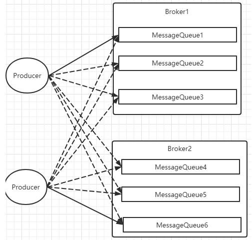
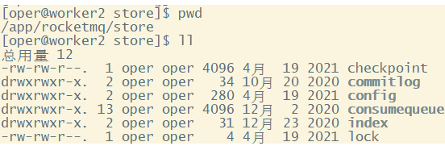

[TOC]

<center><h1> RocketMQ核心源码解读</h1></center>

熟悉了RocketMQ的客户端使用后，这一部分我们来解读RocketMQ的服务端核心源码。通过源码解读进一步了解RocketMQ的消息是如何流转的，以及RocketMQ如何去处理高吞吐、高性能、高可用的三高问题。

# 一、源码环境搭建

## 1、主要功能模块

RocketMQ的官方Git仓库地址：<https://github.com/apache/rocketmq> 可以用git把项目clone下来或者直接下载代码包。

也可以到RocketMQ的官方网站上下载指定版本的源码： <http://rocketmq.apache.org/dowloading/releases/>

源码下很多的功能模块，其中大部分的功能模块都是可以见名知义的：

*   broker: Broker 模块（broke 启动进程）
*   client ：消息客户端，包含消息生产者、消息消费者相关类
*   example: RocketMQ 例代码
*   namesrv：NameServer模块
*   store：消息存储模块
*   remoting：远程访问模块

## 2、源码启动服务

将源码导入IDEA后，需要先对源码进行编译。编译指令 clean install -Dmaven.test.skip=true


编译完成后就可以开始调试代码了。调试时需要按照以下步骤：

**2.1 启动nameServer**

展开namesrv模块，运行NamesrvStartup类即可启动NameServer服务。


&#x9;对这个NamesrvStartup类做一个简单的解读都知道，可以通过-c参数指定一个properties配置文件，并通过-p参数打印出nameserver所有生效的参数配置。


> orderMessageEnable参数默认是false，通过指定配置文件，修改成了true。
>
> 服务端部署时，也可以这样调整nameserver的默认参数配置。

配置完成后，去掉-p参数，再次执行，就可以启动nameserver服务了。启动成功，可以在控制台看到这样日志

    load config properties file OK, /Users/roykingw/namesrv/namesrv.properties
    The Name Server boot success. serializeType=JSON, address 0.0.0.0:9876

**2.2 启动Broker**

&#x9;类似的，Broker服务的启动入口在broker模块的BrokerStatup类。

&#x9;Broker服务，同样可以通过-c参数指定broker.conf文件，并通过-p或者-m参数打印出生效的配置信息。

> broker.conf配置文件在distribution模块中。

&#x9;然后重新启动，即可启动Broker。

**2.3 调用客户端**

&#x9;服务启动好了之后，就可以使用客户端收发消息了。

&#x9;客户端代码在example模块中，具体使用方式略过。

## 3、读源码的方法

&#x9;整个源码环境调试好后，接下来就可以开始详细调试源码了。但是对于RocketMQ的源码，不建议打断点调试，因为线程和定时任务太多，打断点很难调试到。

&#x9;RocketMQ的源码有个特点，就是 **几乎没有注释**。所以开始读源码之前，我会给你分享一些读源码的方式，以便后续你能更好的跟上我的思路。

1、带着问题读源码。如果没有自己的思考，源码不如不读！！！

2、小步快走。不要觉得一两遍就能读懂源码。这里我会分为三个阶段来带你逐步加深对源码的理解。

3、分步总结。带上自己的理解，及时总结。对各种扩展功能，尝试验证。对于RocketMQ，试着去理解源码中的各种单元测试。

# 二、源码热身阶段

梳理一些重要的服务端核心配置，同时梳理一下NameServer和Broker有哪些核心组件，找到一点点读源码的感觉。

## 1、NameServer的启动过程

**1、关注的问题**

在RocketMQ集群中，实际记性消息存储、推送等核心功能点额是Broker。而NameServer的作用，其实和微服务中的注册中心非常类似，他只是提供了Broker端的服务注册与发现功能。

第一次看源码，不要太过陷入具体的细节，先搞清楚NameServer的大体结构。

**2、源码重点**

NameServer的启动入口类是org.apache.rocketmq.namesrv.NamesrvStartup。其中的核心是构建并启动一个NamesrvController。这个Cotroller对象就跟MVC中的Controller是很类似的，都是响应客户端的请求。只不过，他响应的是基于Netty的客户端请求。

&#x9;另外还启动了一个ControllerManager服务，这个服务主要是用来保证服务高可用的，这里暂不解读。

另外，他的实际启动过程，其实可以配合NameServer的启动脚本进行更深入的理解。我们这最先关注的是他的整体结构：


解读出以下几个重点：

1、这几个配置类就可以用来指导如何优化Nameserver的配置。比如，如何调整nameserver的端口？自己试试从源码中找找答案。

2、在之前的4.x版本当中，Nameserver中是没有ControllerManager和NettyRemotingClient的，这意味着现在NameServer现在也需要往外发Netty请求了。

3、稍微解读下Nameserver中核心组件例如RouteInfoManager的结构，可以发现RocketMQ的整体源码风格其实就是典型的MVC思想。 Controller响应网络请求，各种Manager和其中包含的Service处理业务，内存中的各种Table保存消息。

## 2、Broker服务启动过程

**1、关注重点**

Broker是整个RocketMQ的业务核心。所有消息存储、转发这些重要的业务都是Broker进行处理。

这里重点梳理Broker有哪些内部服务。这些内部服务将是整理Broker核心业务流程的起点。

**2、源码重点**

Broker启动的入口在BrokerStartup这个类，可以从他的main方法开始调试。

启动过程关键点：重点也是围绕一个BrokerController对象，先创建，然后再启动。

**首先：** 在BrokerStartup.createBrokerController方法中可以看到Broker的几个核心配置：

*   BrokerConfig ： Broker服务配置
*   MessageStoreConfig ： 消息存储配置。 这两个配置参数都可以在broker.conf文件中进行配置
*   NettyServerConfig  ：Netty服务端占用了10911端口。同样也可以在配置文件中覆盖。
*   NettyClientConfig  ： Broker既要作为Netty服务端，向客户端提供核心业务能力，又要作为Netty客户端，向NameServer注册心跳。
*   AuthConfig：权限相关的配置。

这些配置是我们了解如何优化 RocketMQ 使用的关键。

**然后：** 在BrokerController.start方法可以看到启动了一大堆Broker的核心服务，我们挑一些重要的

```java
this.messageStore.start();//启动核心的消息存储组件
this.timerMessageStore.start(); //时间轮服务，主要是处理指定时间点的延迟消息。

this.remotingServer.start(); //Netty服务端
this.fastRemotingServer.start(); //启动另一个Netty服务端。

this.brokerOuterAPI.start();//启动客户端，往外发请求

this.topicRouteInfoManager.start(); //管理Topic路由信息

BrokerController.this.registerBrokerAll： //向所有依次NameServer注册心跳。

this.brokerStatsManager.start();//服务状态
```

我们现在不需要了解这些核心组件的具体功能，只要有个大概，Broker中有一大堆的功能组件负责具体的业务。后面等到分析具体业务时再去深入每个服务的细节。

我们需要抽象出Broker的一个整体结构：


可以看到Broker启动了两个Netty服务，他们的功能基本差不多。实际上，在应用中，可以通过producer.setSendMessageWithVIPChannel(true)，让少量比较重要的producer走VIP的通道。而在消费者端，也可以通过consumer.setVipChannelEnabled(true)，让消费者支持VIP通道的数据。

# 三、小试牛刀阶段

开始理解一些比较简单的业务逻辑

## 3、Netty服务注册框架

**1、关注重点?**

&#x9;RocketMQ实际上是一个复杂的分布式系统， NameServer，Broker，Client之间需要有大量跨进程的RPC调用。这些复杂的RPC请求是怎么管理，怎么调用的呢？这是我们去理解RocketMQ底层业务的基础。这一部分的重点就是去梳理RocketMQ的这一整套基于Netty的远程调用框架。

&#x9;需要说明的是，RocketMQ整个服务调用框架绝大部分是使用Netty框架封装的。所以，要看懂这部分代码，需要你对Netty框架有足够的了解。

**2、源码重点**

&#x9;​ Netty的所有远程通信功能都由remoting模块实现。remoting模块中有两个对象最为重要。 就是RPC的服务端RemotingServer以及客户端RemotingClient。在RocketMQ中，涉及到的远程服务非常多，同一个服务，可能既是RPC的服务端也可以是RPC的客户端。例如Broker服务，对于Client来说，他需要作为服务端响应他们发送消息以及拉取消息等请求，所以Broker是需要RemotingServer的。而另一方面，Broker需要主动向NameServer发送心跳请求，这时，Broker又需要RemotingClient。因此，Broker既是RPC的服务端又是RPC的客户端。

&#x9;对于这部分的源码，就可以从remoting模块中RemotingServer和RemotingClient的初始化过程入手。有以下几个重点是需要梳理清楚的：

&#x9;1、RemotingServer和RemotingClient之间是通过什么协议通讯的？

&#x9;RocketMQ中，RemotingServer是一个接口，在这个接口下，提供了两个具体的实现类，NettyRemotingServer和MultiProtocolRemotingServer。他们都是基于Netty框架封装的，只不过处理数据的协议不一样。也就是说，RocketMQ可以基于不同协议实现RPC访问。其实这也就为RocketMQ提供多种不同语言的客户端打下了基础。

2、哪些组件需要Netty服务端？哪些组件需要Netty客户端？&#x20;

&#x9;之间简单梳理过，NameServer和Broker的服务内部都是既有RemotingServer和RemotingClient的。 那么作为客户端的Producer和Consumer，是不是就只需要RemotingClient呢？其实也不是，事务消息的Producer也需要响应Broker的事务状态回查，他也是需要NettyServer的。

&#x9;这里需要注意的是，Netty框架是基于Channel长连接发起的RPC通信。只要长连接建立了，那么数据发送是双向的。也就是说，Channel长连接建立完成后，NettyServer服务端也可以向NettyClient客户端发送请求，所以服务端和客户端都需要对业务进行处理。

&#x9;3、Netty框架最核心的部分是如何构架处理链，RocketMQ是如何构建的呢？

&#x9;服务端构建处理链的核心代码：

```java
// org.apache.rocketmq.remoting.netty.NettyRemotingServer
protected ChannelPipeline configChannel(SocketChannel ch) {
        return ch.pipeline()
            .addLast(defaultEventExecutorGroup, HANDSHAKE_HANDLER_NAME, new HandshakeHandler())
            .addLast(defaultEventExecutorGroup,
                encoder, //请求编码器
                new NettyDecoder(), //请求解码器
                distributionHandler, //请求计数器
                new IdleStateHandler(0, 0,
                    nettyServerConfig.getServerChannelMaxIdleTimeSeconds()), //心跳管理器
                connectionManageHandler, //连接管理器
                serverHandler //核心的业务处理器
            );
    }
```

&#x9;我们这里主要分析业务请求如何管理。分两个部分来看：

**1、请求参数：**

&#x9;从请求的编解码器可以看出，RocketMQ的所有RPC请求数据都封装成RemotingCommand对象。​RemotingCommand对象中有几个重要的属性：

```java
private int code; //响应码，表示请求处理成功还是失败
private int opaque = requestId.getAndIncrement(); //服务端内部会构建唯一的请求ID。
private transient CommandCustomHeader customHeader; //自定义的请求头。用来区分不同的业务请求
private transient byte[] body; //请求参数体
private int flag = 0; //参数类型， 默认0表示请求，1表示响应
```

&#x9;**2、处理逻辑**

&#x9;所有核心的业务请求都是通过一个NettyServerHandler进行统一处理。他处理时的核心代码如下：

```java
    @ChannelHandler.Sharable
    public class NettyServerHandler extends SimpleChannelInboundHandler<RemotingCommand> {
		//统一处理所有业务请求
        @Override
        protected void channelRead0(ChannelHandlerContext ctx, RemotingCommand msg) {
            int localPort = RemotingHelper.parseSocketAddressPort(ctx.channel().localAddress());
            NettyRemotingAbstract remotingAbstract = NettyRemotingServer.this.remotingServerTable.get(localPort);
            if (localPort != -1 && remotingAbstract != null) {
                remotingAbstract.processMessageReceived(ctx, msg); //核心处理请求的方法
                return;
            }
            // The related remoting server has been shutdown, so close the connected channel
            RemotingHelper.closeChannel(ctx.channel());
        }
		
        @Override
        public void channelWritabilityChanged(ChannelHandlerContext ctx) throws Exception {
           //调整channel的读写属性
        }
    }
```

&#x9;\*\*2.1、在最核心的处理请求的processMessageReceived方法中，会将请求类型分为 REQUEST\_\_COMMAND 和 RESPONSE\_COMMAND来处理。\*\*为什么会有两种不同类型的请求呢？

&#x9;这是因为客户端的业务请求会有两种类型：一种是客户端发过来的业务请求，另一种是客户上次发过来的业务请求，可能并没有同步给出相应。这时就需要客户端再发一个response类型的请求，获取上一次请求的响应。这也就能支持异步的RPC调用。

&#x9;**2.2、如何处理request类型的请求？**

&#x9;服务端和客户端都会维护一个processorTable。这是个HashMap,key是服务码，也就对应RemotingCommand的code。value是对应的运行单元 Pair\<NettyRequestProcessor, ExecutorService>。包含了执行线程的线程池和具体处理业务的Processor。 而这些Processor，是由业务系统自行注册的。&#x20;

&#x9;也就是说，**想要看每个服务具体有哪些业务能力，就只要看他们注册了哪些Processor就知道了**。

&#x9;Broker服务注册，详见 BrokerController.registerProcssor()方法。

&#x9;NameServer的服务注册方法，重点如下：

```java
    private void registerProcessor() {
        if (namesrvConfig.isClusterTest()) { //是否测试集群模式，默认是false。也就是说现在阶段不推荐。

            this.remotingServer.registerDefaultProcessor(new ClusterTestRequestProcessor(this, namesrvConfig.getProductEnvName()), this.defaultExecutor);
        } else {
            // Support get route info only temporarily
            ClientRequestProcessor clientRequestProcessor = new ClientRequestProcessor(this);
            this.remotingServer.registerProcessor(RequestCode.GET_ROUTEINFO_BY_TOPIC, clientRequestProcessor, this.clientRequestExecutor);

            this.remotingServer.registerDefaultProcessor(new DefaultRequestProcessor(this), this.defaultExecutor);
        }
    }
```

&#x9;另外，NettyClient也会注册一个大的ClientRemotingProcessor，统一处理所有请求。注册方法见 org.apache.rocketmq.client.impl.MQClientAPIImpl类的构造方法。也就是说，只要长连接建立完成了，NettyClient比如Producer，也可以处理NettyServer发过来的请求。

&#x9;**2.3、如何处理response类型的请求？**

&#x9;NettyServer处理完request请求后，会先缓存到responseTable中，等NettyClient下次发送response类型的请求，再来获取。这样就不用阻塞Channel，提升请求的吞吐量。优雅的支持了异步请求。

\*\*	2.4、关于RocketMQ的同步结果推送与异步结果推送\*\*

​ RocketMQ的RemotingServer服务端，会维护一个responseTable，这是一个线程同步的Map结构。 key为请求的ID，value是异步的消息结果。ConcurrentMap\<Integer /\* opaque \*/, ResponseFuture> 。

​ 处理同步请求(NettyRemotingAbstract#invokeSyncImpl)时，处理的结果会存入responseTable，通过ResponseFuture提供一定的服务端异步处理支持，提升服务端的吞吐量。 请求返回后，立即从responseTable中移除请求记录。

​ 实际上，同步也是通过异步实现的。

```java
    //org.apache.rocketmq.remoting.netty.ResponseFuture
	//发送消息后，通过countDownLatch阻塞当前线程，造成同步等待的效果。
    public RemotingCommand waitResponse(final long timeoutMillis) throws InterruptedException {
        this.countDownLatch.await(timeoutMillis, TimeUnit.MILLISECONDS);
        return this.responseCommand;
    }
	//等待异步获取到消息后，再通过countDownLatch释放当前线程。
    public void putResponse(final RemotingCommand responseCommand) {
        this.responseCommand = responseCommand;
        this.countDownLatch.countDown();
    }
```

​ 处理异步请求(NettyRemotingAbstract#invokeAsyncImpl)时，处理的结果依然会存入responsTable，等待客户端后续再来请求结果。但是他保存的依然是一个ResponseFuture，也就是在客户端请求结果时再去获取真正的结果。

另外，在RemotingServer启动时，会启动一个定时的线程任务，不断扫描responseTable，将其中过期的response清除掉。

```java
    //org.apache.rocketmq.remoting.netty.NettyRemotingServer
    TimerTask timerScanResponseTable = new TimerTask() {
        @Override
        public void run(Timeout timeout) {
            try {
                NettyRemotingServer.this.scanResponseTable();
            } catch (Throwable e) {
                log.error("scanResponseTable exception", e);
            } finally {
                timer.newTimeout(this, 1000, TimeUnit.MILLISECONDS);
            }
        }
    };
    this.timer.newTimeout(timerScanResponseTable, 1000 * 3, TimeUnit.MILLISECONDS);
```

整体RPC框架流程如下图：


&#x9;可以看到，RocketMQ基于Netty框架实现的这一套基于服务码的服务注册机制，即可以让各种不同的组件都按照自己的需求注册自己的服务方法，又可以以一种统一的方式同时支持同步请求和异步请求。所以这一套框架，其实是非常简洁易用的。在使用Netty框架进行相关应用开发时，都可以借鉴他的这一套服务注册机制。例如开发一个大型的IM项目，要添加好友、发送文本、发送图片、发送附件、甚至还有表情、红包等等各种各样的请求。这些请求如何封装，就可以参考这一套服务注册框架。​

## 4、Broker心跳注册管理

**1、关注重点**

&#x9;把RocketMQ的服务调用框架整理清楚之后，接下来就可以从一些具体的业务线来进行详细梳理了。

之前介绍过，Broker会在启动时向所有NameServer注册自己的服务信息，并且会定时往NameServer发送心跳信息。而NameServer会维护Broker的路由列表，并对路由表进行实时更新。这一轮就重点梳理这个过程。

**2、源码重点**

Broker启动后会立即发起向NameServer注册心跳。方法入口：BrokerController.this.registerBrokerAll。 然后启动一个定时任务，以10秒延迟，默认30秒的间隔持续向NameServer发送心跳。

```java
// K4 Broker向NameServer进行心跳注册
if (!isIsolated && !this.messageStoreConfig.isEnableDLegerCommitLothis.messageStoreConfig.isDuplicationEnable()) {
    changeSpecialServiceStatus(this.brokerConfig.getBrokerId() ==MASTER_ID);
    this.registerBrokerAll(true, false, true);
}
// 启动后定时注册
scheduledFutures.add(this.scheduledExecutorService.scheduleAtFixed AbstractBrokerRunnable(this.getBrokerIdentity()) {
    @Override
    public void run0() {
        try {
            if (System.currentTimeMillis() < shouldStartTime) {
                BrokerController.LOG.info("Register to namesrv aftshouldStartTime);
                return;
            }
            if (isIsolated) {
                BrokerController.LOG.info("Skip register for brisolated");
                return;
            }
            BrokerController.this.registerBrokerAll(true,brokerConfig.isForceRegister());
        } catch (Throwable e) {
            BrokerController.LOG.error("registerBrokerAll Exception", e);
        }
    }
}, 1000 * 10, Math.max(10000, Math.min(brokerConfig.getRegisterNameServerPeriod(), 60000)), TimeUnit.MILLISECONDS));

```

NameServer内部会通过RouteInfoManager组件及时维护Broker信息。具体参见org.apache.rocketmq.namesrv.routeinfo.RouteInfoManager的registerBroker方法

&#x9;同时在NameServer启动时，会启动定时任务，扫描不活动的Broker。方法入口：NamesrvController.initialize方法，往下跟踪到startScheduleService方法。。


**3、极简化的服务注册发现流程**

为什么RocketMQ要自己实现一个NameServer，而不用Zookeeper、Nacos这样现成的注册中心？

首先，依赖外部组件会对产品的独立性形成侵入，不利于自己的版本演进。Kafka要抛弃Zookeeper就是一个先例。

另外，其实更重要的还是对业务的合理设计。NameServer之间不进行信息同步，而是依赖Broker端向所有NameServer同时发起注册。这让NameServer的服务可以非常轻量。如果可能，你可以与Nacos或Zookeeper的核心流程做下对比。NameServer集群只要有一个节点存活。整个集群就能正常提供服务，而Zookeeper，Nacos等都是基于多数派同意的机制，需要集群中超过半数的节点存活才能正常提供服务。

但是，要知道，这种极简的设计，其实是以牺牲数据一致性为代价的。Broker往多个NameServer同时发起注册，有可能部分NameServer注册成功，而部分NameServer注册失败了。这样，多个NameServer之间的数据是不一致的。作为通用的注册中心，这是不可接受的。但是对于RocketMQ，这又变得可以接受了。因为客户端从NameServer上获得Broker列表后，只要有一个正常运行的Broker就可以了，并不需要完整的Broker列表。

## 5、Producer发送消息过程

**1、关注重点**

首先：回顾下我们之前的Producer使用案例。

Producer有两种：

*   一种是普通发送者：DefaultMQProducer。只负责发送消息，发送完消息，就可以停止了。
*   另一种是事务消息发送者： TransactionMQProducer。支持事务消息机制。需要在事务消息过程中提供事务状态确认的服务，这就要求事务消息发送者虽然是一个客户端，但是也要完成整个事务消息的确认机制后才能退出。

事务消息机制后面将结合Broker进行整理分析。这一步暂不关注。我们只关注DefaultMQProducer的消息发送过程。

然后：整个Producer的使用流程，大致分为两个步骤：一是调用start方法，进行一大堆的准备工作。  二是各种send方法，进行消息发送。

那我们重点关注以下几个问题：

1、Producer启动过程中启动了哪些服务。也就是了解RocketMQ的Client客户端的基础结构。

2、Producer如何管理broker路由信息。 可以设想一下，如果Producer启动了之后，NameServer挂了，那么Producer还能不能发送消息？希望你先从源码中进行猜想，然后自己设计实验进行验证。

3、关于Producer的负载均衡。也就是Producer到底将消息发到哪个MessageQueue中。这里可以结合顺序消息机制来理解一下。消息中那个莫名奇妙的MessageSelector到底是如何工作的。

**2、源码重点**

1、Producer的核心启动流程

所有Producer的启动过程，最终都会调用到DefaultMQProducerImpl#start方法。在start方法中的通过一个mQClientFactory对象，启动生产者的一大堆重要服务。

&#x9;这个mQClientFactory是最为重要的一个对象，负责生产所有的Client,包括Producer和Consumer。

这里其实就是一种设计模式，虽然有很多种不同的客户端，但是这些客户端的启动流程最终都是统一的，全是交由mQClientFactory对象来启动。而不同之处在于这些客户端在启动过程中，按照服务端的要求注册不同的信息。例如生产者注册到producerTable，消费者注册到consumerTable，管理控制端注册到adminExtTable


2、发送消息的核心流程

核心流程如下：


1、发送消息时，会维护一个本地的topicPublishInfoTable缓存，DefaultMQProducer会尽量保证这个缓存数据是最新的。但是，如果NameServer挂了，那么DefaultMQProducer还是会基于这个本地缓存去找Broker。只要能找到Broker，还是可以正常发送消息到Broker的。 --可以在生产者示例中，start后打一个断点，然后把NameServer停掉，这时，Producer还是可以发送消息的。

2、生产者如何找MessageQueue： 默认情况下，生产者是按照轮训的方式，依次轮训各个MessageQueue。但是如果某一次往一个Broker发送请求失败后，下一次就会跳过这个Broker。

```java
	//org.apache.rocketmq.client.impl.producer.TopicPublishInfo
	//QueueFilter是用来过滤掉上一次失败的Broker的，表示上一次向这个Broker发送消息是失败的，这时就尽量不要再往这个Broker发送消息了。
	private MessageQueue selectOneMessageQueue(List<MessageQueue> messageQueueList, ThreadLocalIndex sendQueue, QueueFilter ...filter) {
        if (messageQueueList == null || messageQueueList.isEmpty()) {
            return null;
        }

        if (filter != null && filter.length != 0) {
            for (int i = 0; i < messageQueueList.size(); i++) {
                int index = Math.abs(sendQueue.incrementAndGet() % messageQueueList.size());
                MessageQueue mq = messageQueueList.get(index);
                boolean filterResult = true;
                for (QueueFilter f: filter) {
                    Preconditions.checkNotNull(f);
                    filterResult &= f.filter(mq);
                }
                if (filterResult) {
                    return mq;
                }
            }

            return null;
        }

        int index = Math.abs(sendQueue.incrementAndGet() % messageQueueList.size());
        return messageQueueList.get(index);
    }
```

3、如果在发送消息时传了Selector，那么Producer就不会走这个负载均衡的逻辑，而是会使用Selector去寻找一个队列。 具体参见org.apache.rocketmq.client.impl.producer.DefaultMQProducerImpl#sendSelectImpl 方法。

```java
    //K4 Producer顺序消息的发送方法
    public MessageQueue invokeMessageQueueSelector(Message msg, MessageQueueSelector selector, Object arg,
                                                   final long timeout) throws MQClientException, RemotingTooMuchRequestException {
        long beginStartTime = System.currentTimeMillis();
        this.makeSureStateOK();
        Validators.checkMessage(msg, this.defaultMQProducer);

        TopicPublishInfo topicPublishInfo = this.tryToFindTopicPublishInfo(msg.getTopic());
        if (topicPublishInfo != null && topicPublishInfo.ok()) {
            MessageQueue mq = null;
            try {
                List<MessageQueue> messageQueueList =
                        mQClientFactory.getMQAdminImpl().parsePublishMessageQueues(topicPublishInfo.getMessageQueueList());
                Message userMessage = MessageAccessor.cloneMessage(msg);
                String userTopic = NamespaceUtil.withoutNamespace(userMessage.getTopic(), mQClientFactory.getClientConfig().getNamespace());
                userMessage.setTopic(userTopic);
				//由selector选择出目标mq
                mq = mQClientFactory.getClientConfig().queueWithNamespace(selector.select(messageQueueList, userMessage, arg));
            } catch (Throwable e) {
                throw new MQClientException("select message queue threw exception.", e);
            }

            long costTime = System.currentTimeMillis() - beginStartTime;
            if (timeout < costTime) {
                throw new RemotingTooMuchRequestException("sendSelectImpl call timeout");
            }
            if (mq != null) {
                return mq;
            } else {
                throw new MQClientException("select message queue return null.", null);
            }
        }

        validateNameServerSetting();
        throw new MQClientException("No route info for this topic, " + msg.getTopic(), null);
    }
```

## 6、Consumer拉取消息过程

**1、关注重点**

结合我们之前的示例，回顾下消费者这一块的几个重点问题：

*   消费者也是有两种，推模式消费者和拉模式消费者。优秀的MQ产品都会有一个高级的目标，就是要提升整个消息处理的性能。而要提升性能，服务端的优化手段往往不够直接，最为直接的优化手段就是对消费者进行优化。所以在RocketMQ中，整个消费者的业务逻辑是非常复杂的，甚至某种程度上来说，比服务端更复杂，所以，在这里我们重点关注用得最多的推模式的消费者。

*   消费者组之间有集群模式和广播模式两种消费模式。我们就要了解下这两种集群模式是如何做的逻辑封装。

*   然后我们关注下消费者端的负载均衡的原理。即消费者是如何绑定消费队列的，哪些消费策略到底是如何落地的。

*   最后我们来关注下在推模式的消费者中，MessageListenerConcurrently 和MessageListenerOrderly这两种消息监听器的处理逻辑到底有什么不同，为什么后者能保持消息顺序。

**2、源码重点**

Consumer的核心启动过程和Producer是一样的， 最终都是通过mQClientFactory对象启动。不过之间添加了一些注册信息。整体的启动过程如下：


**3、广播模式与集群模式的Offset处理**

在DefaultMQPushConsumerImpl的start方法中，启动了非常多的核心服务。 比如，对于广播模式与集群模式的Offset处理

```java
if (this.defaultMQPushConsumer.getOffsetStore() != null) {
    this.offsetStore = this.defaultMQPushConsumer.;
} else {
    switch (this.defaultMQPushConsumer.getMessageModel()) {
        case BROADCASTING:
            this.offsetStore = new LocalFileOmQClientFactory, this.defaulgetConsumerGroup());
            break;
        case CLUSTERING:
            this.offsetStore = new RemoteBrokerOmQClientFactory, this.defaulgetConsumerGroup());
            break;
        default:
            break;
    }
    this.defaultMQPushConsumer.setOffsetStore(this.offsetStore);
}
this.offsetStore.load();
```

可以看到，广播模式是使用LocalFileOffsetStore，在Consumer本地保存Offset，而集群模式是使用RemoteBrokerOffsetStore，在Broker端远程保存offset。而这两种Offset的存储方式，最终都是通过维护本地的offsetTable缓存来管理Offset。

**4、Consumer与MessageQueue建立绑定关系**

start方法中还一个比较重要的东西是给rebalanceImpl设定了一个AllocateMessageQueueStrategy，用来给Consumer分配MessageQueue的。

```java
this.rebalanceImpl.setMessageModel(this.defaultMQPushConsumer.getMessageModel());
//Consumer负载均衡策略
this.rebalanceImpl.setAllocateMessageQueueStrategy(this.defaultMQPushConsumer.getAllocateMessageQueueStrategy());
```

这个AllocateMessageQueueStrategy就是用来给Consumer和MessageQueue之间建立一种对应关系的。也就是说，只要Topic当中的MessageQueue以及同一个ConsumerGroup中的Consumer实例都没有变动，那么某一个Consumer实例只是消费固定的一个或多个MessageQueue上的消息，其他Consumer不会来抢这个Consumer对应的MessageQueue。

&#x9;关于具体的分配策略，可以看下RocketMQ中提供的AllocateMessageQueueStrategy接口实现类。你能自己尝试看懂他的分配策略吗？


这里，你可以想一下为什么要让一个MessageQueue只能由同一个ConsumerGroup中的一个Consumer实例来消费。

其实原因很简单，因为Broker需要按照ConsumerGroup管理每个MessageQueue上的Offset，如果一个MessageQueue上有多个同属一个ConsumerGroup的Consumer实例，他们的处理进度就会不一样。这样的话，Offset就乱套了。

**5、顺序消费与并发消费**

同样在start方法中，启动了consumerMessageService线程，进行消息拉取。

```java
//K6 消费者顺序消费与并发消费的区别
if (this.getMessageListenerInner() instancMessageListener顺序消费监听器
    this.consumeOrderly = true;
    this.consumeMessageService =
        new ConsumeMessageOrderlyService(thiMessageListethis.getMessageListenerInn);
    //POExecuto一种新的MessageQueue工作模式。还在TODO中，就暂不关注了。
    this.consumeMessagePopService = ConsumeMessagePopOrdthiMessageListenerOrderly) this.getMessageListenerInner());
} else if (this.getMessageListinstancMessageListenerConcurrently) { //并发消费监听器
    this.consumeOrderly = false;
    this.consumeMessageService =
        new ConsumeMessageConcurrethiMessageListenerConcurrently) tgetMessageLis);
    //POPTODO reuse Executor ?
    this.consumeMessagePopService =
        new ConsumeMessagePopConcurrethiMessageListenerConcurrently) tgetMessageLis);
}

this.consumeMessageService.start();
// POPTODO
this.consumeMessagePopService.start();
```

可以看到， Consumer通过registerMessageListener方法指定的回调函数，都被封装成了ConsumerMessageService的子实现类。

> 当前版本新增了一个POP模式。这是一种新增的工作模式，目前在TODO中，就暂不关注了。有兴趣可以自己看看。
>
> 具体入口在org.apache.rocketmq.client.impl.consumer.PullMessageService 的run方法。这个服务会随着客户端一起启动。
>
> ```java
> 	  @Override
>     public void run() {
>         logger.info(this.getServiceName() + " service started");
>
>         while (!this.isStopped()) {
>             try {
>                 MessageRequest messageRequest = this.messageRequestQueue.take();
>                 if (messageRequest.getMessageRequestMode() == MessageRequestMode.POP) {
>                     this.popMessage((PopRequest) messageRequest);
>                 } else {
>                     this.pullMessage((PullRequest) messageRequest);
>                 }
>             } catch (InterruptedException ignored) {
>             } catch (Exception e) {
>                 logger.error("Pull Message Service Run Method exception", e);
>             }
>         }
>
>         logger.info(this.getServiceName() + " service end");
>     }
> ```

而对于这两个服务实现类的调用，会延续到DefaultMQPushConsumerImpl的pullCallback对象中。也就是Consumer每拉过来一批消息后，就向Broker提交下一个拉取消息的的请求。

> 这里也可以印证一个点，就是顺序消息，只对异步消费也就是推模式有效。同步消费的拉模式是无法进行顺序消费的。因为这个pullCallback对象，在拉模式的同步消费时，根本就没有往下传。
>
> 当然，这并不是说拉模式不能锁定队列进行顺序消费，拉模式在Consumer端应用就可以指定从哪个队列上拿消息。

```java
PullCallback pullCallback = new PullCallback() {
    @Override
    public void onSuccess(PullResult pullResult) {
        if (pullResult != null) {
		    //...
            switch (pullResult.getPullStatus()) {
                case FOUND:
                    //...
                    DefaultMQPushConsumerImpl.this.consumeMessageService.submitConsumeRequest(pullResult.getMsgFoundList(), processQueue, pullRequest.getMessageQueue(), dispatchToConsume);

                    //... 
                break;
                    //...
                }
            }
        }
```

而这里提交的，实际上是一个ConsumeRequest线程。而提交的这个ConsumeRequest线程，在两个不同的ConsumerService中有不同的实现。

这其中，两者最为核心的区别在于ConsumeMessageConcurrentlyService只是控制一批请求的大小，而并不控制从哪个MessageQueue上拉取消息。

```java
    @Override
    public void submitConsumeRequest(
        final List<MessageExt> msgs,
        final ProcessQueue processQueue,
        final MessageQueue messageQueue,
        final boolean dispatchToConsume) {
        final int consumeBatchSize = this.defaultMQPushConsumer.getConsumeMessageBatchMaxSize();
        if (msgs.size() <= consumeBatchSize) {
            ConsumeRequest consumeRequest = new ConsumeRequest(msgs, processQueue, messageQueue);
            try {//往线程池中提交ConsumeRequest。注意，在线程池中，多个ConsumeRequest是并发执行的。所以如果没有并发控制，会有多个线程同时拉取消息。
                this.consumeExecutor.submit(consumeRequest);
            } catch (RejectedExecutionException e) {
                this.submitConsumeRequestLater(consumeRequest);
            }
        } else {
            for (int total = 0; total < msgs.size(); ) {
                List<MessageExt> msgThis = new ArrayList<>(consumeBatchSize);
                for (int i = 0; i < consumeBatchSize; i++, total++) {
                    if (total < msgs.size()) {
                        msgThis.add(msgs.get(total));
                    } else {
                        break;
                    }
                }

                ConsumeRequest consumeRequest = new ConsumeRequest(msgThis, processQueue, messageQueue);
                try {
                    this.consumeExecutor.submit(consumeRequest);
                } catch (RejectedExecutionException e) {
                    for (; total < msgs.size(); total++) {
                        msgThis.add(msgs.get(total));
                    }

                    this.submitConsumeRequestLater(consumeRequest);
                }
            }
        }
    }
```

而ConsumerMessageOrderlyService是锁定了一个队列，处理完了之后，再消费下一个队列。

```java
	@Override
    public void submitConsumeRequest(
        final List<MessageExt> msgs,
        final ProcessQueue processQueue,
        final MessageQueue messageQueue,
        final boolean dispatchToConsume) {
        if (dispatchToConsume) {//不做请求批量大小控制，直接提交请求
            ConsumeRequest consumeRequest = new ConsumeRequest(processQueue, messageQueue);
            this.consumeExecutor.submit(consumeRequest);
        }
    } 
    //ConsumerMessageOrderlyService中定义的consumerRequest
    public void run() {
		// ....

        final Object objLock = messageQueueLock.fetchLockObject(this.messageQueue);
        synchronized (objLock) {
            //....
        }
    }
```

为什么给队列加个锁，就能保证顺序消费呢？结合顺序消息的实现机制理解一下。


从源码中可以看到，Consumer提交请求时，都是往线程池里异步提交的请求。如果不加队列锁，那么就算Consumer提交针对同一个MessageQueue的拉取消息请求，这些请求都是异步执行，他们的返回顺序是乱的，无法进行控制。给队列加个锁之后，就保证了针对同一个队列的第二个请求，必须等第一个请求处理完了之后，释放了锁，才可以提交。这也是在异步情况下保证顺序的基础思路。

**6、实际拉取消息还是通过PullMessageService完成的。**

start方法中，相当于对很多消费者的服务进行初始化，包括指定一些服务的实现类，以及启动一些定时的任务线程，比如清理过期的请求缓存等。最后，会随着mQClientFactory组件的启动，启动一个PullMessageService。实际的消息拉取都交由PullMesasgeService进行。

所谓消息推模式，其实还是通过Consumer拉消息实现的。

```java
	//org.apache.rocketmq.client.impl.consumer.PullMessageService下的pullMessage方法
	private void pullMessage(final PullRequest pullRequest) {
        final MQConsumerInner consumer = this.mQClientFactory.selectConsumer(pullRequest.getConsumerGroup());
        if (consumer != null) {
            DefaultMQPushConsumerImpl impl = (DefaultMQPushConsumerImpl) consumer;
            impl.pullMessage(pullRequest);
        } else {
            log.warn("No matched consumer for the PullRequest {}, drop it", pullRequest);
        }
    }
```

> 另外还一种pop工作模式也是在PullMessagService下的popMessage方法触发。

## 7、客户端负载均衡管理总结

从之前Producer发送消息的过程以及Conmer拉取消息的过程，我们可以抽象出RocketMQ中一个消息分配的管理模型。这个模型是我们在使用RocketMQ时，很重要的进行性能优化的依据。

### 1 Producer负载均衡

Producer发送消息时，默认会轮询目标Topic下的所有MessageQueue，并采用递增取模的方式往不同的MessageQueue上发送消息，以达到让消息平均落在不同的queue上的目的。而由于MessageQueue是分布在不同的Broker上的，所以消息也会发送到不同的broker上。

在之前源码中看到过，Producer轮训时，如果发现往某一个Broker上发送消息失败了，那么下一次会尽量避免再往同一个Broker上发送消息。但是，如果你的应用场景允许发送消息长延迟，也可以给Producer设定setSendLatencyFaultEnable(true)。这样对于某些Broker集群的网络不是很好的环境，可以提高消息发送成功的几率。



同时生产者在发送消息时，可以指定一个MessageQueueSelector。通过这个对象来将消息发送到自己指定的MessageQueue上。这样可以保证消息局部有序。

### 2 Consumer负载均衡

Consumer也是以MessageQueue为单位来进行负载均衡。分为集群模式和广播模式。

**1、集群模式**

在集群消费模式下，每条消息只需要投递到订阅这个topic的Consumer Group下的一个实例即可。RocketMQ采用主动拉取的方式拉取并消费消息，在拉取的时候需要明确指定拉取哪一条message queue。

而每当实例的数量有变更，都会触发一次所有实例的负载均衡，这时候会按照queue的数量和实例的数量平均分配queue给每个实例。

每次分配时，都会将MessageQueue和消费者ID进行排序后，再用不同的分配算法进行分配。内置的分配的算法共有六种，分别对应AllocateMessageQueueStrategy下的六种实现类，可以在consumer中直接set来指定。默认情况下使用的是最简单的平均分配策略。

*   AllocateMachineRoomNearby： 将同机房的Consumer和Broker优先分配在一起。

这个策略可以通过一个machineRoomResolver对象来定制Consumer和Broker的机房解析规则。然后还需要引入另外一个分配策略来对同机房的Broker和Consumer进行分配。一般也就用简单的平均分配策略或者轮询分配策略。

> 感觉这东西挺鸡肋的，直接给个属性指定机房不是挺好的吗。

源码中有测试代码AllocateMachineRoomNearByTest。

在示例中：Broker的机房指定方式： messageQueue.getBrokerName().split("-")\[0]，而Consumer的机房指定方式：clientID.split("-")\[0]

	clinetID的构建方式：见ClientConfig.buildMQClientId方法。按他的测试代码应该是要把clientIP指定为IDC1-CID-0这样的形式。

*   AllocateMessageQueueAveragely：平均分配。将所有MessageQueue平均分给每一个消费者

*   AllocateMessageQueueAveragelyByCircle： 轮询分配。轮流的给一个消费者分配一个MessageQueue。

*   AllocateMessageQueueByConfig： 不分配，直接指定一个messageQueue列表。类似于广播模式，直接指定所有队列。

*   AllocateMessageQueueByMachineRoom：按逻辑机房的概念进行分配。又是对BrokerName和ConsumerIdc有定制化的配置。

*   AllocateMessageQueueConsistentHash。源码中有测试代码AllocateMessageQueueConsitentHashTest。这个一致性哈希策略只需要指定一个虚拟节点数，是用的一个哈希环的算法，虚拟节点是为了让Hash数据在换上分布更为均匀。

最常用的就是平均分配和轮训分配了。例如平均分配时的分配情况是这样的：


而轮训分配就不计算了，每次把一个队列分给下一个Consumer实例。

**2、广播模式**

广播模式下，每一条消息都会投递给订阅了Topic的所有消费者实例，所以也就没有消息分配这一说。而在实现上，就是在Consumer分配Queue时，所有Consumer都分到所有的Queue。

广播模式实现的关键是将消费者的消费偏移量不再保存到broker当中，而是保存到客户端当中，由客户端自行维护自己的消费偏移量。

# 四、融汇贯通阶段

开始梳理一些比较完整，比较复杂的完整业务线。

## 8、消息持久化设计

### 1、RocketMQ的持久化文件结构

消息持久化也就是将内存中的消息写入到本地磁盘的过程。而磁盘IO操作通常是一个很耗性能，很慢的操作，所以，对消息持久化机制的设计，是一个MQ产品提升性能的关键，甚至可以说是最为重要的核心也不为过。这部分我们就先来梳理RocketMQ是如何在本地磁盘中保存消息的。

在进入源码之前，我们首先需要看一下RocketMQ在磁盘上存了哪些文件。RocketMQ消息直接采用磁盘文件保存消息，默认路径在\${user\_home}/store目录。这些存储目录可以在broker.conf中自行指定。



*   存储文件主要分为三个部分：

    *   CommitLog：存储消息的元数据。所有消息都会顺序存入到CommitLog文件当中。CommitLog由多个文件组成，每个文件固定大小1G。以第一条消息的偏移量为文件名。
    *   ConsumerQueue：存储消息在CommitLog的索引。一个MessageQueue一个文件，记录当前MessageQueue被哪些消费者组消费到了哪一条CommitLog。
    *   IndexFile：为了消息查询提供了一种通过key或时间区间来查询消息的方法，这种通过IndexFile来查找消息的方法不影响发送与消费消息的主流程

    另外，还有几个辅助的存储文件，主要记录一些描述消息的元数据：

    *   checkpoint：数据存盘检查点。里面主要记录commitlog文件、ConsumeQueue文件以及IndexFile文件最后一次刷盘的时间戳。
    *   config/\*.json：这些文件是将RocketMQ的一些关键配置信息进行存盘保存。例如Topic配置、消费者组配置、消费者组消息偏移量Offset 等等一些信息。
    *   abort：这个文件是RocketMQ用来判断程序是否正常关闭的一个标识文件。正常情况下，会在启动时创建，而关闭服务时删除。但是如果遇到一些服务器宕机，或者kill -9这样一些非正常关闭服务的情况，这个abort文件就不会删除，因此RocketMQ就可以判断上一次服务是非正常关闭的，后续就会做一些数据恢复的操作。

整体的消息存储结构，如下图：


简单来说，Producer发过来的所有消息，不管是属于那个Topic，Broker都统一存在CommitLog文件当中，然后分别构建ConsumeQueue文件和IndexFile两个索引文件，用来辅助消费者进行消息检索。这种设计最直接的好处是可以较少查找目标文件的时间，让消息以最快的速度落盘。对比Kafka存文件时，需要寻找消息所属的Partition文件，再完成写入。当Topic比较多时，这样的Partition寻址就会浪费非常多的时间。所以Kafka不太适合多Topic的场景。而RocketMQ的这种快速落盘的方式，在多Topic的场景下，优势就比较明显了。

然后在文件形式上：

CommitLog文件的大小是固定的。文件名就是当前CommitLog文件当中存储的第一条消息的Offset。

ConsumeQueue文件主要是加速消费者进行消息索引。每个文件夹对应RocketMQ中的一个MessageQueue，文件夹下的文件记录了每个MessageQueue中的消息在CommitLog文件当中的偏移量。这样，消费者通过ConsumeQueue文件，就可以快速找到CommitLog文件中感兴趣的消息记录。而消费者在ConsumeQueue文件中的消费进度，会保存在config/consumerOffset.json文件当中。

IndexFile文件主要是辅助消费者进行消息索引。消费者进行消息消费时，通过ConsumeQueue文件就足够完成消息检索了，但是如果消费者指定时间戳进行消费，或者要按照MeessageId或者MessageKey来检索文件，比如RocketMQ管理控制台的消息轨迹功能，ConsumeQueue文件就不够用了。IndexFile文件就是用来辅助这类消息检索的。他的文件名比较特殊，不是以消息偏移量命名，而是用的时间命名。但是其实，他也是一个固定大小的文件。

&#x9;了解了RocketMQ的这些基础知识后，接下来我们就可以抽象出几个核心的问题，协助分析RocketMQ的源码。

1、RocketMQ为了提升文件的写入速度，引入了和Kafka类似的顺序写机制。 但是这个顺序写到底是怎么回事呢？

2、RocketMQ在broker.conf文件中，提供了刷盘方式的配置项flushDiskType，有两个配置项ASYNC\_FLUSH 异步刷盘和 SYNC\_FLUSH 同步刷盘。 这两种刷盘方式的本质是什么样的呢？

3、RocketMQ管理这些日志文件的完整方案是什么样的？文件如果一直写入，迟早把硬盘撑满。RocketMQ是如何管理的呢？

由此，可以拓展出一些更深层次的问题，**这是对RocketMQ存盘文件最基础的了解，但是只有这样的设计，是不足以支撑RocketMQ的三高性能的。RocketMQ如何保证ConsumeQueue、IndexFile两个索引文件与CommitLog中的消息对齐？如何保证消息断电不丢失？如何保证文件高效的写入磁盘？等等。如果你想要去抓住RocketMQ这些三高问题的核心设计，那么还是需要到源码当中去深究。**

以下几个部分非常重要，所以有必要单独拉出章节来详细讲解。

### 2、commitLog写入

消息存储的入口在： DefaultMessageStore.asyncPutMessage方法

> 怎么找到这个方法的？这个大家可以自行往上溯源。其实还是可以追溯到Broker处理Producer发送消息的请求的SendMessageProcessor中。

&#x9;1、在进行消息写入前，如何进行的加锁？

&#x9;加锁时，先通过topicQueueLock锁对列，因为数据是以MessageQueue位单位传入进来的，锁对列可以保证同一个MessageQueue的数据是按顺序写入的。然后通过putMessageLock锁写入操作。保证同一时刻，只有一个线程在写入消息。

&#x9;另外，putMessageLock可以根据配置信息选择是SpingLock自旋锁还是ReentrantLock可重入锁。自旋锁就是一直尝试CAS直到拿到锁。ReentrantLock做一次CAS，拿不到就休眠，直到前面线程unlock的时候唤醒，继续竞争锁(非公平) 。两者的区别在于如果写入的消息非常多，竞争非常激烈，适合用ReentrantLock，减少CPU空转。竞争没有那么激烈，则适合用自旋锁，得到锁的速度更快。

&#x9;2、 CommitLog文件是按照顺序写的方式写入的。

&#x9;什么是顺序写？其实一直比较抽象。如果你想要具体了解顺序写是怎么回事。可以看看RocketMQ的具体实现。

```java
result = mappedFile.appendMessage(msg, this.appendMessageCallback, putMessageContext);
```

&#x9;这个mappedFile是RocketMQ自己实现的一个DefaultMappedFIle。 appendMessage方法就是关于顺序写，最好的实际案例。比任何八股文都真实可信。

> 在appendMessage方法中指定byteBuffer的写入位置，只从文件最后开始写入。然后具体的写入逻辑，在appendMessageCallback的doAppend方法中。 在这个方法里可以看到CommitLog的一条记录到底是什么样子。

&#x9;3、消息写入后如何刷盘

&#x9;应用程序只能将文件写入到PageCache内存中，这是断点就丢失的。只有调用刷盘操作后，将数据写入磁盘，才能保证断电不丢失。RocketMQ是如何控制刷盘这件事的？CommitLog文件写入数据后，就会进行刷盘

```java
return handleDiskFlushAndHA(putMessageResult, msg, needAckNums, needHandleHA);
```

> 这个方法分两个部分分析， diskFlush刷盘。 HA表示主从复制。

### 3、文件同步刷盘与异步刷盘

&#x9;RocketMQ实现了非常简单方便的刷盘方式配置。 在broker配置文件里，flushDiskType参数就可以直接配置刷盘方式。这个参数有两个选项SYNC\_FLUSH就是同步刷盘，ASYNC\_FLUSH 。

&#x9;关于同步刷盘和异步刷盘的区别，简单理解就是Broker写入消息时是不是立即进行刷盘。来一条消息就进行一次刷盘，这就是同步刷盘，这样数据安全性更高。过一点时间进行一次刷盘，这就是异步刷盘，这样操作系统的IO执行效率更高。那么事实到底是什么样的呢？最好的方法当然是到源码中验证一下。&#x20;

入口：CommitLog.handleDiskFlush

> org.apache.rocketmq.store.CommitLog下的GroupCommitService线程的run方法

这里涉及到了对于同步刷盘与异步刷盘的不同处理机制。这里有很多极致提高性能的设计，对于我们理解和设计高并发应用场景有非常大的借鉴意义。

```java
        @Override
        public CompletableFuture<PutMessageStatus> handleDiskFlush(AppendMessageResult result, MessageExt messageExt) {
            // Synchronization flush 同步刷盘
            if (FlushDiskType.SYNC_FLUSH == CommitLog.this.defaultMessageStore.getMessageStoreConfig().getFlushDiskType()) {
                final GroupCommitService service = (GroupCommitService) this.flushCommitLogService;
                if (messageExt.isWaitStoreMsgOK()) {//构建request的时候从配置文件中读取了刷盘超时时间，默认5秒。
                    GroupCommitRequest request = new GroupCommitRequest(result.getWroteOffset() + result.getWroteBytes(), CommitLog.this.defaultMessageStore.getMessageStoreConfig().getSyncFlushTimeout());
                    flushDiskWatcher.add(request);//这里只是监控刷盘是否超时。
                    service.putRequest(request);//实际进行刷盘，刷盘操作先排队，再执行。
                    return request.future();
                } else {
                    service.wakeup();
                    return CompletableFuture.completedFuture(PutMessageStatus.PUT_OK);
                }
            }
            // Asynchronous flush
            else {
                if (!CommitLog.this.defaultMessageStore.isTransientStorePoolEnable()) {//默认false
                    flushCommitLogService.wakeup();
                } else {
                    commitRealTimeService.wakeup();
                }
                return CompletableFuture.completedFuture(PutMessageStatus.PUT_OK);
            }
        }
```

**先来看同步刷盘**

&#x9;同步刷盘通过GroupCommitService完成，同步刷盘的流程：


&#x9;这种读写对列双缓存的设计，可以有效的提高高并发场景下的数据一致性问题。

&#x9;之前在介绍同步刷盘和异步刷盘时，会简单的说同步刷盘就是来一条消息进行一次刷盘。但是从源码中分析出来的却并不是这么简单。因为你要知道刷盘对操作系统来说是一个很重的操作。过于频繁的调用刷盘操作，会给操作系统带来很大的IO负担。这里也需要思考两个问题：

1、传统八股文会说同步刷盘可以保证消息安全。因为消息尽快写到了磁盘当中，断电就不会丢失。但是，实际情况是，RocketMQ的同步刷盘在后台任务中同样是要休眠的，意味着，消息写入PageCache缓存再到写入磁盘，这中间依然是会有时间差的。这意味着同样会有断电丢失的可能。那为什么普遍都认为配置同步刷盘就可以保证消息安全呢？

2、从RocketMQ中可以看到，对于刷盘操作，并不是简单的想怎么调用就怎么调用。当调用刷盘操作过于频繁时，是需要进行优化的。那么，是不是可以回顾下Kafka中的刷盘频率是怎么配置的？刷盘间隔时间log.flush.interval.ms可以设置成1吗？

&#x9;**然后看异步刷盘**

&#x9;默认情况下，是使用CommitRealTimeService线程来进行刷盘。

```java
this.commitRealTimeService = new CommitLog.CommitRealTimeService();
```

&#x9;这个异步刷盘的过程就相对简单一些。就是休眠一段时间，干一次活。休眠间隔由配置文件指定。

&#x9;核心流程，简短出如下几个步骤：

```java
	//获取配置的刷盘间隔时间。默认200毫秒
	int interval = CommitLog.this.defaultMessageStore.getMessageStoreConfig().getCommitIntervalCommitLog();

	try{
		boolean result = CommitLog.this.mappedFileQueue.commit(commitDataLeastPages);//主要是提交commitWhere参数

		CommitLog.this.flushManager.wakeUpFlush(); //waitForRunning会阻塞线程，wakeup后会继续执行线程

		this.waitForRunning(interval);//休眠一次间隔时间
	} catch(){

	}

	//提交失败，重试，最多十次。
	boolean result = false;
    for (int i = 0; i < RETRY_TIMES_OVER && !result; i++) {
        result = CommitLog.this.mappedFileQueue.commit(0);
        CommitLog.log.info(this.getServiceName() + " service shutdown, retry " + (i + 1) + " times " + (result ? "OK" : "Not OK"));
    }
```

&#x9;这里比较好玩的是RocketMQ对于后台线程的并发控制。有兴趣可以关注一下。RocketMQ提供了一个自己实现的CountDownLatch2工具类来提供线程阻塞功能，使用CAS驱动CountDownLatch2的countDown操作。每来一个消息就启动一次CAS，成功后，调用一次countDown。而**这个CountDonwLatch2在Java.util.concurrent.CountDownLatch的基础上，实现了reset功能，这样可以进行对象重用**。如果你对JUC并发编程感兴趣，那么这也是一个不错的学习点。

### 4、CommitLog主从复制

入口：CommitLog.handleDiskFlushAndHA

在主要的DefaultHAService中，会在启动过程中启动三个守护进程。

```java
	//DefaultHAService#start
    @Override
    public void start() throws Exception {
        this.acceptSocketService.beginAccept(); //维护主从长连接
        this.acceptSocketService.start();
        this.groupTransferService.start(); //主从同步，跟主节点相关
        this.haConnectionStateNotificationService.start(); //主从同步，跟从节点相关
        if (haClient != null) {
            this.haClient.start();
        }
    }
```

这其中与Master相关的是acceptSocketService和groupTransferService。其中acceptSocketService主要负责维护Master与Slave之间的TCP连接。groupTransferService主要与主从同步复制有关。而slave相关的则是haClient。

至于其中关于主从的同步复制与异步复制的实现流程，还是比较复杂的。相比4.x版本，还添加了集群自动选主功能的支持，有兴趣的同学可以深入去研究一下。

&#x9;这里只抽象出两个重点关注的地方：

1、groupTransferService同样采用了读写双Buffer的方法。可见这种方案在RocketMQ中是非常认可的，也可以作为处理高并发请求的一种经验。

2、在主从同步中，RocketMQ对于性能进行极致追求，甚至放弃了完整的Netty请求方案，而转用更轻量级的Java的NIO来构建。

### 5、分发ConsumeQueue和IndexFile

当CommitLog写入一条消息后，在DefaultMessageStore的start方法中，会启动一个后台线程reputMessageService。源码就定义在DefaultMessageStore中。这个后台线程每隔1毫秒就会去拉取CommitLog中最新更新的一批消息。如果发现CommitLog中有新的消息写入，就会触发一次doDispatch。

```java
	//org.apache.rocketmq.store.DefaultMessageStore中的ReputMessageService线程类
	public void doDispatch(DispatchRequest req) {
        for (CommitLogDispatcher dispatcher : this.dispatcherList) {
            dispatcher.dispatch(req);
        }
    }
```

dispatchList中包含两个关键的实现类CommitLogDispatcherBuildConsumeQueue和CommitLogDispatcherBuildIndex。源码就定义在DefaultMessageStore中。他们分别用来构建ConsumeQueue索引和IndexFile索引。

> 具体的构建逻辑比较复杂，有兴趣同学可以自行研究。

并且，如果服务异常宕机，会造成CommitLog和ConsumeQueue、IndexFile文件不一致，有消息写入CommitLog后，没有分发到索引文件，这样消息就丢失了。DefaultMappedStore的load方法提供了恢复索引文件的方法，入口在load方法。

### 6、过期文件删除机制

入口： DefaultMessageStore.addScheduleTask -> DefaultMessageStore.this.cleanFilesPeriodically() 和  DefaultMessageStore.this.cleanQueueFilesPeriodically()

在这个方法中会启动两个线程，cleanCommitLogService用来删除过期的CommitLog文件，cleanConsumeQueueService用来删除过期的ConsumeQueue和IndexFile文件。

在删除CommitLog文件时，Broker会启动后台线程，每60秒，检查CommitLog、ConsumeQueue文件。然后对超过72小时的数据进行删除。也就是说，默认情况下， RocketMQ只会保存3天内的数据。这个时间可以通过fileReservedTime来配置。

触发过期文件删除时，有两个检查的纬度，一个是，是否到了触发删除的时间，也就是broker.conf里配置的deleteWhen属性。另外还会检查磁盘利用率，达到阈值也会触发过期文件删除。这个阈值默认是72%，可以在broker.conf文件当中定制。但是最大值为95，最小值为10。

然后在删除ConsumeQueue和IndexFile文件时，会去检查CommitLog当前的最小Offset，然后在删除时进行对齐。

需要注意的是，**RocketMQ在删除过期CommitLog文件时，并不检查消息是否被消费过。** 所以如果有消息长期没有被消费，是有可能直接被删除掉，造成消息丢失的。

RocketMQ整个文件管理的核心入口在DefaultMessageStore的start方法中，整体流程总结如下：


### 7、文件索引结构

了解了大部分的文件写入机制之后，最后我们来理解一下RocketMQ的索引构建方式。

1、CommitLog文件的大小是固定的，但是其中存储的每个消息单元长度是不固定的，具体格式可以参考org.apache.rocketmq.store.CommitLog中计算消息长度的方法

```java
    protected static int calMsgLength(int sysFlag, int bodyLength, int topicLength, int propertiesLength) {
        int bornhostLength = (sysFlag & MessageSysFlag.BORNHOST_V6_FLAG) == 0 ? 8 : 20;
        int storehostAddressLength = (sysFlag & MessageSysFlag.STOREHOSTADDRESS_V6_FLAG) == 0 ? 8 : 20;
        final int msgLen = 4 //TOTALSIZE
            + 4 //MAGICCODE
            + 4 //BODYCRC
            + 4 //QUEUEID
            + 4 //FLAG
            + 8 //QUEUEOFFSET
            + 8 //PHYSICALOFFSET
            + 4 //SYSFLAG
            + 8 //BORNTIMESTAMP
            + bornhostLength //BORNHOST
            + 8 //STORETIMESTAMP
            + storehostAddressLength //STOREHOSTADDRESS
            + 4 //RECONSUMETIMES
            + 8 //Prepared Transaction Offset
            + 4 + (bodyLength > 0 ? bodyLength : 0) //BODY
            + 1 + topicLength //TOPIC
            + 2 + (propertiesLength > 0 ? propertiesLength : 0) //propertiesLength
            + 0;
        return msgLen;
    }
```

正因为消息的记录大小不固定，所以RocketMQ在每次存CommitLog文件时，都会去检查当前CommitLog文件空间是否足够，如果不够的话，就重新创建一个CommitLog文件。文件名为当前消息的偏移量。

2、ConsumeQueue文件主要是加速消费者的消息索引。他的每个文件夹对应RocketMQ中的一个MessageQueue，文件夹下的文件记录了每个MessageQueue中的消息在CommitLog文件当中的偏移量。这样，消费者通过ComsumeQueue文件，就可以快速找到CommitLog文件中感兴趣的消息记录。而消费者在ConsumeQueue文件当中的消费进度，会保存在config/consumerOffset.json文件当中。

**文件结构：** 每个ConsumeQueue文件固定由30万个固定大小20byte的数据块组成，数据块的内容包括：msgPhyOffset(8byte，消息在文件中的起始位置)+msgSize(4byte，消息在文件中占用的长度)+msgTagCode(8byte，消息的tag的Hash值)。

> msgTag是和消息索引放在一起的，所以，消费者根据Tag过滤消息的性能是非常高的。

在ConsumeQueue.java当中有一个常量CQ\_STORE\_UNIT\_SIZE=20，这个常量就表示一个数据块的大小。


例如，在ConsumeQueue.java当中构建一条ConsumeQueue索引的方法 中，就是这样记录一个单元块的数据的。

```java
    private boolean putMessagePositionInfo(final long offset, final int size, final long tagsCode,
        final long cqOffset) {

        if (offset + size <= this.maxPhysicOffset) {
            log.warn("Maybe try to build consume queue repeatedly maxPhysicOffset={} phyOffset={}", maxPhysicOffset, offset);
            return true;
        }

        this.byteBufferIndex.flip();
        this.byteBufferIndex.limit(CQ_STORE_UNIT_SIZE);
        this.byteBufferIndex.putLong(offset);
        this.byteBufferIndex.putInt(size);
        this.byteBufferIndex.putLong(tagsCode);
        //.......
    }
```

3、IndexFile文件主要是辅助消息检索。他的作用主要是用来支持根据key和timestamp检索消息。他的文件名比较特殊，不是以消息偏移量命名，而是用的时间命名。但是其实，他也是一个固定大小的文件。

**文件结构：** 他的文件结构由 indexHeader(固定40byte)+ slot(固定500W个，每个固定20byte) + index(最多500W\*4个，每个固定20byte) 三个部分组成。

> indexFile的详细结构有大厂之前面试过，可以参考一下我的博文： <https://blog.csdn.net/roykingw/article/details/120086520>

然后，了解这些文件结构有什么用呢？下面的延迟消息机制就是一个例子。

## 9、延迟消息机制

### 1、关注重点

&#x9;目前版本RocketMQ中提供了两种延迟消息机制，一种是指定固定的延迟级别。通过在Message中设定一个MessageDelayLevel参数，对应18个预设的延迟级别。另一种是指定固定的时间点。通过在Message中设定一个DeliverTimeMS指定一个Long类型表示的具体时间点。到了时间点后，RocketMQ会自动发送消息。

&#x9;延迟消息是RocketMQ相比其他MQ产品，非常有特色的一个功能。同时，延迟任务也是我们在开发过程中经常会遇见的功能需求。我们重点就是来梳理RocketMQ是如何设计这两种延迟消息机制的。

### 2、源码重点

&#x9;**首先来梳理第一种指定固定延迟级别的延迟消息​**

&#x9;核心使用机制就是在Message中设定一个MessageDelayLevel参数，对应18个延迟级别。然后Broker中会创建一个默认的Schedule\_Topic主题，这个主题下有18个队列，对应18个延迟级别。消息发过来之后，会先把消息存入Schedule\_Topic主题中对应的队列。然后等延迟时间到了，再转发到目标队列，推送给消费者进行消费。

&#x9;这类延迟消息由一个很重要的后台服务scheduleMessageService来管理。 他会在broker启动时也一起加载。

**1、消息写入到系统内置的Topic中**

&#x9;Broker在处理消息之前，会注册一系列的钩子，类似于过滤器，对消息做一些预处理。其中就会对延迟消息做处理。

&#x9;其中HookUtils中有一个方法，就会在Broker处理消息之前对延迟消息做一些特殊处理。

```java
public static PutMessageResult handleScheduleMessage(BrokerController brokerController,
        final MessageExtBrokerInner msg) {
        final int tranType = MessageSysFlag.getTransactionValue(msg.getSysFlag());
        if (tranType == MessageSysFlag.TRANSACTION_NOT_TYPE
            || tranType == MessageSysFlag.TRANSACTION_COMMIT_TYPE) {
            if (!isRolledTimerMessage(msg)) {
                if (checkIfTimerMessage(msg)) {
                    if (!brokerController.getMessageStoreConfig().isTimerWheelEnable()) {
                        //wheel timer is not enabled, reject the message
                        return new PutMessageResult(PutMessageStatus.WHEEL_TIMER_NOT_ENABLE, null);
                    }//转移指定时间点的延迟消息
                    PutMessageResult transformRes = transformTimerMessage(brokerController, msg);
                    if (null != transformRes) {
                        return transformRes;
                    }
                }
            }
            // Delay Delivery
            if (msg.getDelayTimeLevel() > 0) {//转移固定延迟级别
                transformDelayLevelMessage(brokerController, msg);
            }
        }
        return null;
    }
```

&#x9;在这个方法中就对消息属性进行判断。如果是延迟消息，就会转发到系统内置的Topic中。

&#x9;**固定延迟级别的延迟消息，转移到SCHEDULE\_TOPIC\_XXXX Topic中，对列对应延迟级别。**

&#x20;	transformDelayLevelMessage方法就会修改消息的目标Topic和队列。接下来Broker就会将消息像正常消息一样写入到系统内置的延迟Topic中。这个Topic下默认18个队列，就对应18个预设的延迟级别。

```java
//K9 固定延迟级别的消息，直接转存到 SCHEDULE_TOPIC_XXXX TOPIC下
    public static void transformDelayLevelMessage(BrokerController brokerController, MessageExtBrokerInner msg) {

        if (msg.getDelayTimeLevel() > brokerController.getScheduleMessageService().getMaxDelayLevel()) {
            msg.setDelayTimeLevel(brokerController.getScheduleMessageService().getMaxDelayLevel());
        }
        //保留消息的原始Topic和队列
        // Backup real topic, queueId
        MessageAccessor.putProperty(msg, MessageConst.PROPERTY_REAL_TOPIC, msg.getTopic());
        MessageAccessor.putProperty(msg, MessageConst.PROPERTY_REAL_QUEUE_ID, String.valueOf(msg.getQueueId()));
        msg.setPropertiesString(MessageDecoder.messageProperties2String(msg.getProperties()));
        //修改成系统内置的Topic和队列
        msg.setTopic(TopicValidator.RMQ_SYS_SCHEDULE_TOPIC);
        msg.setQueueId(ScheduleMessageService.delayLevel2QueueId(msg.getDelayTimeLevel()));
    }
```

&#x9;**指定时间点的延迟消息，转移到rmq\_sys\_wheel\_timer Topic中，对列固定为0。**

&#x9;transformTimerMessage方法会对指定时间点的延迟消息进行检查。如果还没有到指定的时间点，同样修改消息的目标Topic和队列，接下来Broker就会将消息转移到**rmq\_sys\_wheel\_timer Topic中，对列固定为0**

```java
    //K9 指定时间点的延迟消息，转移到rmq_sys_wheel_timer Topic下
    private static PutMessageResult transformTimerMessage(BrokerController brokerController,
        MessageExtBrokerInner msg) {
        //do transform
        int delayLevel = msg.getDelayTimeLevel();
        long deliverMs;
        try {
            if (msg.getProperty(MessageConst.PROPERTY_TIMER_DELAY_SEC) != null) {
                deliverMs = System.currentTimeMillis() + Long.parseLong(msg.getProperty(MessageConst.PROPERTY_TIMER_DELAY_SEC)) * 1000;
            } else if (msg.getProperty(MessageConst.PROPERTY_TIMER_DELAY_MS) != null) {
                deliverMs = System.currentTimeMillis() + Long.parseLong(msg.getProperty(MessageConst.PROPERTY_TIMER_DELAY_MS));
            } else {
                deliverMs = Long.parseLong(msg.getProperty(MessageConst.PROPERTY_TIMER_DELIVER_MS));
            }
        } catch (Exception e) {
            return new PutMessageResult(PutMessageStatus.WHEEL_TIMER_MSG_ILLEGAL, null);
        }
        if (deliverMs > System.currentTimeMillis()) {
            if (delayLevel <= 0 && deliverMs - System.currentTimeMillis() > brokerController.getMessageStoreConfig().getTimerMaxDelaySec() * 1000L) {
                return new PutMessageResult(PutMessageStatus.WHEEL_TIMER_MSG_ILLEGAL, null);
            }

            int timerPrecisionMs = brokerController.getMessageStoreConfig().getTimerPrecisionMs();
            if (deliverMs % timerPrecisionMs == 0) {
                deliverMs -= timerPrecisionMs;
            } else {
                deliverMs = deliverMs / timerPrecisionMs * timerPrecisionMs;
            }

            if (brokerController.getTimerMessageStore().isReject(deliverMs)) {
                return new PutMessageResult(PutMessageStatus.WHEEL_TIMER_FLOW_CONTROL, null);
            }
            MessageAccessor.putProperty(msg, MessageConst.PROPERTY_TIMER_OUT_MS, deliverMs + "");
            MessageAccessor.putProperty(msg, MessageConst.PROPERTY_REAL_TOPIC, msg.getTopic());
            MessageAccessor.putProperty(msg, MessageConst.PROPERTY_REAL_QUEUE_ID, String.valueOf(msg.getQueueId()));
            msg.setPropertiesString(MessageDecoder.messageProperties2String(msg.getProperties()));
            msg.setTopic(TimerMessageStore.TIMER_TOPIC);
            msg.setQueueId(0);
        } else if (null != msg.getProperty(MessageConst.PROPERTY_TIMER_DEL_UNIQKEY)) {
            return new PutMessageResult(PutMessageStatus.WHEEL_TIMER_MSG_ILLEGAL, null);
        }
        return null;
    }
```

**2、固定延迟级别的消息，处理后转储回业务指定的Topic**

&#x9;延迟消息被转存到系统的Topic下之后，接下来就是要启动一系列的定时任务。延迟时间到了后，再将消息转储回到Producer提交的业务Topic和Queue中，这样就可以正常被消费者消费了。

这个转储的核心服务是scheduleMessageService，他也是Broker启动过程中的一个功能组件。随BrokerController组件一起构建。这个服务只在master节点上启动，而在slave节点上会主动关闭这个服务。

```java
	//org.apache.rocketmq.broker.BrokerController
	//K4 Broker向NameServer进行心跳注册
    if (!isIsolated && !this.messageStoreConfig.isEnableDLegerCommitLog() && !this.messageStoreConfig.isDuplicationEnable()) {
		//这里面会启动处理延迟消息的scheduleMessageService。这些服务只在Master上启动。
        changeSpecialServiceStatus(this.brokerConfig.getBrokerId() == MixAll.MASTER_ID);
        this.registerBrokerAll(true, false, true);
    }

	//后面会开始加载scheduleMessageService
	result = result && this.scheduleMessageService.load();


	//具体的启动方法
    public synchronized void changeScheduleServiceStatus(boolean shouldStart) {
        if (isScheduleServiceStart != shouldStart) {
            LOG.info("ScheduleServiceStatus changed to {}", shouldStart);
            if (shouldStart) {
                this.scheduleMessageService.start();
            } else {
                this.scheduleMessageService.stop();
            }
            isScheduleServiceStart = shouldStart;

            if (timerMessageStore != null) {
                timerMessageStore.syncLastReadTimeMs();
                timerMessageStore.setShouldRunningDequeue(shouldStart);
            }
        }
    }
```

&#x9;由于RocketMQ的主从节点支持切换，所以就需要考虑这个服务的幂等性。在节点切换为slave时就要关闭服务，切换为master时就要启动服务。并且，即便节点多次切换为master，服务也只启动一次。所以在ScheduleMessageService的start方法中，就通过一个CAS操作来保证服务的启动状态。

```java
if (started.compareAndSet(false, true)) {
```

这个CAS操作还保证了在后面，同一时间只有一个DeliverDelayedMessageTimerTask执行。这种方式，给整个延迟消息服务提供了一个基础保证。

ScheduleMessageService会每隔1秒钟执行一个executeOnTimeup任务，将消息从延迟队列中写入正常Topic中。 代码见ScheduleMessageService中的DeliverDelayedMessageTimerTask.executeOnTimeup方法。

在executeOnTimeup方法中，就会去扫描SCHEDULE\_TOPIC\_XXXX这个Topic下的所有messageQueue，然后扫描这些MessageQueue对应的ConsumeQueue文件，找到没有处理过的消息，计算他们的延迟时间。如果延迟时间没有到，就等下一秒再重新扫描。如果延迟时间到了，就进行消息转储。将消息转回到原来的目标Topic下。

```java
#org.apache.rocketmq.broker.schedule.ScheduleMessageService
private boolean syncDeliver(MessageExtBrokerInner msgInner, String msgId, long offset, long offsetPy,
            int sizePy) {//构建这个process时，将Message的消息转回了业务指定的Topic和Queue。
            PutResultProcess resultProcess = deliverMessage(msgInner, msgId, offset, offsetPy, sizePy, false);
            PutMessageResult result = resultProcess.get();//通过asyncPutMessage方法正常投递
            boolean sendStatus = result != null && result.getPutMessageStatus() == PutMessageStatus.PUT_OK;
            if (sendStatus) {
                ScheduleMessageService.this.updateOffset(this.delayLevel, resultProcess.getNextOffset());
            }
            return sendStatus;
        }
```

整个延迟消息的实现方式是这样的：


而ScheduleMessageService中扫描延迟消息的主要逻辑是这样的：

```java
        public void executeOnTimeUp() {
            ConsumeQueueInterface cq = ////找到延迟队列对应的ConsumeQueue文件
                ScheduleMessageService.this.brokerController.getMessageStore().getConsumeQueue(TopicValidator.RMQ_SYS_SCHEDULE_TOPIC,
                    delayLevel2QueueId(delayLevel));
			//...
            ReferredIterator<CqUnit> bufferCQ = cq.iterateFrom(this.offset);
            //...
            long nextOffset = this.offset;
            try {
                while (bufferCQ.hasNext() && isStarted()) {
                    CqUnit cqUnit = bufferCQ.next(); //获取一条ConsumeQueue记录
                    long offsetPy = cqUnit.getPos();
                    int sizePy = cqUnit.getSize();
                    long tagsCode = cqUnit.getTagsCode();
                    //...
					//计算下一个ConsumeQueue单元的位置。下一次扫描就从这个地方开始。
                    nextOffset = currOffset + cqUnit.getBatchNum();

                    long countdown = deliverTimestamp - now;
                    if (countdown > 0) {//还没到延迟时间
                        this.scheduleNextTimerTask(currOffset, DELAY_FOR_A_WHILE);
                        ScheduleMessageService.this.updateOffset(this.delayLevel, currOffset);
                        return;
                    }
					//获取CommitLog中的实际消息
                    MessageExt msgExt = ScheduleMessageService.this.brokerController.getMessageStore().lookMessageByOffset(offsetPy, sizePy);
                    if (msgExt == null) {
                        continue;
                    }

                    MessageExtBrokerInner msgInner = ScheduleMessageService.this.messageTimeUp(msgExt);
                   	//....
					//时间到了就转储
                    boolean deliverSuc;
                    if (ScheduleMessageService.this.enableAsyncDeliver) {//异步投递，默认false
                        deliverSuc = this.asyncDeliver(msgInner, msgExt.getMsgId(), currOffset, offsetPy, sizePy);
                    } else {//K9 固定延迟级别的延迟消息同步投递
                        deliverSuc = this.syncDeliver(msgInner, msgExt.getMsgId(), currOffset, offsetPy, sizePy);
                    }

                    if (!deliverSuc) {
                        this.scheduleNextTimerTask(nextOffset, DELAY_FOR_A_WHILE);
                        return;
                    }
                }
            } catch (Exception e) {
                log.error("ScheduleMessageService, messageTimeUp execute error, offset = {}", nextOffset, e);
            } finally {
                bufferCQ.release();
            }
			//部署下一次任务
            this.scheduleNextTimerTask(nextOffset, DELAY_FOR_A_WHILE);
        }
```

你看。这段代码，如果你不懂ConsumeQueue文件的结构，大概率是看不懂他是在干什么的。但是如果清楚了ConsumeQueue文件的结构，就可以很清晰的感受到RocketMQ其实就是在Broker端，像一个普通消费者一样去进行消费，然后扩展出了延迟消息的整个扩展功能。而这，其实也是很多互联网大厂对RocketMQ进行自定义功能扩展的很好的参考。

当然，如果你有心深入分析下去的话，可以针对扫描的效率做更多的梳理以及总结。因为只要是延迟类任务，都需要不断进行扫描。但是如何提升扫描的效率其实是一个非常核心的问题。各种框架都有不同的设计思路，而RocketMQ其实就是给出了一个很高效的参考。

**3、指定时间的延迟消息，通过时间轮算法进行定时计算**

&#x9;对于指定时间点的延迟消息，也有一个核心后台线程来处理。就是timerMessageStore。

&#x9;timerMessageStore会随着scheduleMessageService一起加载。

```java
		//K8 加载timerMessageStore，处理指定时间点的延迟消息
        if (messageStoreConfig.isTimerWheelEnable()) {
            result = result && this.timerMessageStore.load();//处理指定时间点的延迟消息
        }
```

&#x9;在这个load方法中会调用一个initService方法，加载五个核心线程

```java
	public void initService() {
        enqueueGetService = new TimerEnqueueGetService();
        enqueuePutService = new TimerEnqueuePutService();
        dequeueWarmService = new TimerDequeueWarmService();
        dequeueGetService = new TimerDequeueGetService();
        timerFlushService = new TimerFlushService();

        int getThreadNum = Math.max(storeConfig.getTimerGetMessageThreadNum(), 1);
        dequeueGetMessageServices = new TimerDequeueGetMessageService[getThreadNum];
        for (int i = 0; i < dequeueGetMessageServices.length; i++) {
            dequeueGetMessageServices[i] = new TimerDequeueGetMessageService();
        }

        int putThreadNum = Math.max(storeConfig.getTimerPutMessageThreadNum(), 1);
        dequeuePutMessageServices = new TimerDequeuePutMessageService[putThreadNum];
        for (int i = 0; i < dequeuePutMessageServices.length; i++) {
            dequeuePutMessageServices[i] = new TimerDequeuePutMessageService();
        }
    }
```

&#x9;这五个核心Service会结合TimeMeessageStore中的几个核心队列来进行操作。

```java
    protected final BlockingQueue<TimerRequest> enqueuePutQueue;
    protected final BlockingQueue<List<TimerRequest>> dequeueGetQueue;
    protected final BlockingQueue<TimerRequest> dequeuePutQueue;

    private final TimerWheel timerWheel;
    private final TimerLog timerLog;
```

&#x9;他们的关系是这样的：


&#x9;然后，核心的延迟任务，是使用一个TimeWheel时间轮组件来判断的，这是做定时任务时用得非常多的一种算法。这种算法的核心，其实就是时钟。 时间不断推移，时间轮就会不断吐出到期的数据。

&#x9;**时间轮算法有两个核心：**

**1、数据按照预设的过期时间，放到对应的slot上(时钟表上的每个秒钟刻度)。 如果数据的延迟时间超过了时间轮的最大数据数，就会在slot上记录一个轮次(钟表上当前的第1秒和第二天的1秒，指向同一个刻度，但是数据上记录一个轮次，就能区分天了)**

**2、时间轮上设置一个指针变量(钟表上的秒钟)，指针会按固定时间前进(秒钟每秒前移一格)。指针指向的Slot(秒钟指向的刻度)，就是当前已经到期的数据(当然，如果对应slot上的轮次>1那就没有到期，只要将数据上的轮次-1就可以了)。**

&#x9;RocketMQ中的时间轮算法实现是这样的:


主要以下几点：

&#x9;**1、TimerWheel整体是一个数组，工作原理可以理解为一个时钟盘。盘上的每个刻度是一个slot。每个slot记录一条数据的索引。所有具体的消息数据都是放到一个LocalBuffer缓存数组中的。每个Slot就描述一条或多条LocalBuffer上的具体消息数据。**

> 整个时间轮默认slot的个数：slotsTotal={TIMER\_WHEEL\_TTL\_DAY}x{DAY\_SECS}(7 x 86400) 即七天的秒数，时间精度timerPrecisionMs=1000，也就是一秒。即每个slot里会保存1秒的消息索引。也就是说RocketMQ的延迟消息时间精度是1秒(实际上API上的延迟时间是可以设置到毫秒，但是具体执行时，精度只能到1秒)
>
> 也就是说七天内的数据，时钟转一轮就可以全部判断出来了。七天外的数据，时钟就要多转几轮才能判断出来。

&#x9;**2、在TimerMessageStore中有两个变量currReadTimeMs 和 currReadTimeMs。 这两个指针就类似于时钟上的指针。其中，currWriteTimeMs指向当前正在写入数据的slot。 而currReadTimeMs指向当前正在读取数据的slot。这两个变量不断往前变化，就可以像时钟的指针一样依次读取每一秒上的数据。这时候读到的slot是可以表示当前这一秒的数据 ，还有 时间轮转过多轮后的数据。**

&#x9;读到数据后，只要过滤掉以后轮次的数据，就可以拿到当前时间点的Slot数据。这样就可以通过TimerDequeueGetService调用TimerWheel.dequeue()方法从时间轮中拿出来，放到后续对列中，再继续处理。

&#x9;这个时间轮算法可以随时放入指定过期时间的数据，然后又会自动将到了过期时间的数据吐出来。很明显，即便脱离RocketMQ的延迟消息业务场景，也是一个非常强大的工具。如果有实力把RocketMQ的这个时间轮算法单独抽取出来，那么以后，这就是一个堪比quartz，xxljob之类的现成工具了。

## 10、长轮询机制

### 1、功能回顾

RocketMQ对消息消费者提供了Push推模式和Pull拉模式两种消费模式。但是这两种消费模式的本质其实都是Pull拉模式，Push模式可以认为是一种定时的Pull机制。但是这时有一个问题，当使用Push模式时，如果RocketMQ中没有对应的数据，那难道一直进行空轮询吗？如果是这样的话，那显然会极大的浪费网络带宽以及服务器的性能，并且，当有新的消息进来时，RocketMQ也没有办法尽快通知客户端，而只能等客户端下一次来拉取消息了。针对这个问题，RocketMQ实现了一种长轮询机制 long polling。

长轮询机制简单来说，就是当Broker接收到Consumer的Pull请求时，判断如果没有对应的消息，不用直接给Consumer响应(给响应也是个空的，没意义)，而是就将这个Pull请求给缓存起来。当Producer发送消息过来时，增加一个步骤去检查是否有对应的已缓存的Pull请求，如果有，就及时将请求从缓存中拉取出来，并将消息通知给Consumer。

&#x9;长轮询机制是所有基于长连接进行消息传输的分布式系统都需要考虑的一个很重要的优化机制。接下来我们就来看看RocketMQ是如何实现的。

### 2、源码重点

Consumer请求缓存，代码入口PullMessageProcessor#processRequest方法

PullRequestHoldService服务会随着BrokerController一起启动。

生产者线：从DefaultMessageStore.doReput进入

整个流程以及源码重点如下图所示：


&#x9;实际上，长轮询机制也是在不断优化的。在之前版本中，检查PullRequestHoldService中的PullRequest，是在Producer发送消息时进行的。现在这个版本已经把检查过程转移到了PullRequestHoldService的后台线程中。这其中有什么区别，大家可以自行体会。

# 五、基于RocketMQ源码理解零拷贝与顺序写

&#x9;在之前分享中已经看到，对于CommitLog文件读写， RocketMQ是通过一个自己实现的MappedFile类进行写入的。在这个工具类中，包含了很多在面试中容易忽略或者混淆的问题。

## 1、顺序写加速文件写入磁盘

通常应用程序往磁盘写文件时，由于磁盘空间不是连续的，会有很多碎片。所以我们去写一个文件时，也就无法把一个文件写在一块连续的磁盘空间中，而需要在磁盘多个扇区之间进行大量的随机写。这个过程中有大量的寻址操作，会严重影响写数据的性能。而顺序写机制是在磁盘中提前申请一块连续的磁盘空间，每次写数据时，就可以避免这些寻址操作，直接在之前写入的地址后面接着写就行。

Kafka官方详细分析过顺序写的性能提升问题。Kafka官方曾说明，顺序写的性能基本能够达到内存级别。而如果配备固态硬盘，顺序写的性能甚至有可能超过写内存。而RocketMQ很大程度上借鉴了Kafka的这种思想。

## 2、刷盘机制保证消息不丢失

	在操作系统层面，当应用程序写入一个文件时，文件内容并不会直接写入到硬件当中，而是会先写入到操作系统中的一个缓存PageCache中。PageCache缓存以4K大小为单位，缓存文件的具体内容。这些写入到PageCache中的文件，在应用程序看来，是已经完全落盘保存好了的，可以正常修改、复制等等。但是，本质上，PageCache依然是内存状态，所以一断电就会丢失。因此，需要将内存状态的数据写入到磁盘当中，这样数据才能真正完成持久化，断电也不会丢失。这个过程就称为刷盘。


> Java当中使用FileOutputStream类或者BufferedWriter类，进行write操作，就是写入的Pagecache。
>
> RocketMQ中通过fileChannel.commit方法写入消息，也是写入到Pagecache。

PageCache是源源不断产生的，而Linux操作系统显然不可能时时刻刻往硬盘写文件。所以，操作系统只会在某些特定的时刻将PageCache写入到磁盘。例如当我们正常关机时，就会完成PageCache刷盘。另外，在Linux中，对于有数据修改的PageCache，会标记为Dirty(脏页)状态。当Dirty Page的比例达到一定的阈值时，就会触发一次刷盘操作。例如在Linux操作系统中，可以通过/proc/meminfo文件查看到Page Cache的状态。

```shell
[root@192-168-65-174 ~]# cat /proc/meminfo 
MemTotal:       16266172 kB
.....
Cached:           923724 kBc
.....
Dirty:                32 kB
Writeback:             0 kB
.....
Mapped:           133032 kB
.....
```

但是，只要操作系统的刷盘操作不是时时刻刻执行的，那么对于用户态的应用程序来说，那就避免不了非正常宕机时的数据丢失问题。因此，操作系统也提供了一个系统调用，应用程序可以自行调用这个系统调用，完成PageCache的强制刷盘。在Linux中是fsync，同样我们可以用man 2 fsync 指令查看。


RocketMQ对于何时进行刷盘，也设计了两种刷盘机制，同步刷盘和异步刷盘。只需要在broker.conf中进行配置就行。


RocketMQ到底是怎么实现同步刷盘和异步刷盘的，还记得吗？

## 3、零拷贝加速文件读写

零拷贝(zero-copy)是操作系统层面提供的一种加速文件读写的操作机制，非常多的开源软件都在大量使用零拷贝，来提升IO操作的性能。对于Java应用层，对应着mmap和sendFile两种方式。接下来，咱们深入操作系统来详细理解一下零拷贝。

**1：理解CPU拷贝和DMA拷贝**

我们知道，操作系统对于内存空间，是分为用户态和内核态的。用户态的应用程序无法直接操作硬件，需要通过内核空间进行操作转换，才能真正操作硬件。这其实是为了保护操作系统的安全。正因为如此，应用程序需要与网卡、磁盘等硬件进行数据交互时，就需要在用户态和内核态之间来回的复制数据。而这些操作，原本都是需要由CPU来进行任务的分配、调度等管理步骤的，早先这些IO接口都是由CPU独立负责，所以当发生大规模的数据读写操作时，CPU的占用率会非常高。


之后，操作系统为了避免CPU完全被各种IO调用给占用，引入了DMA(直接存储器存储)。由DMA来负责这些频繁的IO操作。DMA是一套独立的指令集，不会占用CPU的计算资源。这样，CPU就不需要参与具体的数据复制的工作，只需要管理DMA的权限即可。


DMA拷贝极大的释放了CPU的性能，因此他的拷贝速度会比CPU拷贝要快很多。但是，其实DMA拷贝本身，也在不断优化。

引入DMA拷贝之后，在读写请求的过程中，CPU不再需要参与具体的工作，DMA可以独立完成数据在系统内部的复制。但是，数据复制过程中，依然需要借助数据总进线。当系统内的IO操作过多时，还是会占用过多的数据总线，造成总线冲突，最终还是会影响数据读写性能。

为了避免DMA总线冲突对性能的影响，后来又引入了Channel通道的方式。Channel，是一个完全独立的处理器，专门负责IO操作。既然是处理器，Channel就有自己的IO指令，与CPU无关，他也更适合大型的IO操作，性能更高。


这也解释了，为什么Java应用层与零拷贝相关的操作都是通过Channel的子类实现的。这其实是借鉴了操作系统中的概念。

而所谓的零拷贝技术，其实并不是不拷贝，而是要尽量减少CPU拷贝。

**2：再来理解下mmap文件映射机制是怎么回事。**

mmap机制的具体实现参见配套示例代码。主要是通过java.nio.channels.FileChannel的map方法完成映射。

以一次文件的读写操作为例，应用程序对磁盘文件的读与写，都需要经过内核态与用户态之间的状态切换，每次状态切换的过程中，就需要有大量的数据复制。


在这个过程中，总共需要进行四次数据拷贝。而磁盘与内核态之间的数据拷贝，在操作系统层面已经由CPU拷贝优化成了DMA拷贝。而内核态与用户态之间的拷贝依然是CPU拷贝。所以，在这个场景下，零拷贝技术优化的重点，就是内核态与用户态之间的这两次拷贝。

而mmap文件映射的方式，就是在用户态不再保存文件的内容，而只保存文件的映射，包括文件的内存起始地址，文件大小等。真实的数据，也不需要在用户态留存，可以直接通过操作映射，在内核态完成数据复制。


这个拷贝过程都是在操作系统的系统调用层面完成的，在Java应用层，其实是无法直接观测到的，但是我们可以去JDK源码当中进行间接验证。在JDK的NIO包中，java.nio.HeapByteBuffer映射的就是JVM的一块堆内内存，在HeapByteBuffer中，会由一个byte数组来缓存数据内容，所有的读写操作也是先操作这个byte数组。这其实就是没有使用零拷贝的普通文件读写机制。

```java
 HeapByteBuffer(int cap, int lim) {            // package-private
        super(-1, 0, lim, cap, new byte[cap], 0);
        /*
        hb = new byte[cap];
        offset = 0;
        */
    }
```

而NIO把包中的另一个实现类java.nio.DirectByteBuffer则映射的是一块堆外内存。在DirectByteBuffer中，并没有一个数据结构来保存数据内容，只保存了一个内存地址。所有对数据的读写操作，都通过unsafe魔法类直接交由内核完成，这其实就是mmap的读写机制。

mmap文件映射机制，其实并不神秘，我们启动任何一个Java程序时，其实都大量用到了mmap文件映射。例如，我们可以在Linux机器上，运行一下下面这个最简单不过的应用程序：

```java
import java.util.Scanner;
public class BlockDemo {
    public static void main(String[] args) {
        Scanner scanner = new Scanner(System.in);
        final String s = scanner.nextLine();
        System.out.println(s);
    }
}
```

通过Java指令运行起来后，可以用jps查看到运行的进程ID。然后，就可以使用lsof -p {PID}的方式查看文件的映射情况。


这里面看到的mem类型的FD其实就是文件映射。

> cwd 表示程序的工作目录。rtd 表示用户的根目录。 txt表示运行程序的指令。下面的1u表示Java应用的标准输出，2u表示Java应用的标准错误输出，默认的/dev/pts/1是linux当中的伪终端。通常服务器上会写 java xxx 1>text.txt 2>&1 这样的脚本，就是指定这里的1u，2u。

最后，这种mmap的映射机制由于还是需要用户态保存文件的映射信息，数据复制的过程也需要用户态的参与，这其中的变数还是非常多的。所以，**mmap机制适合操作小文件**，如果文件太大，映射信息也会过大，容易造成很多问题。通常mmap机制建议的映射文件大小不要超过2G 。而RocketMQ做大的CommitLog文件保持在1G固定大小，也是为了方便文件映射。

**3：梳理下sendFile机制是怎么运行的。**

sendFile机制的具体实现参见配套示例代码。主要是通过java.nio.channels.FileChannel的transferTo方法完成。

```java
sourceReadChannel.transferTo(0,sourceFile.length(),targetWriteChannel);
```

还记得Kafka当中是如何使用零拷贝的吗？你应该看到过这样的例子，就是Kafka将文件从磁盘复制到网卡时，就大量的使用了零拷贝。百度去搜索一下零拷贝，铺天盖地的也都是拿这个场景在举例。


早期的sendfile实现机制其实还是依靠CPU进行页缓存与socket缓存区之间的数据拷贝。但是，在后期的不断改进过程中，sendfile优化了实现机制，在拷贝过程中，并不直接拷贝文件的内容，而是只拷贝一个带有文件位置和长度等信息的文件描述符FD，这样就大大减少了需要传递的数据。而真实的数据内容，会交由DMA控制器，从页缓存中打包异步发送到socket中。


为什么大家都喜欢用这个场景来举例呢？其实我们去看下Linux操作系统的man帮助手册就能看到一部分答案。使用指令man 2 sendfile就能看到Linux操作系统对于sendfile这个系统调用的手册。


2.6.33版本以前的Linux内核中，out\_fd只能是一个socket，所以网上铺天盖地的老资料都是拿网卡来举例。但是现在版本已经没有了这个限制。

sendfile机制在内核态直接完成了数据的复制，不需要用户态的参与，所以这种机制的传输效率是非常稳定的。**sendfile机制非常适合大数据的复制转移。**

&#x9;最后，比较mmap和sendfile这两种零拷贝的实际机制，会发现他们两者的一些使用区别：

mmap需要用户态的配合，所以，性能相比sendfile要差一点。但是，另一方面，mmap机制可以在用户态操作数据，所以mmap对数据的处理，相比sendfile更灵活。

&#x9;实际上，RocketMQ相比于Kafka。Kafka大量运行了sendfile来进行消息传递，尤其是把文件从磁盘读取到网卡发送的过程。而RocketMQ则大量运用了mmap机制。所以，RocketMQ相比于Kafka，也体现出了这样的不同。RocketMQ功能相对丰富，而Kafka的性能则更高。
