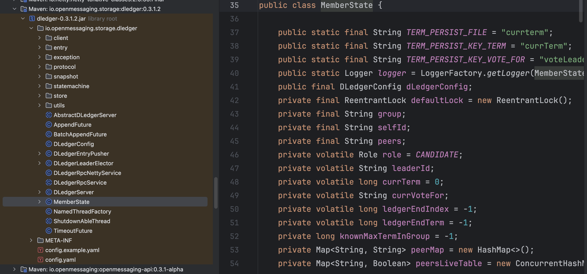

[TOC]

<center><h1>RocketMQ集群高级特性</h1></center>

&#x9;在看完RocketMQ的核心源码后，详细你对于RocketMQ已经比较熟悉了。这一章节将会给你分享一些RocketMQ集群架构中的高级特性。这些特性的底层原理相对来说会比较复杂。如果你感兴趣，可以去源码中尝试自己梳理下这些工作机制。

# 一、Dledger文件一致性协议

> 这一部分章节，目前网上资料比较少。请慎重。

## 1、Deldger高可用集群下的消息一致性问题

&#x9;RocketMQ提供了两种集群机制，一种是固定角色的主从集群，另一种是自行选主的Dledger集群。在之前章节中，也带大家简单看了一下主从集群的消息同步过程，那么你有没有好奇过Dledger高可用集群又是怎么进行消息同步的呢？

&#x9;很明显的一点，Dledger高可用集群的主节点是自主选举产生的，他的文件同步会要比主从同步复杂很多。消息数据不能简单的只是从主节点往从节点同步，而是需要在整个集群内达成一致。


&#x9;在一个Server集群中，数据写入到Server集群中的一个节点，然后希望从集群中任何一个节点都能读到写入的数据，这种问题就称为分布式数据一致性问题。

&#x9;这个问题实现起来会面临几个核心的问题：

&#x9;1、服务稳定性问题：各个Server状态不稳定，随时可能宕机。

&#x9;2、网络抖动问题：Server之间的网络如果发生抖动，集群内的某些请求就可能丢失。

&#x9;3、网速问题：数据在Server之间的传输速度不一致，难以保证数据的顺序。分布式场景是要保证集群内最终反馈出来的数据是一致的。但是数据的变化通常跟操作顺序有关。所以，还需要引入操作日志集，并保证日志的顺序，才能最终保证集群对外数据的一致性。

&#x9;4、快速响应：尽快向客户端给出写入操作的响应结果。响应时间不能简单依赖于集群中最慢的节点。

&#x9;所以，这个不起眼的问题，其实是IT界中一个非常有难度的问题。解决这样的问题，也有一系列的算法。

*   弱一致性算法：DNS系统、Gossip协议(使用场景：Fabric区块链，Cassandra，RedisCluster，Consul)
*   强一致性算法：Basic-Paxos、Multi-Paxos包括Raft系列(Nacos的JRaft，Kafka的Kraft以及RocketMQ的Dledger)、ZAB（Zookeeper)

&#x9;这其中，RocketMQ的Dledger集群其实也是基于Raft协议诞生的一种分布式一致性协议。接下来就先了解下Raft协议，再来看看RocketMQ中的Dledger是怎么实现的。

> RocketMQ中的Dledger其实是一个外来品，来自于OpenMessage这样一个开源组织。而Dledger其实是一个保证分布式日志一致性的小框架，RocketMQ把这个小框架用在了自己的日志文件同步场景。

## 2、理解Raft协议的基本流程

&#x9;先来看个热闹，看下Raft协议到底是个什么样子的。网上有个动画文稿，是对Raft算法最生动形象的描述。地址： <http://thesecretlivesofdata.com/raft/>

&#x9;从这个动画中可以看到， Raft协议是分为两个阶段工作的：Election选举和Log Replicaion日志同步。也就是说Raft要解决的其实是两个事情，一个是集群中选举产生主节点。另一个是在集群内进行数据同步。

&#x9;Raft算法的基本工作流程是这样的：


&#x9;这里重点是需要理解Log日志和State Machine状态机。Log日志就是保存在Server上的操作日志，其中每个条目称为Entry。Entry中的操作，最终都会落地到StateMachine中。Raft算法的核心就是要保证所有节点上的Entry顺序一致。

> 注意，是保证Entry顺序一致，而不是保证Entry不丢失，这是两个概念。

1、多个Server基于他的一致性协议，会共同选举产生一个 Leader，负责响应客户端的请求。

2、Leader 通过一致性协议，将客户端的指令转发到集群所有节点上。

3、每个节点将客户端的指令以 Entry 的形式保存到自己的 Log 日志当中。此时 Entry 是uncommited状态。

4、当有多数节点共同保存了 Entry 后，就可以执行 Entry 中的客户端执行，提交到State Machine 状态机中。此时 Entry 更新为commited状态。

&#x9;为此，Raft协议给每个节点设定了三种不同的状态，Leader，Follower和Candidate。


*   Leader ： 1、选举产⽣。多数派决定。2、向 Follower 节点发送⼼跳，Follower 收到⼼跳就不会竞选Leader。3、响应客户端请求。集群内所有的数据变化都从 Leader 开始。4、向 Follower 同步操作⽇志。 具体实现时，有的产品会让发到 Follower 上的请求转发到 Leader 上去。 也有的直接拒绝
*   Follower：1、参与选举投票。2、同步 Leader 上的数据。3、接收 Follower 的⼼跳。如果 Follower ⻓期没有发送⼼跳，就转为 Candidate，竞选 Leader。
*   Candidate：没有 Leader 时，发起投票，竞选 Leader。

&#x9;Raft协议为了保证同一时刻，集群当中最多只会有一个主节点，防止脑裂问题，还会增加一个Term任期的概念。


&#x9;时间被划分为多个任期。每个任期都以选举开始。选举成功后，由一名Leader管理集群，直到任期结束。有些选举失败了，没有选举出Leader，那就进入下一个任期，开始下一次选举。

> 从CAP理论的角度分析，Raft优先保证的是CP，而放弃了A。与之形成对比的是Eureka，保证AP。

他们的状态变化过程是这样的：


&#x9;1、所有节点启动时都从 Follower 状态开始。

&#x9;2、每个Follower 设定了⼀个选举过期时间Election Timeout 。Follower持续等待 Leader 的⼼跳请求。如果超过选举过期时间，就转为 Candidate，向其他节点发起投票，竞选 Leader。为了防⽌所有节点在同⼀时间过期，这个选举过期时间通常会设定为⼀个随机值，⼀般在 150ms到 300ms之间。

&#x9;3、Candidate 开始新⼀个任期的选举。每个 Candidate 会投⾃⼰⼀票，然后向其他节点发起投票 RPC 请求。然后等待其他节点返回投票结果。等待时⻓也是Election Timeout。

&#x9;4、每个节点在每⼀个任期内有⼀次投票的资格。他们会响应 Candidate 的投票 RPC 请求。按照⼀定的规则进⾏投票。返回⽀持 或者 不⽀持。

&#x9;5、Candidate 收到其他节点的投票 RPC 响应之后，会重置他的 Election Timeout，继续等待其他响应。⼀旦某⼀个 Candidate 接收到了超过集群⼀半节点的投票同意结果后，就会转为 Leader 节点。并开始向其他节点发送⼼跳 RPC 请求。确认⾃⼰的 Leader 地位。

&#x9;6、其他节点接收到 Leader 的⼼跳后，就会乖乖的转为 Follower 状态。 Candidate 也会转为 Follower 。然后等待从 Leader 同步⽇志。直到 Leader 节点⼼跳超时或者服务宕机，再触发下⼀轮选举，进⼊下⼀个 Term任期。

> 以上截图大都来自于Raft的经典论文《In Search of an Understandable Consensus Algorithm》

## 3、Raft协议的基础实现机制拆解

&#x9;接下来思考下Raft算法要如何实现这些流程呢？这里我们主要分析每个节点要保存哪些数据，然后RPC请求要传递哪些数据。

&#x9;这里简单总结Raft算法的基础数据结构：


首先是数据：

**所有节点都需要的信息**：

*   currentTerm： 服务器当前的任期
*   votedFor：当前任期内投票给了谁。
*   log\[]：日志条目Entry。每个 Entry 要包含Command：客户端指令，term：任期，idx：Entry 的偏移量。
*   commitIndex：标记为commited的 Entry 的索引。记录消息同步的进度。
*   lastApplied：已执行完 Command的 Entry 索引。 记录往状态机提交的进度。lastApplied<=commitIndex。 这两个主要是提交到状态机需要

**Leader 上的特有参数**：

*   nextIndex\[] : 给每个 Follower 同步到了哪一条 Entry。记录与follower 的同步进度。
*   matchIndex\[]：给每个 Follower 已经复制到了哪一条 Entry。主要是要记录有哪些 Entry 发给 Follower，正在等待 Follower 确认中。

然后看RPC 请求，最为核心的有三个。第一个是 Candidate投票的 RPC 请求。第二个是 Leader 发送的心跳请求。第三个是Leader 发送的日志同步请求。

**对于投票请求**，主要请求参数

*   term : 当前任期
*   candidateId： 投票的候选人 ID。
*   lastLogIndex：候选人的最后日志Entry 索引。
*   last logo term：候选人最后日志条目的任期号。

> 前两个参数是必须的。后两个参数主要是当主从发生切换时，可以用来找出最新的Candidate。

主要响应参数：

*   term : 当前任期号
*   voteGranted：投票结果。是否支持当前 Candidate 当选为 Leader。

&#x9;\*\*对于后两个请求，都是有 Leader 往 Follower 发送。\*\*其实可以合并为一种请求。心跳请求不带日志条目，而同步日志请求带日志条目。Follower 只要判断下有没有日志条目就可以区分是哪种请求。

主要请求参数：

*   term：当前领导者的任期
*   leaderId：当前领导者的 ID。
*   entries\[]：要同步的日志条目。心跳请求就传空。同步消息请求则可以支持批量同步。
*   leaderCommit：领导者已知已提交的最高的日志条目的索引。主要是 Follower 要知道新的条目是要从哪里开始同步。
*   为了安全起见，论文中还建议将上一条 Entry 的Index 以及 Term 发送过来。主要还是用来协助 Follower 定位 Entry

主要响应参数：

*   term 当前任期。
*   success： 响应是否成功。

## 4、RocketMQ中的Raft实现

&#x9;接下来我们主要是结合RocketMQ的源码，看下在RocketMQ中的Raft协议的这些数据和请求，是怎么组织的。

&#x9;**1、每个节点的基础状态**

基本跟论文中差不多。只不过分在了多个地方。

&#x9;part1：io.openmessaging.storage.dledger.MemberState



核心：

*   selfId: 自己的 ID
*   role： 自己的角色
*   leaderId
*   currentTerm: 当前 Leader 的任期。
*   currentVoteFor： 当前 Term 内，投票给了谁。 一个任期内只能投一次票
*   ledgerEndIndex：当前节点最后一个Entry 的索引
*   LedgerEndTerm：当前节点最后一个 Entry 的任期

&#x9;part2、还有一个DLedgerEntryPusher，记录了 Leader 的消息同步进度。DLedgerEntryPusher 里有一个dispatcherMap，里面记录了每个节点的同步状态。相当于 nextIndex\[]。

然后还有一个 pendingMap 记录待确认的消息，相当于 matchIndex\[]。

    // io.openmessaging.storage.dledger.DLedgerEntryPusher 构造方法
    for (String peer : memberState.getPeerMap().keySet()) {
                if (!peer.equals(memberState.getSelfId())) {
                    dispatcherMap.put(peer, new EntryDispatcher(peer, logger));
                }
            }
    ​
    // io.openmessaging.storage.dledger.DLedgerEntryPusher#EntryDispatcher
    // doAppendInner方法 记录每条消息的等待确认的时间
    			PushEntryRequest request = buildPushRequest(entry, PushEntryRequest.Type.APPEND);
                CompletableFuture<PushEntryResponse> responseFuture = dLedgerRpcService.push(request);
                pendingMap.put(index, System.currentTimeMillis());

**2、LogEntry的设计**

&#x9;见io.openmessaging.storage.dledger.entry.DLedgerEntry 其中的body就是传递的消息。


&#x9;在RocketMQ中，要传递的消息主要就是CommitLog。实际上是RocketMQ设计的CommitLog下的一个子类DLedgerCommitLog。

&#x9;这也就是说RocketMQ的Deldger集群模式下记录的CommitLog日志，和主从集群下记录的CommitLog日志是不同的。因此，Dledger集群和主从集群，他们的日志文件是不通用的。如果你想要把主从集群升级成Dledger集群，那么日志文件是无法直接迁移过去的。

**3、状态机**

&#x9;Dledger 只保留一个接口 io.openmessaging.storage.dledger.statemachine.StateMachine 。在状态机中，同样记录了 lastAppliedIndex 和 CommitIndex。其中，lastAppliedIndex 封装在io.openmessaging.storage.dledger.statemachine.StateMachineCaller中。通过这个类来调度触发状态机的对应方法。接下来在onCommited方法里，记录committedIndex，并封装成一个 Task，放到队列里，排队执行。

&#x9;这个状态机只是定义了一些提交Entry的具体操作，具体实现逻辑交由 RocketMQ 自行实现。

**4、RPC 请求**

见io.openmessaging.storage.dledger.protocol包下的各种 Request 和 Response


&#x9;关于RocketMQ的Dledger就分析到这里。如果你确实还想要了解每个请求到底是怎么构建的，其中每个参数是如何流转的，那么可以自行分析下源码。

# 二、主从节点切换的高可用集群

&#x9;从前面的分析可以看到， RocketMQ提供的Dledger虽然确实增加了集群的高可用，但是他是把集群选举和同步日志都一起完成的。而Dledger集群下的日志，显然会比主从集群大很多。这就会增加写日志的IO负担。因此，在RocketMQ 5.X的大版本中，RocketMQ又提供了一种Controller机制，即可以使用Raft的选举机制带来的高可用特性，同时又可以使用RocketMQ原生的CommitLog日志。


&#x9;具体部署方式，参见官网 <https://rocketmq.apache.org/zh/docs/deploymentOperations/03autofailover>。

&#x9;具体操作，就不在笔记中多说了，相信看到这里，对于RocketMQ的这些配置，部署的操作，已经驾轻就熟了。在这里希望给你强调的并不是这个Controller组件的用法，而是希望带你去了解RocketMQ思考问题的方式。另外，如果你真感兴趣，不妨按照我们之前带大家读源码的思路，带着这个问题去分析下源码中是如何实现主从切换的。

> 实际上在之前分析Broker核心源码的过程中，会经常涉及到主从切换的部分关键代码。

# 三、RocketMQ的BrokerContainer容器式运行机制

&#x9;在RocketMQ 4.x版本中，一个Broker就是一个进程。不管是以主从或者Dledger形式部署，一个进程中都只有一个Broker服务。而Broker又是分主从的，他们的压力式不一样的。Broker负责响应客户端的请求，非常繁忙。Slave一般只承担冷备或热备的作用。这种节点之间角色的不对等会导致RocketMQ的服务器资源没有办法充分利用起来。

&#x9;因此在RocketMQ5.x版本中，提供了一种新的模式BrokerContainer。在一个BrokerContainer进程中可以加入多个Broker。这些Broker可以是Master Broker、Slave Broler或者是DledgerBroker。通过这种方式，可以提高单个节点的资源利用率。并且可以通过各种形式的交叉部署来实现节点之间的对等部署。


&#x9;BrokeContainer模式的部署方式是低啊用bin/mqbrokercontainer脚本启动，并通过-c参数指定单独的配置文件。

```shell
bin/mqbrokercontainer -c broker-container.conf
```

&#x9;至于配置文件具体的配置方式，同样可以参见RocketMQ给出的配置示例文件。conf/container/目录下的配置。其中最核心的配置就是通过brokerConfigPaths参数，指定多个Broker的配置文件，将他们打包成一个BrokerContainer执行。

    #配置端口，用于接收mqadmin命令
    listenPort=10811
    #指定namesrv
    namesrvAddr=worker1:9876;worker2:9876;worker3:98767
    #或指定自动获取namesrv
    fetchNamesrvAddrByAddressServer=false
    #指定要向BrokerContainer内添加的brokerConfig路径，多个config间用“:”分隔；
    #不指定则只启动BrokerConainer，具体broker可通过mqadmin工具添加
    brokerConfigPaths=/app/rocketmq/rocketmq-all-5.3.0-bin-release/conf/2m-2s-async/broker-b-s.properties:/app/rocketmq/rocketmq-all-5.3.0-bin-release/conf/2m-2s-async/broker-a.properties

# 四、RocketMQ的集群架构总结

&#x9;RocketMQ从2022年9月份开始推出了新的5.x大版本。相比于之前的4.x版本，5.x版本向云原生前进了一大步。实际上，除了这里看到的Controller主从切换集群和Container容器化运行机制外，5.x版本中还增加了一个Proxy组件。这个组件也和Controller类似，可以和Broker一起组合部署，也可以单独部署。其作用主要是兼容多语言客户端。当然，如果还是使用java的客户端，则不需要启动Proxy。

> proxy具体部署过程，参见官网：<https://rocketmq.apache.org/zh/docs/quickStart/01quickstart>


