[TOC]

<center><h1> MQ常见问题梳理</h1></center>

&#x9;这一部分主要给大家分享一些MQ常见的问题。可能大家在网上见过类似的面试题解析的文章或视频。但是这一次，在我们学习了这么长的体系知识之后，希望你能对这些问题带上一些自己的思考。

&#x9;另外，有很多MQ共有的问题，我们这次也不局限于RocketMQ，而是会综合RabbitMQ和Kafka一起来讨论。

# 一、MQ如何保证消息不丢失

## 1、哪些环节可能会丢消息

&#x9; 首先分析下MQ的整个消息链路中，有哪些步骤是可能会丢消息的

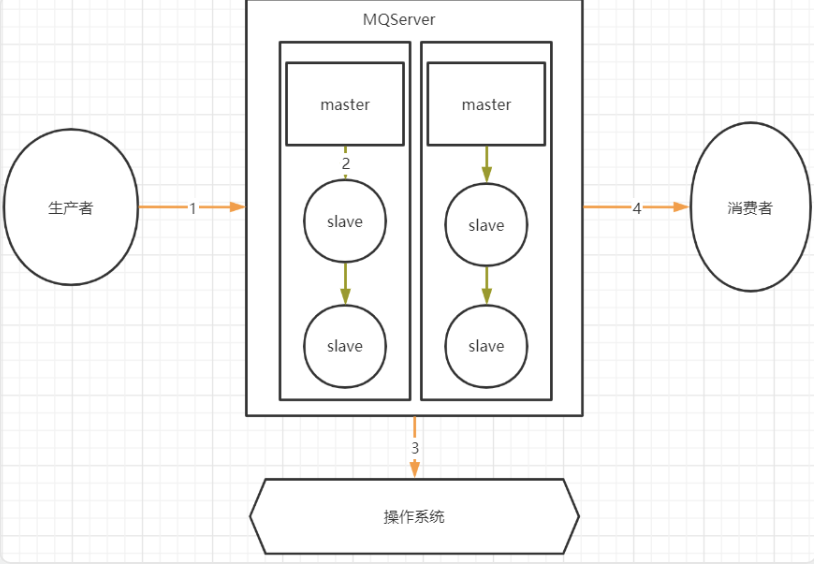

其中，1，2，4三个场景都是跨网络的，而跨网络就肯定会有丢消息的可能。

然后关于3这个环节，通常MQ存盘时都会先写入操作系统的缓存page cache中，然后再由操作系统异步的将消息写入硬盘。这个中间有个时间差，就可能会造成消息丢失。如果服务挂了，缓存中还没有来得及写入硬盘的消息就会丢失。

## 2、生产者发送消息如何保证不丢失

&#x9;生产者发送消息之所以可能会丢消息，都是因为网络。因为网络的不稳定性，容易造成请求丢失。怎么解决这样的问题呢？其实一个统一的思路就是生产者确认。简单来说，就是生产者发出消息后，给生产者一个确定的通知，这个消息在Broker端是否写入完成了。就好比打电话，不确定电话通没通，那就互相说个“喂”，具体确认一下。只不过基于这个同样的思路，各个MQ产品有不同的实现方式。

&#x9;**1、生产者发送消息确认机制**

&#x9;在RocketMQ中，提供了三种不同的发送消息的方式：

```java
// 异步发送，不需要Broker确认。效率很高，但是会有丢消息的可能。
producer.sendOneway(msg);
// 同步发送，生产者等待Broker的确认。消息最安全，但是效率很低。
SendResult sendResult = producer.send(msg, 20 * 1000);
// 异步发送，生产者另起一个线程等待Broker确认，收到Broker确认后直接触发回调方法。消息安全和效率之间比较均衡，但是会加大客户端的负担。
producer.send(msg, new SendCallback() {
	@Override
	public void onSuccess(SendResult sendResult) {
		// do something
	}

	@Override
	public void onException(Throwable e) {
		// do something
	}
});
```

&#x9;与之类似的，Kafka也同样提供了这种同步和异步的发送消息机制。

```java
//直接send发送消息，返回的是一个Future。这就相当于是异步调用。
Future<RecordMetadata> future = producer.send(record) 
//调用future的get方法才会实际获取到发送的结果。生产者收到这个结果后，就可以知道消息是否成功发到broker了。这个过程就变成了一个同步的过程。
RecordMetadata recordMetadata = producer.send(record).get();
```

&#x9;而在RabbitMQ中，则是提供了一个Publisher Confirms生产者确认机制。其思路也是Publiser收到Broker的响应后再出发对应的回调方法。

```java
//获取channel
Channel ch = ...; 
//添加两个回调，一个处理ack响应，一个处理nack响应
ch.addConfirmListener(ConfirmCallback ackCallback, ConfirmCallback nackCallback)
```

&#x9;这些各种各样不同API的背后，都是一个统一的思路，就是给生产者响应，让生产者知道消息有没有发送成功。如果没有发送成功，也由生产者自行进行补救。可以重发，也可以向业务抛异常。都由生产者自行处理。

&#x9;**2、RocketMQ的事务消息机制**

&#x9;RocketMQ提出了事务消息机制，其实也是保证生产者安全发送消息的利器。事务消息机制的基本流程如下：

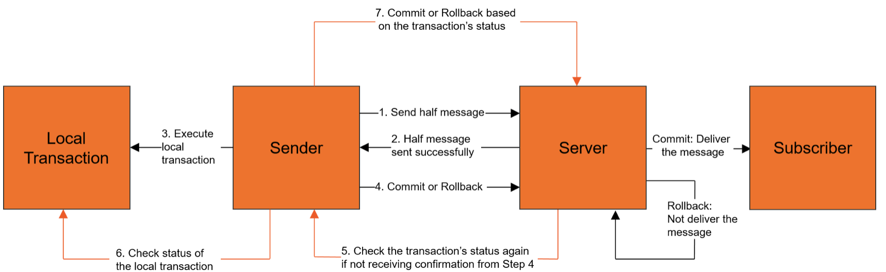

> 事务消息机制的详细流程，之前章节已经做过介绍，这里就不详细展开了

&#x9;其实整体上来看，RocketMQ的事务消息机制，还是基于生产者确认构建的一种实现机制。其核心思想，还是通过Broker主动触发生产者的回调方法，从而确认消息是否成功发送到了Broker。只不过，这里将一次确认变成了多次确认。在多次确认的过程中，除了确认消息的安全性，还给了生产者“反悔”的机会。另外，事务消息机制进一步将生产者确认与生产者的本地事务结合到了一起，从而让生产者确认这个机制有了更多的业务属性。

&#x9;例如，以最常见的电商订单场景为例，就可以在下完订单后，等到用户支付的过程中使用事务消息机制。这样可以保证本地下单和第三方支付平台支付这两个业务是事务性的，要么同时成功，就往下游发订单消息。要么就同时失败，不往下游发订单消息。

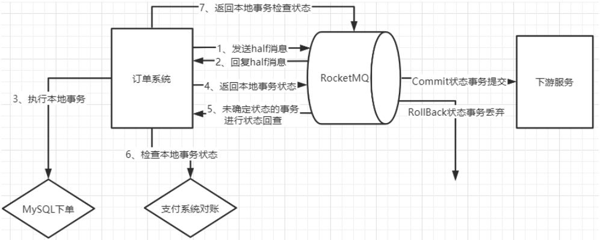

## 3、Broker写入数据如何保证不丢失

&#x9;接下来，Producer把消息发送到Broker上了之后，Broker是不是能够保证消息不丢失呢？这里也有一个核心的问题，那就是PageCache缓存。

&#x9;数据会优先写入到缓存，然后过一段时间再写入到磁盘。但是缓存中的数据有个特点，就是断电即丢失，所以，如果服务器发生非正常断电，内存中的数据还没有写入磁盘，这时就会造成消息丢失。

&#x9;怎么解决这个问题呢？

\*\*	首先需要理解操作系统是如何把消息写入到磁盘的\*\*。

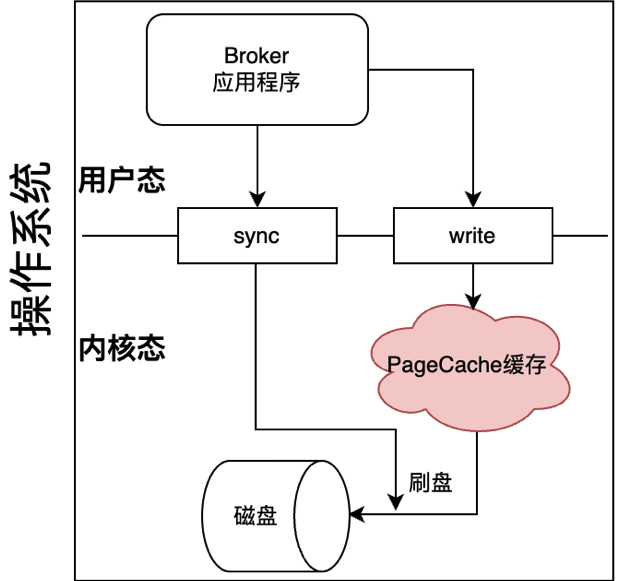

&#x9;以Linux为例， 用户态的应用程序，不管是什么应用程序， 想要写入磁盘文件时，都只能调用操作系统提供的write系统调用，申请写磁盘。至于消息如何经过PageCache再写入到磁盘中，这个过程，这个过程是在内核态执行的，也就是操作系统自己执行的，应用程序无法干预。这个过程中，应用系统唯一能够干预的，就是调用操作系统提供的sync系统调用，申请一次刷盘操作，主动将PageCache中的数据写入到磁盘。

```shell
>> man 2 write
WRITE(2)                                                       Linux Programmer's Manual                                                       
NAME
       write - write to a file descriptor

>> man 2 fsync
FSYNC(2)                                                       Linux Programmer's Manual                                                       
NAME
       fsync, fdatasync - synchronize a file's in-core state with storage device
```

&#x9;**然后来看MQ是如何调用fsync的**

&#x9;先来看RocketMQ：

&#x9;RocketMQ的Broker提供了一个很明确的配置项flushDiskType，可以选择刷盘模式。有两个可选项，SYNC\_FLUSH 同步刷盘和ASYNC\_FLUSH 异步刷盘。

&#x9;所谓同步刷盘，是指broker每往日志文件中写入一条消息，就调用一次刷盘操作。而异步刷盘，则是指broker每隔一个固定的时间，才去调用一次刷盘操作。异步刷盘性能更稳定，但是会有丢消息的可能。而同步刷盘的消息安全性就更高，但是操作系统的IO压力就会非常大。

&#x9;在RocketMQ中，就算是同步刷盘，其实也并不是真的写一次消息就刷盘一次，这在海量消息的场景下，操作系统是撑不住的。所以，我们在之前梳理RocketMQ核心源码的过程中看到，RocketMQ的同步刷盘的实现方式其实也是以10毫秒的间隔去调用刷盘操作。从理论上来说，也还是会有非正常断电造成消息丢失的可能，甚至严格意义上来说，任何应用程序都不可能完全保证断电消息不丢失。但是，RocketMQ的这一套同步刷盘机制，却可以通过绝大部分业务场景的验证。这其实就是一种平衡。

&#x9;然后来看Kafka:

&#x9;Kafka中并没有明显的同步刷盘和异步刷盘的区别，不过他暴露了一系列的参数，可以管理刷盘的频率。

    flush.ms : 多长时间进行一次强制刷盘。
    log.flush.interval.messages：表示当同一个Partiton的消息条数积累到这个数量时，就会申请一次刷盘操作。默认是Long.MAX。
    log.flush.interval.ms：当一个消息在内存中保留的时间，达到这个数量时，就会申请一次刷盘操作。他的默认值是空。如果这个参数配置为空，则生效的是下一个参数。
    log.flush.scheduler.interval.ms：检查是否有日志文件需要进行刷盘的频率。默认也是Long.MAX。

&#x9;其实在这里大家可以思考下，对kafka来说，把log.flush.interval.messages参数设置成1，就是每写入一条消息就调用一次刷盘操作，这不就是所谓的同步刷盘了吗？

&#x9;最后来看RabbitMQ：

&#x9;关于消息刷盘问题，RabbitMQ官网给了更明确的说法。那就是对于Classic经典对列，即便声明成了持久化对列，RabbitMQ的服务端也不会实时调用fsync，因此无法保证服务端消息断电不丢失。对于Stream流式对列，则更加直接，RabbitMQ明确不会主动调用fsync进行刷盘，而是交由操作系统自行刷盘。

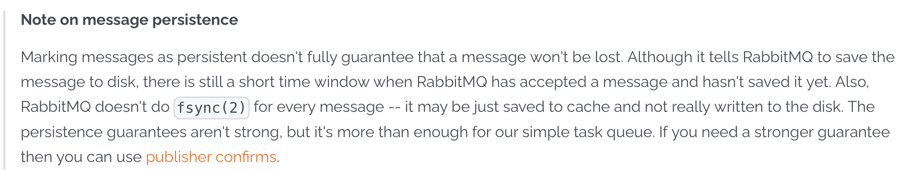

&#x9;至于怎么办呢？他明确就建议了，如果对消息安全性有更高的要求，可以使用Publisher Confirms机制来进一步保证消息安全。这其实也是对Kafka和RocketMQ同样适用的建议。

## 4、Broker主从同步如何保证不丢失

&#x9;对于Broker来说，通常Slave的作用就是做一个数据备份。当Broker服务宕机了，甚至是磁盘都坏了时，可以从Slave上获取数据记录。但是，如果主从同步失败了，那么Broker的这一层保证就会失效。因此，主从同步也有可能造成消息的丢失。

&#x9;我们这里重点来讨论一下，RocketMQ的普通集群以及Dledger高可用集群。

&#x9;先来看RocketMQ的普通集群方案，在这种方案下，可以指定集群中每个节点的角色，固定的作为Master或者Slave。

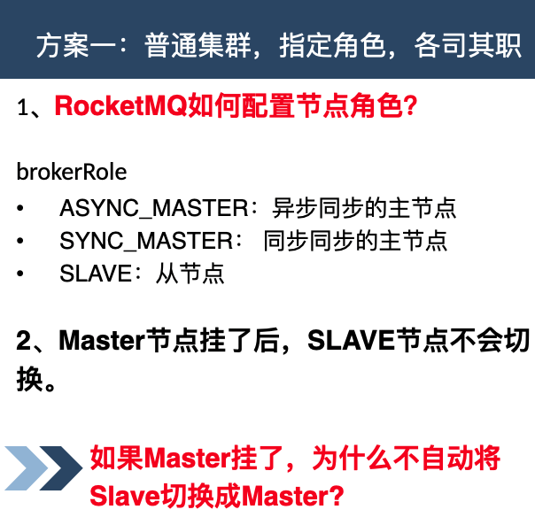

&#x9;在这种集群机制下，消息的安全性还是比较高的。但是有一种极端的情况需要考虑。因为消息需要从Master往Slave同步，这个过程是跨网络的，因此也是有时间延迟的。所以，如果Master出现非正常崩溃，那么就有可能有一部分数据是已经写入到了Master但是还来得及同步到Slave。这一部分未来得及同步的数据，在RocketMQ的这种集群机制下，就会一直记录在Master节点上。等到Master重启后，就可以继续同步了。另外由于Slave并不会主动切换成Master，所以Master服务崩溃后，也不会有新的消息写进来，因此也不会有消息冲突的问题。所以，只要Mater的磁盘没有坏，那么在这种普通集群下，主从同步通常不会造成消息丢失。

&#x9;与之形成对比的是Kafka的集群机制。在Kafka集群中，如果Leader Partition的服务崩溃了，那么，那些Follower Partition就会选举产生一个新的Leadr Partition。而集群中所有的消息，都以Leader Partition的为准。即便旧的Leader Partition重启了，也是作为Follower Partition启动，主动删除掉自己的HighWater之后的数据，然后从新的Leader Partition上重新同步消息。这样，就会造成那些已经写入旧的Leader Partition但是还没来得及同步的消息，就彻底丢失了。

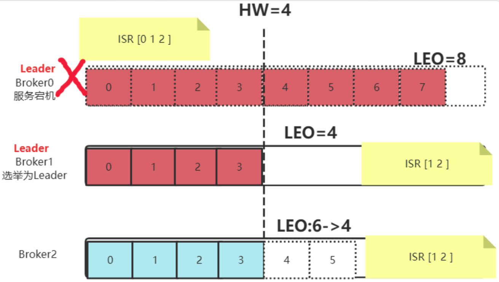

&#x9;RocketMQ和Kafka之间的这种差异，其实还是来自于他们处理MQ问题的初衷不同。RocketMQ诞生于阿里的金融体系，天生对消息的安全性比较敏感。而Kafka诞生于LinkedIn的日志收集体系，天生对服务的可用性要求更高。这也体现了不同产品对业务的取舍。

&#x9;然后来看下RocketMQ的Dledger高可用集群。在RocketMQ中，直接使用基于Raft协议的Dledger来保存CommitLog消息日志。也就是说他的消息会通过Dledger的Raft协议，在主从节点之间同步。

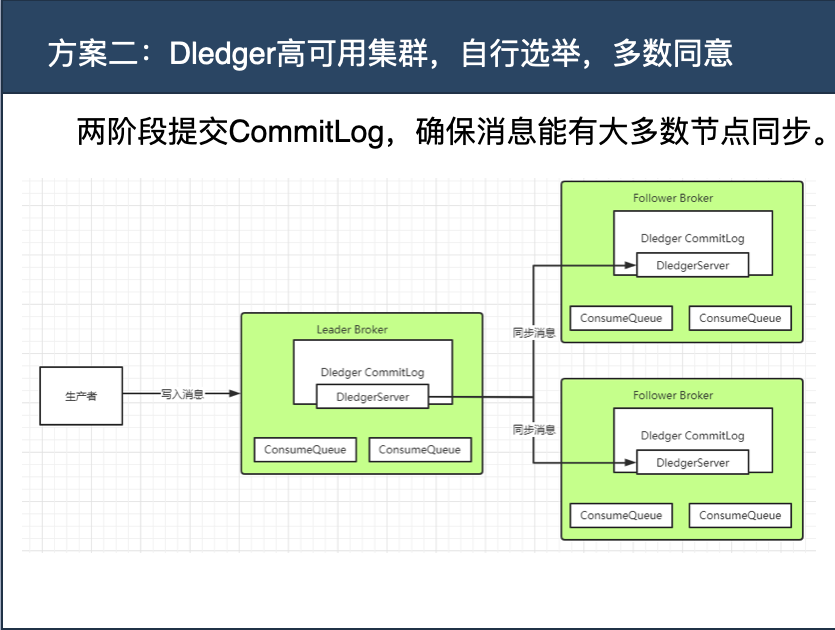

&#x9;而关于Raft协议，之前章节做给分析，他是一种基于两阶段的多数派同意机制。每个节点会将客户端的治指令以Entry的形式保存到自己的Log日志当中。此时Entry是uncommited状态。当有多数节点统统保存了Entry后，就可以执行Entry中的客户端指令，提交到StateMachine状态机中。此时Entry更新为commited状态。

&#x9;他优先保证的是集群内的数据一致性，而并不是保证不丢失。在某些极端场景下，比如出现网络分区情况时，也会丢失一些未经过集群内确认的消息。不过，基于RocketMQ的使用场景，这种丢失消息的可能性非常小。另外，之前也提到过，这种服务端无法保证消息安全的问题，其实结合客户端的生产者确认机制，是可以得到比较好的处理的。因此，在RocketMQ中使用Dledger集群的话，数据主从同步这个过程，数据安全性还是比较高的。基本可以认为不会造成消息丢失。

## 5、消费者消费消息如何不丢失

&#x9;最后，消费者消费消息的过程中，需要从Broker上拉取消息，这些消息也是跨网络的，所以拉取消息的请求也可能丢失。这时，会不会有丢消息的可能呢？

&#x9;几乎所有的MQ产品都设置了消费状态确认机制。也就是消费者处理完消息后，需要给Broker一个响应，表示消息被正常处理了。如果Broker端没有拿到这个响应，不管是因为Consumer没有拿到消息，还是Consumer处理完消息后没有给出相应，Broker都会认为消息没有处理成功。之后，Broker就会向Consumer重复投递这些没有处理成功的消息。RocketMQ和Kafka是根据Offset机制重新投递，而RabbitMQ的Classic Queue经典对列，则是把消息重新入队。因此，正常情况下，Consumer消费消息这个过程，是不会造成消息丢失的，相反，可能需要考虑下消息幂等的问题。

&#x9;但是，这也并不是说消费者消费消息不可能丢失。例如像下面这种情况，Consumer异步处理消息，就有可能造成消息丢失。

```java
consumer.registerMessageListener(new MessageListenerConcurrently{
	@Override
	public ConsumeConcurrentlyStatus consumeMessage(List<MessageExt> msgs,ConsumeConcurrentlyContext context) {
		new Thread(){
			public void run(){
				//处理业务逻辑
				System.out.printf("%s Receive New Messages: &s %n", Thread.currentThread() .getN
			｝
		};
	return ConsumeConcurrentlyStatus.CONSUME_SUCCESS;
});
```

&#x9;这里需要注意的是，通常在开发过程中，不太会这么直白的使用多线程异步机制去处理问题。但是，很有可能在处理业务时，使用一些第三方框架来处理消息。他们是不是使用的多线程异步机制，那就不能确定了。所以，线程并发，在任何业务场景下，都是必不可少的基本功。

## 6、如果MQ服务全部挂了，如何保证不丢失

&#x9;最后有一种小概率的极端情况，就是MQ的服务全部挂掉了，这时，要如何保证业务能够继续稳定进行，同时业务数据不会丢失呢？

&#x9;通常的做法是设计一个降级缓存。Producer往MQ发消息失败了，就往降级缓存中写，然后，依然正常去进行后续的业务。

&#x9;此时，再启动一个线程，不断尝试将降级缓存中的数据往MQ中发送。这样，至少当MQ服务恢复过来后，这些消息可以尽快进入到MQ中，继续往下游Conusmer推送，而不至于造成消息丢失。

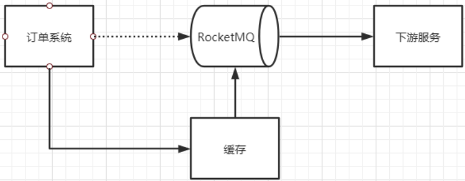

## 7、MQ消息零丢失方案总结

&#x9;最后要注意到，这里讨论到的各种MQ消息防止丢失的方案，其实都是以增加集群负载，降低吞吐为代价的。这必然会造成集群效率下降。因此，这些保证消息安全的方案通常都需要根据业务场景进行灵活取舍，而不是一股脑的直接用上。

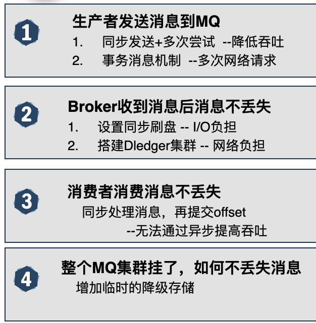

&#x9;这里希望你能够理解到，这些消息零丢失方案，其实是没有最优解的。因为如果有最优解，那么这些MQ产品，就不需要保留各种各样的设计了。这和很多面试八股文是有冲突的。面试八股文强调标准答案，而实际业务中，这个问题是没有标准答案的，一切，都需要根据业务场景去调整。

# 二、MQ如何保证消息的顺序性

&#x9;这里首先需要明确的是，通常讨论MQ的消息顺序性，其实是在强调局部有序，而不是全局有序。就好比QQ和微信的聊天消息，通常只要保证同一个聊天窗口内的消息是严格有序的。至于不同窗口之间的消息，顺序出了点偏差，其实是无所谓的。所谓全局有序，通常在业务上没有太多的使用场景。在RocketMQ和Kafka中把Topic的分区数设置成1，这类强行保证消息全局有序的方案，纯属思维体操。

&#x9;那么怎么保证消息局部有序呢？最典型的还是RocketMQ的顺序消费机制。

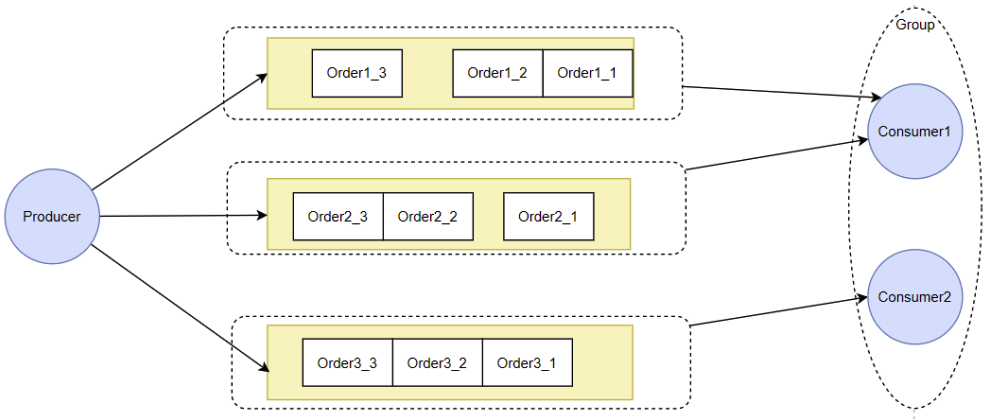

&#x9;这个机制需要两个方面的保障。

1、Producer将一组有序的消息写入到同一个MessageQueue中。

2、Consumer每次集中从一个MessageQueue中拿取消息。

&#x9;在Producer端，RocketMQ和Kafka都提供了分区计算机制，可以让应用程序自己决定消息写入到哪一个分区。所以这一块，是由业务自己决定的。只要通过定制数据分片算法，把一组局部有序的消息发到同一个对列当中，就可以通过对列的FIFO特性，保证消息的处理顺序。对于RabbitMQ，则可以通过维护Exchange与Queue之间的绑定关系，将这一组局部有序的消息转发到同一个对列中，从而保证这一组有序的消息，在RabbitMQ内部保存时，是有序的。

&#x9;在Conusmer端，RocketMQ是通过让Consumer注入不同的消息监听器来进行区分的。而具体的实现机制，在之前章节分析过，核心是通过对Consumer的消费线程进行并发控制，来保证消息的消费顺序的。类比到Kafka呢。Kafka中并没有这样的并发控制。而实际上，Kafka的Consumer对某一个Partition拉取消息时，天生就是单线程的，所以，参照RocketMQ的顺序消费模型，Kafka的Consumer天生就是能保证局部顺序消费的。

&#x9;至于RabbitMQ，以他的Classic Queue经典对列为例，他的消息被一个消费者从队列中拉取后，就直接从队列中把消息删除了。所以，基本不存在资源竞争的问题。那就简单的是一个队列只对应一个Consumer，那就是能保证顺序消费的。如果一个队列对应了多个Consumer，同一批消息，可能会进入不同的Consumer处理，所以也就没法保证消息的消费顺序

# 三、MQ如何保证消息幂等性

## 1、生产者发送消息到服务端如何保持幂等

&#x9;Producer发送消息时，如果采用发送者确认的机制，那么Producer发送消息会等待Broker的响应。如果没有收到Broker的响应，Producer就会发起重试。但是，Producer没有收到Broker的响应，也有可能是Broker已经正常处理完了消息，只不过发给Producer的响应请求丢失了。这时候Producer再次发起消息重试，就有可能造成消息重复。

&#x9;RocketMQ的处理方式，是会在发送消息时，给每条消息分配一个唯一的ID。

```java
	//org.apache.rocketmq.client.impl.producer.DefaultMQProducerImpl#sendKernelImpl
				//for MessageBatch,ID has been set in the generating process
                if (!(msg instanceof MessageBatch)) {
                    MessageClientIDSetter.setUniqID(msg);
                }


	public static void setUniqID(final Message msg) {
        if (msg.getProperty(MessageConst.PROPERTY_UNIQ_CLIENT_MESSAGE_ID_KEYIDX) == null) {
            msg.putProperty(MessageConst.PROPERTY_UNIQ_CLIENT_MESSAGE_ID_KEYIDX, createUniqID());
        }
    }
```

&#x9;通过这个ID，就可以判断消息是否重复投递。

&#x9;而对于Kafka，则会通过他的幂等性配置，防止生产者重复投递消息造成的幂等性问题。

&#x9;在Kafka中，需要打开idempotence幂等性控制后(默认是打开的，但是如果其他配置有冲突，会影响幂等性配置)。Kafka为了保证消息发送的Exactly-once语义，增加了几个概念：

*   PID：每个新的Producer在初始化的过程中就会被分配一个唯一的PID。这个PID对用户是不可见的。
*   Sequence Numer: 对于每个PID，这个Producer针对Partition会维护一个sequenceNumber。这是一个从0开始单调递增的数字。当Producer要往同一个Partition发送消息时，这个Sequence Number就会加1。然后会随着消息一起发往Broker。
*   Broker端则会针对每个\<PID,Partition>维护一个序列号（SN），只有当对应的SequenceNumber = SN+1时，Broker才会接收消息，同时将SN更新为SN+1。否则，SequenceNumber过小就认为消息已经写入了，不需要再重复写入。而如果SequenceNumber过大，就会认为中间可能有数据丢失了。对生产者就会抛出一个OutOfOrderSequenceException。

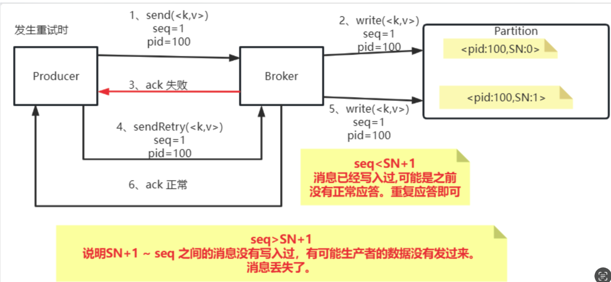

## 2、消费者消费消息如何保持幂等

&#x9;这里以RocketMQ来讨论如何防止消费者多次重复消费同一条消息。

&#x9;首先，关于消息会如何往消费者投递。RocketMQ官网明确做了回答：


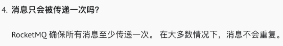

&#x9;也就是说，在大多数情况下，不需要单独考虑消息重复消费的问题。但是，同样，这个回答里也说明了，存在一些小概率情况，需要单独考虑消费者的消息幂等问题。

&#x9;至于有哪些小概率情况呢？最典型的情况就是网络出现波动的时候。RocketMQ是通过消费者的响应机制来推进offset的，如果consumer从broker上获取了消息，正常处理之后，他要往broker返回一个响应，但是如果网络出现波动，consumer从broker上拿取到了消息，但是等到他向broker发响应时，发生网络波动，这个响应丢失了，那么就会造成消息的重复消费。因为broker没有收到响应，就会向这个Consumer所在的Group重复投递消息。

&#x9;然后，消费者如何防止重复消费呢？

&#x9;防止重复消费，最主要是要找到一个唯一性的指标。在RocketMQ中，Producer发出一条消息后，RocketMQ内部会给每一条消息分配一个唯一的messageId。而这个messageId在Consumer中是可以获取到的。所以大多数情况下，这个messageId就是一个很好的唯一性指标。Consumer只要将处理过的messageId记录下来，就可以判断这条消息之前有没有处理过。

&#x9;但是同样也有一些特殊情况。如果Producer是采用批量发送，或者是事务消息机制发送，那么这个messageId就没有那么好控制了。所以，如果在真实业务中，更建议根据业务场景来确定唯一指标。例如，在电商下单的场景，订单ID就是一个很好的带有业务属性的唯一指标。在使用RocketMQ时，可以使用message的key属性来传递订单ID。这样Consumer就能够比较好的防止重复消费。

&#x9;最后，对于幂等性问题，除了要防止重复消费外，还需要防止消费丢失。也就是Consumer一直没有正常消费消息的情况。

&#x9;在RocketMQ中，重复投递的消息，会单独放到以消费者组为维度构建的重试对列中。如果经过多次重试后还是无法被正常消费，那么最终消息会进入到消费者组对应的死信对列中。也就是说，如果RocketMQ中出现了死信对列，那么就意味着有一批消费者的逻辑是一直有问题的，这些消息始终无法正常消费。这时就需要针对死信对列，单独维护一个消费者，对这些错误的业务消息进行补充处理。这里需要注意一下的是，RocketMQ中的死信对列，默认权限是无法消费的，需要手动调整权限才能正常消费。

# 四、MQ如何快速处理积压的消息

## 1、消息积压会有哪些问题。

&#x9;对RocketMQ和Kafka来说，他们的消息积压能力本来就是很强的，因此，短时间的消息积压，是没有太多问题的。但是需要注意，如果消息积压问题一直得不到解决，RocketMQ和Kafka在日志文件过期后，就会直接删除过期的日志文件。而这些日志文件上未消费的消息，就会直接丢失。

&#x9;而对RabbitMQ来说， Classic Queue经典对列和Quorum Queue仲裁对列，如果有大量消息积压，未被消费，就会严重影响服务端的性能，因此需要重点关注。而至于Stream Queue流式对列，整体的处理机制已经和RocketMQ与Kafka比较相似了，对消息积压的承受能力就会比较强。但是还是需要注意和RocketMQ与Kafka相同的问题。

## 2、怎么处理大量积压的消息

&#x9;产生消息积压的根本原因还是Consumer处理消息的效率太低，所以最核心的目标还是要提升Consumer消费消息的效率。如果不能从业务上提升Consumer消费消息的性能，那么最直接的办法就是针对处理消息比较慢的消费者组，增加更多的Consumer实例。但是这里需要注意一下，增加Consumer实例是不是会有上限。

&#x9;对于RabbitMQ，如果是Classic Queue经典对列，那么针对同一个Queue的多个消费者，是按照Work Queue的模式，在多个Consuemr之间依次分配消息的。所以这时，如果Consumer消费能力不够，那么直接加更多的Consumer实例就可以了。这里需要注意下的是如果各个Consumer实例他们的运行环境，或者是处理消息的速度有差别。那么可以优化一下每个Consumer的比重(Qos属性)，从而尽量大的发挥Consumer实例的性能。

&#x9;而对于RocketMQ，因为同一个消费者组下的多个Cosumer需要和对应Topic下的MessageQueue建立对应关系，而一个MessageQueue最多只能被一个Consumer消费，因此，增加的Consumer实例最多也只能和Topic下的MessageQueue个数相同。如果此时再继续增加Consumer的实例，那么就会有些Consumer实例是没有MessageQueue去消费的，因此也就没有用了。

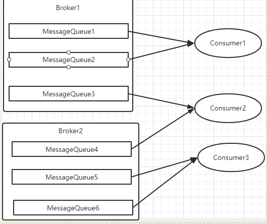

&#x9;这时，如果Topic下的MessageQueue配置本来就不够多的话，那就无法一直增加Consumer节点个数了。这时怎么处理呢？如果要快速处理积压的消息，可以创建一个新的Topic，配置足够多的MessageQueue。然后把Consumer实例的Topic转向新的Topic，并紧急上线一组新的消费者，只负责消费旧Topic中的消息，并转存到新的Topic中。这个速度明显会比普通Consumer处理业务逻辑要快很多。然后在新的Topic上，就可以通过添加消费者个数来提高消费速度了。之后再根据情况考虑是否要恢复成正常情况。

> 其实这种思路和RocketMQ内部很多特殊机制的处理方式是一样的。例如固定级别的延迟消息机制，也是把消息临时转到一个系统内部的Topic下，处理过后，再转回来。

&#x9;至于Kafka，也可以采用和RocketMQ相似的处理方式。

# 五、RocketMQ课程总结

&#x9;所有的MQ，其实处理的都是一类相似的问题。但是，互联网却诞生了不下几十种MQ的产品。为什么都做着差不多的功能，但是却有这么多不同的产品呢？这就需要对MQ的业务场景进行逐步的深度挖掘。把业务问题理解得越深刻，那么对这些不同产品的理解才会更深刻，日后处理各种各样的业务问题，也才会有更多的可选方案，或者，换种说法，就是经验。这才是程序员最大的价值。

