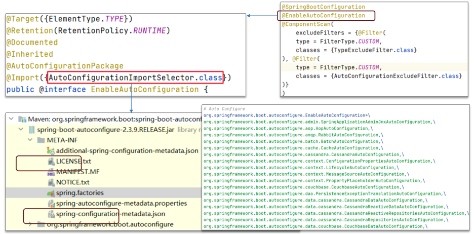

# SpringBoot基础
## 1. SpringBoot简介
SpringBoot是一个快速开发框架，它提供了一系列的starter，通过starter可以快速引入各种依赖，简化开发。

## 2. SpringBoot自动配置原理
> Springboot中最高频的一道面试题，也是框架最核心的思想

- @SpringBootConfiguration：该注解与 @Configuration 注解作用相同，用来声明当前也是一个配置类。
- @ComponentScan：组件扫描，默认扫描当前引导类所在包及其子包。
- @EnableAutoConfiguration：SpringBoot实现自动化配置的核心注解。

> 1,  在Spring Boot项目中的引导类上有一个注解@SpringBootApplication，这个注解是对三个注解进行了封装，分别是：
> - @SpringBootConfiguration
> - @EnableAutoConfiguration
> - @ComponentScan
> 
> 2,  其中@EnableAutoConfiguration是实现自动化配置的核心注解。 该注解通过@Import注解导入对应的配置选择器。
内部就是读取了该项目和该项目引用的Jar包的的classpath路径下META-INF/spring.factories文件中的所配置的类的全类名。 在这些配置类中所定义的Bean会根据条件注解所指定的条件来决定是否需要将其导入到Spring容器中。
> 
> 3, 条件判断会有像@ConditionalOnClass这样的注解，判断是否有对应的class文件，如果有则加载该类，把这个配置类的所有的Bean放入spring容器中使用。
